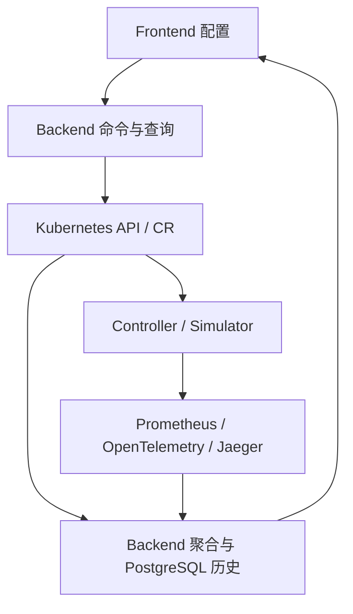

# hello-k8s-ai 项目概览

> 本文件是根目录快速入口。完整、持续维护的项目说明见
> [docs/overview/PROJECT_OVERVIEW.md](docs/overview/PROJECT_OVERVIEW.md)，文档导航见
> [docs/INDEX.md](docs/INDEX.md)。

## 1. 项目定位

hello-k8s-ai 是一个 Kubernetes 原生 AI 推理调度与仿真平台。系统用 CRD 表达租户、模型、逻辑节点、策略、实例和扩缩容配置，通过 Controller 收敛资源，再由 Simulator 产生性能、Metrics 和 Trace 数据。

当前项目用于验证控制面和调度链路，不执行真实模型推理，也不等同于生产级推理网关。

## 2. 主要组件

| 组件 | 职责 | 代码入口 |
| --- | --- | --- |
| CRD/API | 定义配置、运行态和字段所有权 | `api/v1/` |
| Controller Manager | 运行 6 个 Reconciler，完成策略、流量、状态和扩缩容收敛 | `cmd/main.go`、`internal/controller/` |
| Simulator | 模拟到达、排队、服务时间和冷启动，写回状态并发送遥测 | `simulator/` |
| Dashboard Backend | 聚合 Kubernetes、PostgreSQL、Prometheus 和 Jaeger，提供 REST/SSE | `dashboard/backend/` |
| Dashboard Frontend | 配置资源并展示当前态、历史、指标和 Trace | `dashboard/frontend/my-app/` |
| 部署系统 | 构建四类镜像并部署完整本地栈 | `Makefile`、`hack/local-cluster.sh`、`config/`、`dashboard/deploy/` |

## 3. 主数据链路



Kubernetes API Server 是配置和最新收敛状态的主要事实源；PostgreSQL 保存历史、审计和幂等记录，不拥有当前 CR 状态。

## 4. 当前边界

- `Model.spec.absoluteScore` 是调度前必须提供的能力基准，旧 `status.absoluteScore` 只用于升级兼容。
- Orchestrator 的节点放置计划会持久化并约束 Simulator Pod；Kubernetes Scheduler 负责执行该约束。
- Traffic 页面读取真实集群数据，但 Overlay 仍是前端草稿，尚未写回 Tenant QPS。
- 本地完整栈面向 Docker Desktop Kubernetes；E2E 使用独立 Kind 集群。
- 生产认证授权、数据持久化高可用、真实 GPU 设备和真实推理数据面尚未完成。

## 5. 最短使用路径

```bash
bash setup.sh
make cluster-status
```

提交前完整静态验证：

```bash
make verify
```

独立 Kind E2E：

```bash
make test-e2e
```

## 6. 继续阅读

- [AI 交接上下文](docs/AI_CONTEXT.md)
- [架构总览](docs/overview/ARCHITECTURE_OVERVIEW.md)
- [端到端数据流](docs/data-flow/END_TO_END_DATA_FLOW.md)
- [本地部署](docs/getting-started/DEPLOYMENT.md)
- [验证指南](docs/getting-started/VERIFICATION.md)
- [排障指南](docs/operations/TROUBLESHOOTING.md)
