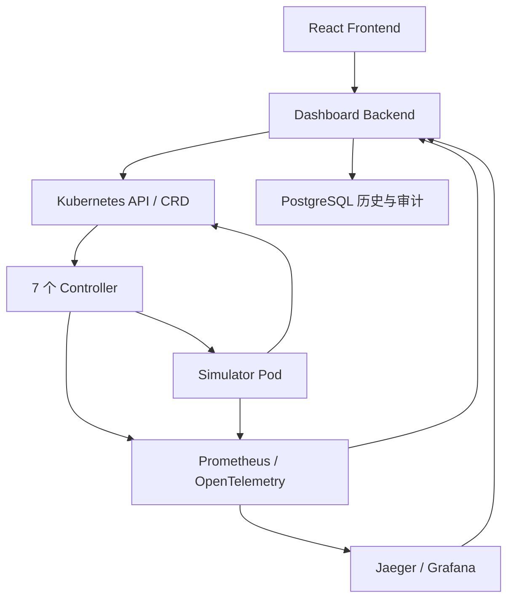

# hello-k8s-ai

[](https://github.com/3900563672/hello-k8s-ai/actions/workflows/lint.yml)
[](https://github.com/3900563672/hello-k8s-ai/actions/workflows/test.yml)
[](https://github.com/3900563672/hello-k8s-ai/actions/workflows/docs.yml)

hello-k8s-ai 是一个以 Kubernetes API 为当前事实源的 AI 推理调度与仿真平台。React Frontend 通过 Dashboard Backend 管理租户、模型、逻辑 WorkerNode 和 Simulator 时间倍速；七个 Controller 将配置与策略收敛为 Simulator 工作负载；Simulator 产生状态、Prometheus 指标和 OpenTelemetry Trace；Backend 再聚合 Kubernetes、PostgreSQL、Prometheus 与 Jaeger 数据供页面展示。

## 文档入口

文档按读者分层，各层独立维护、互不串读；变更历史统一归档：

| 读者 | 入口 |
| --- | --- |
| 人类 | [docs/INDEX.md](docs/INDEX.md)（专题索引）；想快速入门读 [PROJECT_OVERVIEW_NEW.md](PROJECT_OVERVIEW_NEW.md) |
| 能操作本机的 Agent（Codex、Claude Code） | [AGENTS.md](AGENTS.md) + [docs/agents/README.md](docs/agents/README.md) |
| 只在自己工作区、收打包内容的远程 AI | [docs/remote-ai/llms.txt](docs/remote-ai/llms.txt)，包内先读 `CONTEXT_PACK.md` |
| 全部读者 | 变更历史 [change-history/README.md](change-history/README.md)；最近 5 条见下方时间线 |

想用 AI 协作开发，人类可先读 [AI 协作与提示词手册](docs/getting-started/AI_COLLABORATION.md)。参与贡献见 [CONTRIBUTING.md](CONTRIBUTING.md)。

项目采用 [Apache-2.0](LICENSE) 许可证。

## 最省事的部署方式

本地开发/演示默认使用独立的 Kind 多节点集群（`hello-k8s-ai-dev`，1 control-plane + 4 worker），由 `make cluster-up` 自动创建并切换 Context；不再依赖 Docker Desktop 内置 Kubernetes。PVC 数据持久化在 `/var/lib/hello-k8s-ai-pv`（Docker 数据盘内），集群删除重建不丢历史。

覆盖旧项目文件后，在项目根目录执行：

```bash
bash setup.sh
```

这一个命令会：

1. 清理已确认废弃的旧文档、旧 Kind 配置、缓存和重复锁文件。
2. 检查当前 Context、API Server、全部 Node、`standard` StorageClass 和 Docker Desktop 资源。
3. 构建 Controller、Simulator、Backend、Frontend 四个项目镜像。
4. 预拉取 PostgreSQL、Prometheus、OpenTelemetry Collector、Jaeger、Grafana 镜像。
5. 把所有运行镜像导入当前 10 个 Kubernetes Node 的 containerd，避免 `ImagePullBackOff`。
6. 部署 CRD、Controller、可观测性、PostgreSQL、Backend 与 Frontend。
7. 默认不写入任何演示数据，保持干净环境；需要演示数据时设置 `DEMO_ENABLED=true`（此时按当前 Worker Node 动态创建演示配置，不写死节点名）。
8. 验证 Backend API、SimulationClock 与 Frontend 页面；干净模式断言业务 CR 与历史快照为空，演示模式额外验证 Metrics、Trace 与数据库快照。
9. 启动本地端口转发。

首次构建需要下载基础镜像和依赖，时间取决于网络；脚本对镜像拉取有重试，任一步失败都会停止并将诊断保存到 `.runtime/last-failure.log`。

一键启动得到的是干净环境：没有任何预置的租户、模型、节点与策略，也没有历史切面。你可以打开 Dashboard，参考「填写指南」（`/guide`）用预置模板从空开始创建自己的配置；没有运行就没有历史数据，这是预期行为。

## 前置条件

- Docker Desktop（Docker 引擎）已启动；不再需要 Docker Desktop 内置 Kubernetes。
- `kubectl config current-context` 输出 `kind-hello-k8s-ai-dev`（`make cluster-up` 自动创建并切换）。
- Docker CLI 与 `kubectl` 可用。
- Kubernetes Node 是 Kind 管理的本地容器（镜像由 `make cluster-up` 自动导入）。
- 存在 `standard` StorageClass。

部署不要求本机安装 Go、Node.js、npm、kind 或独立 Kustomize；编译在 Docker 中完成，清单由 `kubectl` 内置 Kustomize 处理。

## 部署后访问

| 组件 | 地址 |
| --- | --- |
| Dashboard（唯一入口） | `http://localhost:8080` |

Grafana、Prometheus 与 Jaeger 不再单独暴露端口：Grafana 监控面板在 Dashboard「监控面板」页内嵌，Prometheus 与 Jaeger 数据在「数据回显」页展示。

常用命令：

```bash
make cluster-status  # 查看工作负载、CR、PVC 与 Backend 状态
make cluster-open    # 端口转发中断后重新启动
make cluster-urls    # 只打印访问地址
make cluster-down    # 停止工作负载，保留集群、CRD、CR、Secret 与 PVC
DEMO_ENABLED=true make cluster-up  # 需要演示数据时显式开启
```

`make cluster-down` 只停止工作负载，保留集群、CRD、CR、Secret 与 PVC；`make kind-down` 才删除 Kind 开发集群（PVC 数据保留在 `/var/lib/hello-k8s-ai-pv`，重建自动挂回）。

## 最近变更

<!-- docs-sync:timeline-start -->
最近 5 条变更（完整时间线见 [change-history/README.md](change-history/README.md)）：

- 2026-08-19 [WSL 升级验证实验：2.9.4 预览线仍复现，环境已回滚（#71/#63）](change-history/2026-08-19-wsl-upgrade-validation/README.md)
- 2026-08-19 [WSL 源码级验证：2.9.5+ 修复已确认存在（#71 最后证明项）](change-history/2026-08-19-wsl-source-fix-verified/README.md)
- 2026-08-19 [WSL 重启后排除测试 + 探针工具缺陷修复（32 号文档）](change-history/2026-08-19-wsl-reboot-exclusion-test/README.md)
- 2026-08-19 [WSL 回环研究三 issue 闭环（#66 查重 / #65 指纹 / #64 参数实验）](change-history/2026-08-19-wsl-issue-64-65-66/README.md)
- 2026-08-19 [WSL 回环研究：openvmm/WSL “为什么这么写”git 溯源 + 版本缺陷区间勘误（31 号文档）](change-history/2026-08-19-wsl-history-trace/README.md)

<!-- docs-sync:timeline-end -->

## 系统边界



Kubernetes API Server 拥有配置与最新收敛状态；PostgreSQL 只保存历史快照、事件、审计和幂等记录；Prometheus 保存时序指标；Jaeger 保存 Trace。Frontend 不直接访问这些基础设施，只调用 Backend。

## 当前能力

| 能力 | 状态 |
| --- | --- |
| 11 个 CRD、7 个 Controller、Simulator | 已实现 |
| Simulator 运行时倍速（1x..20x） | 已实现；只加速离散事件引擎，不改变 Controller 冷却、数据新鲜度或历史时间 |
| Backend Kubernetes cache、PostgreSQL、Prometheus、Jaeger 聚合 | 已实现 |
| React Config、Traffic、Data Overview | 已接真实 Backend；Traffic Overlay 提交仍是部分实现 |
| 预置配置模板与"从模板新建" | 已实现；模板只预填表单，提交与运行由用户决定 |
| Monitor（Grafana 内嵌）与 Guide（填写指南） | 已实现；Grafana 经 Dashboard `/grafana/` 单入口访问，`/guide` 集中展示字段含义与系统常量 |
| 参数与填写指南（/guide） | 已实现；集中展示字段含义、默认值与系统常量 |
| 干净环境一键启动（默认无演示数据） | 已实现；DEMO_ENABLED=true 可恢复演示链路 |
| Docker Desktop 完整栈一键部署 | 已实现；需要在目标机器执行真实运行验收 |
| 生产认证、HA、备份、持久化可观测存储 | 未实现；当前仍是本地开发/演示拓扑 |

详细部署、验证与排障见：

- [本地运行](docs/getting-started/LOCAL_RUN.md)
- [部署架构](docs/getting-started/DEPLOYMENT.md)
- [验证指南](docs/getting-started/VERIFICATION.md)
- [排障](docs/operations/TROUBLESHOOTING.md)

自动化 E2E 使用隔离的 Kind 集群 `hello-k8s-ai-test-e2e`，与日常开发集群 `hello-k8s-ai-dev` 互不影响。
