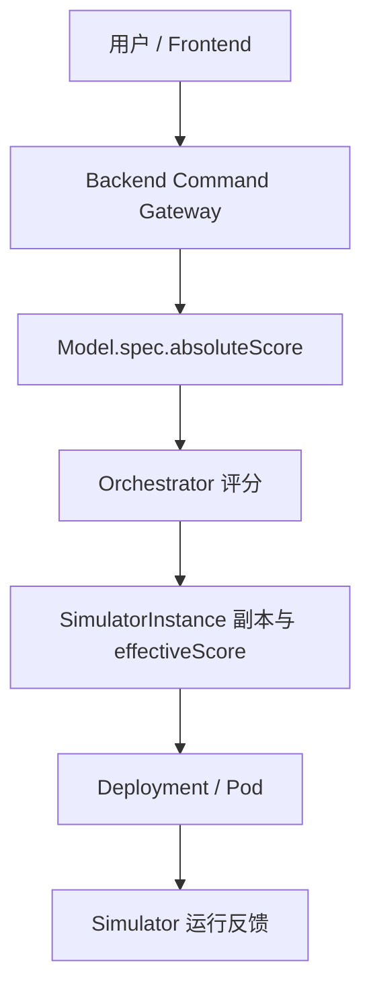

# Model 能力基准分生产路径修复

- 变更日期：2026-08-14
- 关联问题：Fixes #5
- 变更级别：P0 首次调度闭环
- 变更范围：CRD/API、Orchestrator、Dashboard Backend、Frontend、部署、测试和文档
- CRD 变化：`Model.spec.absoluteScore` 新增为必填正整数
- 数据库变化：无

## 1. 修复结果

`absoluteScore` 现在是 Model 的显式能力配置，由用户或 Dashboard Backend 在创建 Model 时写入 `spec.absoluteScore`。CRD、Backend 和 Frontend 三层都把它视为必要输入，Orchestrator 不再依赖部署脚本偷偷修改 Status。

新链路为：

直接通过 YAML 创建 Model 时，Kubernetes API 也会拒绝缺少或小于 1 的 `spec.absoluteScore`。因此“配置缺失但对象创建成功，随后被误报为 `no_feasible_placement`”的路径已被切断。

## 2. 设计选择

本次把分数定义为“单个已预热副本在理想条件下的能力基准”，属于进入调度前必须已知的模型配置，不是 Controller 观察到的运行状态。原因如下：

- 首个 Simulator 副本启动前没有运行数据可用于计算该值；由 Controller 自动生成会形成启动依赖环。
- 当前项目没有独立基准测试服务、评分数据源或版本化校准流程，控制器无法可靠推断真实能力。
- Backend 已具备受控的 Model Spec 写命令、dry-run、幂等、resourceVersion 和审计链路，适合作为用户配置入口。
- Frontend Config 已经维护其他 Model 静态参数，把能力基准放在同一表单可让接入步骤显式可见。

因此没有新增“猜分数”的 Controller，也没有给 CRD 设置隐式默认值。Frontend 新建草稿使用可见的初始值 100，用户可以在表单中修改；Kubernetes API 本身仍要求调用者显式提交字段。

## 3. 当前权威与兼容规则

| 字段 | 当前语义 | 写入者 | 读取规则 |
| --- | --- | --- | --- |
| `Model.spec.absoluteScore` | 当前能力基准配置 | 用户 / Backend | Orchestrator 首选且唯一的新权威来源 |
| `Model.status.absoluteScore` | 旧版本遗留值 | 无新写入者 | 仅当旧对象缺少 Spec 字段时回退读取 |

旧 Status 字段暂未删除，避免滚动升级时让已部署 Model 立即失去调度能力。`make cluster-up` 会把旧 Status 中的正数复制到 Spec；完全没有分数的旧对象不会被自动赋予猜测值。

## 4. 缺失配置的诊断变化

虽然新 CRD 会阻止新的缺失对象，Orchestrator 仍需处理升级前已经存储的不完整对象。若某次扩容涉及的全部实例模型都没有有效分数：

- Decision reason：`model_absolute_score_missing`；
- Orchestrator Ready Condition：`False`；
- Condition reason：`ModelScoreMissing`；
- Condition message：列出缺失分数的 Model 名称。

若至少有一个带有效分数的模型参与候选，而最终仍无放置结果，原因保持 `no_feasible_placement`，避免把真实 Policy 或容量问题误判为分数缺失。

## 5. 影响范围

| 模块 | 影响 |
| --- | --- |
| Model CRD | 新对象必须提供 `spec.absoluteScore >= 1`；`kubectl get models` 新增 AbsoluteScore 列。 |
| Orchestrator | 优先读取 Spec，兼容旧 Status；缺失配置有独立 reason/Condition；Spec 更新会刷新已有实例分数。 |
| Dashboard Backend | Model Spec 白名单加入 absoluteScore；缺失字段在命令入口直接拒绝。 |
| Frontend | 类型、校验、默认值、读写映射、表单、模板预览和列表都包含能力基准分。 |
| 本地部署 | 样例 YAML 直接包含分数；部署脚本从旧 Status 迁移到 Spec，不再写 Status。 |
| Simulator | 无算法修改；仍消费 Orchestrator 写入的 Instance effectiveScore。 |
| Database / Prometheus / OTel | 无 schema 或协议变化。 |

## 6. 资料入口

- [实现修改明细](IMPLEMENTATION_DETAILS.md)
- [升级与回滚](MIGRATION_AND_ROLLBACK.md)
- [测试报告](TEST_REPORT.md)

## 7. 后续边界

本次解决的是“分数由谁提供、如何进入调度”的闭环，不声称 100 或任何人工值天然准确。若未来引入真实基准测试服务，应新建设计分数版本、硬件/模型版本关联、过期策略和审计来源，再评估是否迁回 Status；不要让两个生产者同时写同一权威值。

## 8. 同日构建校正

首次整理该变更时，`internal/controller/constants.go` 被误删。该文件保存 Controller 共用的 Condition、阶段、遥测组件名和指标标签常量；缺失后根模块无法编译，进而使 lint、Controller 镜像构建和 E2E 全部失败。

后续校正按删除前内容原样恢复该文件，没有改变 absoluteScore 业务设计。同时补强现有 Makefile 和 GitHub Actions：E2E 固定 Kind/Kubernetes 版本并保证失败后清理，CI 分别覆盖 Controller、Backend、Frontend、生成文件、部署清单和全部项目镜像。详细结果见 [测试报告](TEST_REPORT.md)。
