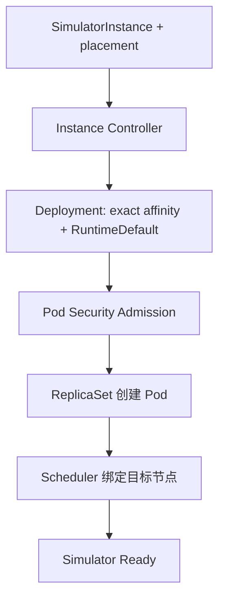

# 实现细节

## 1. Simulator Pod 安全上下文

位置：`internal/controller/simulatorinstance_controller.go` 的 `ensurePlacementDeployment`。

在设置 ServiceAccount、终止宽限期和 node affinity 时，Controller 现在同时确保：

```text
Deployment.spec.template.spec.securityContext.seccompProfile.type = RuntimeDefault
```

该配置放在 Pod 级，因此 Deployment 中的 Simulator 容器统一继承。代码只初始化缺失的 `PodSecurityContext`，随后明确维护 seccomp profile；不会改变容器现有的 non-root、capabilities、只读根文件系统、探针或环境变量。

这条路径同时覆盖：

- 没有 placement annotation 的旧式单 Deployment；
- 带 placement annotation 的主节点 Deployment；
- 其他节点的哈希后缀 Deployment；
- Rebalance 和普通扩缩容产生的后续 Pod template。

## 2. 缩容遍历 lint

位置：`internal/controller/placement_plan.go` 的 `scaleDownPlacementNode`。

原实现从切片最后一个下标递减，优先选择非主节点。新实现通过 `slices.Backward(placements)` 以相同顺序遍历，返回逻辑没有变化：

1. 仍优先回收排序后最靠后的非主节点；
2. 没有非主节点时仍回收主节点；
3. 空计划仍返回 `false`。

这是等价的语法调整，不改变放置算法和确定性排序。

## 3. 快速回归断言

位置：`internal/controller/controller_integration_test.go` 的 `TestSimulatorInstancePlacementCreatesNodePinnedDeployments`。

既有测试已检查每个 Deployment 的副本数、精确节点 affinity 和 placement annotation。本次增加 Pod template 的 `RuntimeDefault` 断言，因此缺失安全字段会在快速 fake-client 测试中失败，不必等到 Kind 的 Pod Security Admission 才发现。

## 4. E2E 镜像闭环

位置：`test/e2e/e2e_suite_test.go`、`test/e2e/e2e_test.go`。

BeforeSuite 现在执行以下准备：

1. 构建并加载 Manager 镜像；
2. 构建 `example.com/hello-k8s-ai-simulator:v0.0.1`；
3. 把 Simulator 镜像加载到同一个 Kind 集群。

Manager 部署后，测试通过 Deployment 环境变量指定该镜像，并使用 `SIMULATOR_IMAGE_PULL_POLICY=Never`。这样 E2E 验证的是仓库当前 Simulator 二进制，不会访问 Docker Hub 的 `simulator:latest`。

放置用例的断言顺序调整为：

1. Deployment required node affinity 等于选中节点；
2. Pod template seccomp profile 等于 `RuntimeDefault`；
3. 恰好出现一个带实例标签的 Pod；
4. Pod 的 `spec.nodeName` 等于选中节点；
5. Pod Ready Condition 最终为 `True`。

Pod 查询改用 `range .items[*]`，资源尚未创建时返回空结果，由 Gomega 重试；不再因为访问 `.items[0]` 产生数组越界错误，最终失败信息也更接近真实状态。

## 5. 上下游关系



本次只修复 Deployment 到 Pod Admission 之间的断点。Orchestrator 的 NodeName 传递、逻辑容量预留和 WorkerNodeUsage 事后核算保持不变。
