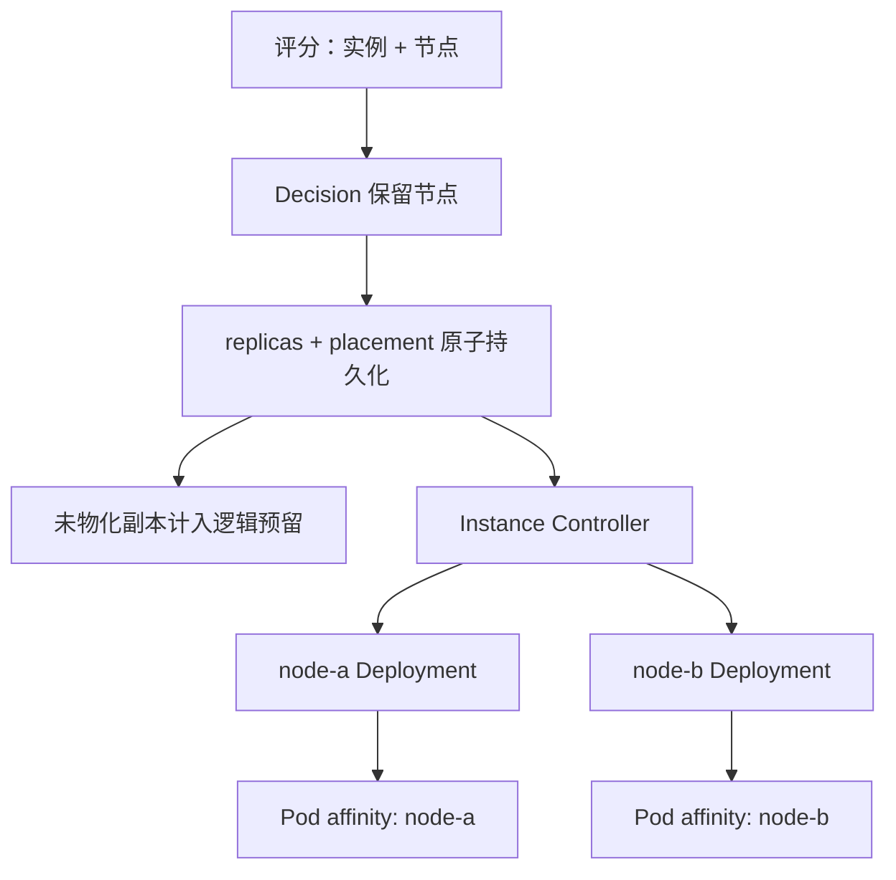

# Orchestrator 选点执行契约修复

- 变更日期：2026-08-14
- 变更级别：P0 调度正确性
- 变更范围：Controller、测试、架构文档
- CRD 版本变化：无
- Backend/Frontend API 变化：无

## 1. 修复结果

Orchestrator 评分阶段选出的节点不再在执行阶段丢失。扩缩容操作现在同时持久化：

- 目标副本数；
- 目标节点或回收节点；
- 逐节点副本分布；
- 可恢复的 pending plan；
- 本轮 trigger ID。

SimulatorInstance Controller 按逐节点副本分布创建或修补 Deployment。每个已迁移 Deployment 的 required node affinity 只包含一个节点，因此 Kubernetes Scheduler 只能把该组 Pod 放到 Orchestrator 批准的节点。

## 2. 为什么不能只给原 Deployment 增加一个 nodeName

原实现一个 SimulatorInstance 对应一个 Deployment，而 Orchestrator 每次只为新增的一个副本选择节点。若把“本轮选中的节点”直接写到原 Deployment 的 Pod template，Deployment 中已有的全部副本都会在 rollout 后迁到这个节点，既改变旧副本落点，也可能造成更严重的容量超配。

本次采用“逐节点副本计划 + 每节点一个 Deployment”：



这样保留现有评分算法和 Controller 分工，只补齐跨 Controller 的执行契约。

## 3. 新增的内部放置契约

放置计划保存在 SimulatorInstance annotation：

```text
platform.study.com/node-placements
```

示例：

```json
{
  "version": 1,
  "primaryNode": "desktop-worker",
  "placements": [
    {"nodeName": "desktop-worker", "replicas": 1},
    {"nodeName": "desktop-worker2", "replicas": 2}
  ]
}
```

约束：

- `version` 当前必须为 `1`；
- 节点名不可为空、不可重复；
- 每个节点的副本数必须大于 0；
- `primaryNode` 必须存在于 placements；
- placements 的副本数合计必须等于 `spec.replicas`；
- 该 annotation 只允许 Orchestrator 写，Instance Controller 只读。

主节点沿用 `simulator-<instance>` Deployment 名称。其他节点使用 `simulator-<instance>-node-<node-hash>`，避免节点名过长或不满足 DNS 名称限制。

## 4. 扩缩容后的真实数据流

### 扩容

1. `findBestPlacement` 对实例、节点组合评分并检查 GPU、并发和 Policy。
2. `Decision` 保存目标节点。
3. `persistScalePlan` 在一次 SimulatorInstance 更新中增加 replicas、增加目标节点的 placement，并写 pending plan。
4. `collectExpectedNodeUsage` 把尚未创建 Pod 的 placement 差额计入逻辑容量，避免状态回写窗口内重复批准同一容量。
5. SimulatorInstance Controller 为目标节点创建或修补 Deployment，并写单节点 required affinity。
6. Kubernetes Scheduler 完成 Pod 绑定；绑定结果只能是计划节点。
7. WorkerNodeUsage 根据实际 Pod 回写使用量；计划预留与实际占用逐步重合。

### 缩容

1. 决策在选定实例后继续选定回收节点。
2. replicas 与该节点 placement 同时减一。
3. 对应 Deployment 缩容；节点 placement 归零时删除该 Deployment。
4. 缩容优先回收非主节点，减少主 Deployment 改名或重建。

### Policy 收窄

如果已有 placement 不再满足 TenantNodePolicy 或 ModelNodePolicy，Orchestrator 优先产生 `Rebalance`：从失效节点迁出一个副本，在合法且容量足够的节点增加一个副本，总副本数不变。目标容量不足时停止迁移并报告 `placement_rebalance_blocked`，不会绕过 Deny。

## 5. 旧对象迁移

未带 `node-placements` annotation 的 SimulatorInstance 保持原单 Deployment 行为，不会因升级立即重建。

下一次实际扩缩容前，Orchestrator 会读取该实例的非终态 Pod：

- 已调度 Pod 数等于 `spec.replicas`：按 `spec.nodeName` 恢复现有逐节点分布，再应用本轮增减；
- Pod 数不一致或仍未调度：暂停新决策，等待工作负载稳定，不猜测落点。

迁移后主节点继续使用原 Deployment 名称；其他节点才新增 Deployment。因此单节点旧实例通常只发生 affinity 收窄，不会额外增加 Deployment。

## 6. 影响边界

| 模块 | 影响 |
| --- | --- |
| Orchestrator | Decision 和 pending plan 保留目标/来源节点；增加 placement 持久化、旧 Pod 落点恢复、逻辑预留和 Policy Rebalance。 |
| SimulatorInstance Controller | 从“一个实例一个 Deployment”扩展为“一个实例按节点拥有一个或多个 Deployment”；状态按全部 Deployment 聚合。 |
| WorkerNodeUsage | 写入逻辑不变；仍以实际已调度 Pod 为最终占用事实。 |
| Simulator | 无代码变化；同一实例的 Pod 仍竞争同一个 Lease，只有 Leader 写状态。 |
| Backend | 无代码变化；Informer 本来就列出全部 Deployment/Pod，并以 identity annotation 关联实例。 |
| Frontend | 无代码变化；Workloads 页面会自然显示同一实例下的多个 Deployment。 |
| CRD | 无字段变化；放置契约使用内部 annotation，因此不需要生成或升级 CRD。 |
| RBAC | 无变化；Manager 已因 WorkerNodeUsage 拥有 Pod list/watch 权限，Instance Controller 已有 Deployment 管理权限。 |
| 数据库/Prometheus/OTel | 数据模型不变；Deployment 数量可能增加，Pod/实例 identity 保持不变。 |

## 7. 文件索引

详细到函数级的修改见 [IMPLEMENTATION_DETAILS.md](IMPLEMENTATION_DETAILS.md)。测试范围与执行记录见 [TEST_REPORT.md](TEST_REPORT.md)。

## 8. 保留的边界与剩余风险

- 逻辑 GPU/并发仍不是 Kubernetes Extended Resource；本次通过持久化计划、逻辑预留和精确 affinity 保证本项目 Controller 的决策闭环，不替代 device plugin。
- WorkerNode CR 名仍需与 Kubernetes Node 的 `kubernetes.io/hostname` 值一致，这是原设计约束。
- Controller-runtime cache 是最终一致的；`MaxConcurrentReconciles=1`、原子 placement 更新和计划预留共同缩小并发窗口，但外部组件绕过本项目直接创建同 identity Pod 仍不受该协议保护。
- 同一 Instance 可对应多个 Deployment，外部运维脚本不得继续假设名称只有 `simulator-<instance>`。
- Policy Rebalance 每次只迁移一个副本，以控制 rollout 影响；大规模策略收窄需要多轮 Reconcile 才能完成。
