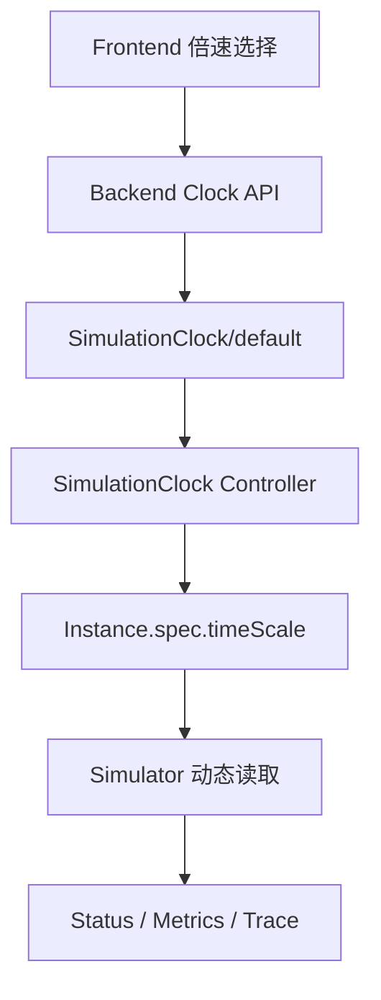

# Simulator 时间倍速控制链路

- 变更日期：2026-08-14
- 关联问题：Fixes #10
- 变更级别：P1 Simulator 运行控制
- 变更范围：CRD/API、Controller、Simulator、Dashboard Backend、Frontend、部署、测试和文档
- CRD 变化：新增 `SimulationClock`；`SimulatorInstance.spec` 新增 `timeScale`
- 数据库变化：无

## 1. 完成结果

用户可以在 Dashboard 选择 1x、2x、5x、10x 或 20x。配置经过 Backend 专用命令写入 Kubernetes，再由新的 SimulationClock Controller 同步到全部 SimulatorInstance；运行中的 Simulator 在下一真实 Tick 读取新值，不重建 Pod。

## 2. 时间语义

| 时间域 | 是否加速 | 说明 |
| --- | --- | --- |
| SimEngine 步长、请求到达、队列、TTFT、冷启动累计 | 是 | `simulationStep = realTick × timeScale`。 |
| Simulator Tick、Status、Metrics、Trace 发布频率 | 否 | 默认仍每 5 秒真实时间。 |
| Traffic/Performance/Orchestrator 周期与样本新鲜度 | 否 | 继续使用真实时间。 |
| 扩缩冷却、Lease、Prometheus scrape、DB snapshot | 否 | 避免倍速绕过控制面保护。 |
| Backend server/actual/logical time 与历史游标 | 否 | 当前仍是权威 UTC/快照浏览。 |

本次实现的是 Simulator 离散事件引擎加速，不是全系统逻辑时钟，也不包含 pause、Seek、分支或确定性回放。

## 3. 配置与收敛契约

- 集群唯一对象：`SimulationClock/default`。
- `spec.rate`：必填整数，默认 1，范围 1..20。
- Controller 缺失时自动创建 1x 默认对象。
- `status.observedGeneration/appliedRate/synchronizedInstances/totalInstances/conditions` 描述字段同步。
- Frontend 只有在 Clock 已收敛时允许下一次提交；resourceVersion 冲突要求重新读取。
- Clock Ready 代表 Instance 字段已同步；Simulator 进程已采用新值由 `hello_k8s_ai_simulator_time_scale` 指标确认。

## 4. 影响范围

| 模块 | 影响 |
| --- | --- |
| CRD | 新增第 11 个 CRD；Instance 增加带默认值的派生字段。 |
| Controller | 新增第 7 个 Reconciler，负责全局到实例的幂等扇出。 |
| Simulator | 固定真实 Tick 乘以倍速推进事件时间；动态修改不重启。 |
| Backend | 新增 Clock 写接口、收敛读模型、审计/幂等/并发保护和指标查询。 |
| Frontend | 新增倍速选择、能力/历史/收敛禁用逻辑和状态验证。 |
| Kubernetes/RBAC | Manager 可管理 Clock Status/实例字段；Backend 只可 create/update Clock，不可 delete/status。 |
| 数据库 | 无 schema 变化；已有快照 JSON 通过新增可选读模型字段向后兼容。 |

## 5. 资料入口

- [实现修改明细](IMPLEMENTATION_DETAILS.md)
- [升级与回滚](MIGRATION_AND_ROLLBACK.md)
- [测试报告](TEST_REPORT.md)

## 6. 明确未实现

- 没有加速 Controller cooldown、freshness 或 Lease。
- 没有让 Frontend 自行插值或伪造时间。
- 没有把 timeScale 写入 Deployment template，因此不会为改倍速触发 rollout。
- 没有新增数据库表、依赖、框架或独立时间服务。
- 没有解决 leader 切换时队列、随机数和累计模拟时间的 checkpoint；切换后仍重置。
