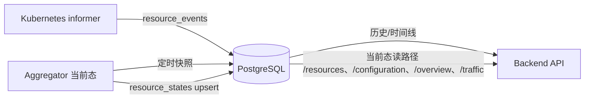

# 数据库生命周期自动化与当前态持久化读路径

- 变更日期：2026-08-16
- 关联问题：Fixes #12（Phase 1 + Phase 2 + Phase 3）
- 变更级别：P1 控制面数据库链路
- 变更范围：Dashboard Backend、部署清单、数据库 Schema、测试
- CRD 变化：无
- 数据库变化：新增 `resource_states` 表（003 迁移）；Backend 启动自动应用，无需人工建表

## 1. 完成结果

数据库生命周期改为"自动 + 可感知"：Backend 连接/迁移失败按退避重试（默认 6 次 × 5s，可配），启动日志明确打印已应用迁移数与历史数据量（含是否恢复历史）；Backend 部署增加 initContainer 等待 PostgreSQL 就绪，消除 CrashLoop；健康接口新增 `database` 详情（迁移数/事件数/快照数/当前态数）。当前态结构化入库：快照循环把聚合快照中的每个资源（Model/Tenant/WorkerNode/策略/实例/Traffic/Workloads）拆成 `resource_states` 行周期性 upsert。读路径切换（Phase 3）：`/configuration`、`/overview`、`/traffic` 的"最新当前态"改为数据库优先——从 `resource_states` 重建快照返回，存储不可用或记录为空时自动回退实时聚合；新增 `GET /api/v1/resources` 直接暴露当前态记录（kind/namespace/limit 过滤），数据库成为前端展示数据的持久化来源。

## 2. 数据链路

## 3. 关键行为

- 迁移：`migrations/001..003` 由 Backend 启动自动应用（`schema_migrations` 记录，幂等，advisory lock 防并发）。
- 重试：`DATABASE_STARTUP_RETRIES`（默认 6）、`DATABASE_STARTUP_BACKOFF`（默认 5s）；超过后按 `DATABASE_REQUIRED` 决定退出或降级。
- 启动日志：`PostgreSQL ready; history is persistent` + 迁移数/事件数/快照数/当前态数 + `historyRecovered`。
- 部署：Backend `initContainers.wait-for-postgresql` 用 `pg_isready` 等待数据库。
- 当前态：`UpsertResourceStates` 批量 upsert（`ON CONFLICT (kind, namespace, name)`），快照循环每 30s 执行；失败只记日志，不阻断控制面。
- 查询基础：`ListResourceStates(kind, namespace, limit)`（Store 层）与 `GET /api/v1/resources`（HTTP，`kind`/`namespace`/`limit` 过滤，默认 100 上限 1000）。
- 读路径：`snapshotFor` 无 `at` 参数时先尝试从 `resource_states` 重建当前态（`currentSnapshotFromRecords`，损坏记录跳过，`asOf` 取最新 `captured_at`）；存储不可用、记录为空或查询失败时回退 informer 实时聚合，前端无感降级。

## 4. 影响范围

| 模块 | 影响 |
| --- | --- |
| Backend config | 新增 `DATABASE_STARTUP_RETRIES` / `DATABASE_STARTUP_BACKOFF` |
| Backend store | 新增 `Status` / `UpsertResourceStates` / `ListResourceStates`；`StoreStatus`、`ResourceStateRecord` 类型 |
| Backend app | openDatabase 退避重试与启动日志；persistSnapshot 拆解当前态入库 |
| Backend API | 健康接口新增 `checks.database` 详情；新增 `GET /api/v1/resources`；当前态读路径数据库优先 |
| 部署 | backend.yaml 增加 initContainer |
| Schema | 新增 `resource_states` 表与索引（003） |
| 测试 | 新增 `TestPostgresLifecycle` 集成测试（TEST_DATABASE_URL） |

## 5. 资料入口

- [实现修改明细](IMPLEMENTATION_DETAILS.md)
- [升级与回滚](MIGRATION_AND_ROLLBACK.md)
- [测试报告](TEST_REPORT.md)

## 6. 剩余未验证

- 真实集群中 initContainer 等待行为未在集群部署验证（本机 kubectl 上下文是 CI 专用 Kind 集群，未部署）。
- 数据库优先读路径在真实多副本 Backend 下的行为未验证（本地为单实例集成测试）。