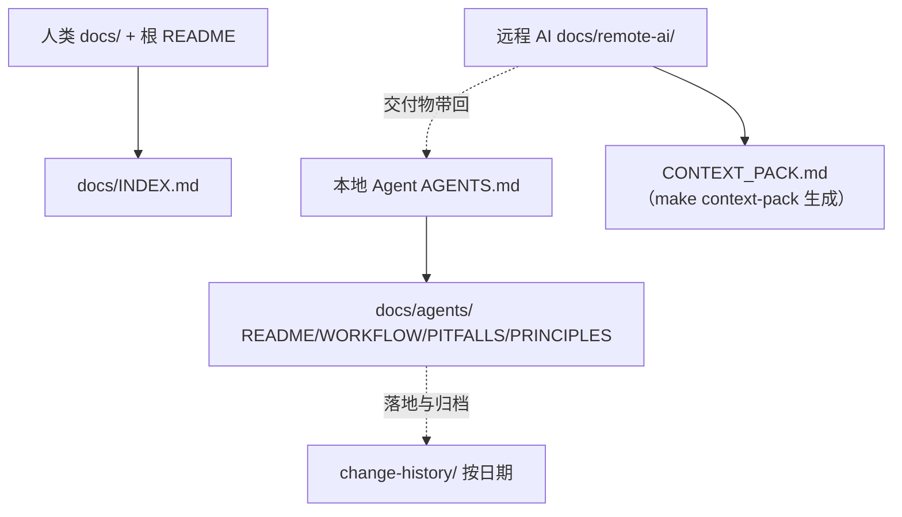

# 文档体系分层重构

- 变更日期：2026-08-16
- 关联问题：无（用户直接指示）
- 变更级别：P1 文档体系与 AI 协作方式
- 变更范围：docs、AGENTS.md、Makefile、hack、change-history
- CRD 变化：无
- 数据库变化：无

## 1. 完成结果

文档按读者分为三层：人类（`docs/` 与根目录 README）、本地 Agent（`AGENTS.md` + `docs/agents/`）、远程 AI（`docs/remote-ai/` + `make context-pack` 生成的上下文包）。`AI_CONTEXT.md` 拆为薄入口并保留基线速览；`change-history/` 全部纳入 git；新增工作流、踩坑清单、打包与链接校验脚本。

## 2. 分层职责

| 层 | 读者 | 入口 | 维护者 |
| --- | --- | --- | --- |
| 人类 | 开发与使用者 | 根 `README.md`、`docs/INDEX.md` | 人 + Agent 代笔 |
| 本地 Agent | 能操作本机仓库的 AI | `AGENTS.md`、`docs/agents/` | Agent，人审核 |
| 远程 AI | 只在自己工作区、收打包内容 | `docs/remote-ai/`，包内 `CONTEXT_PACK.md` | 人 + Agent 代笔，远程 AI 提建议 |

## 3. 迁移说明

- `docs/AI_CONTEXT.md` 第 3–7 节（约束/字段所有权/Controller 名称/目录/修改规范）→ `docs/agents/PRINCIPLES.md`。
- 第 8 节（已知易误判点）→ `docs/agents/KNOWN_PITFALLS.md`。
- 第 1–2 节（项目说明与状态基线）→ `AI_CONTEXT.md` 薄入口基线速览 + 上下文包模板。
- 第 9–10 节（验证基线/下一步）→ 指向 `change-history/` 与 `overview/CURRENT_STATUS_AND_ROADMAP.md`。

## 4. 新增能力

- `make context-pack`：生成远程 AI 上下文包（CONTEXT_PACK.md + 关键文件 + tar.gz，输出 `.runtime/context-pack/`，不提交）。
- `make docs-check`：校验仓库内 Markdown 相对链接与图片路径。
- `docs/agents/WORKFLOW.md`：Agent 从需求到汇报的完整流程（含 issue 决策）。
- `docs/agents/KNOWN_PITFALLS.md`：结构化踩坑记录（现象/原因/解决/验证/日期）。
- `change-history/` 全部纳入版本控制，交付必须追加条目。

## 5. 资料入口

- [实现修改明细](IMPLEMENTATION_DETAILS.md)
- [升级与回滚](MIGRATION_AND_ROLLBACK.md)
- [测试报告](TEST_REPORT.md)