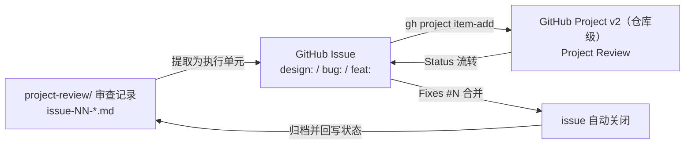

# Project Review 看板与任务闭环

> 维护层：agents ｜ 最后同步：2026-08-16 ｜ 对应变更：change-history/2026-08-16-project-review-repo-level/
> 定义 GitHub Issue、GitHub Project v2 看板（Project Review）与仓库 `project-review/` 审查记录三者之间的关联模型和批量闭环规则。单条任务的开发流程仍以 [WORKFLOW.md](WORKFLOW.md) 为准，本文件只负责"从审查记录到看板、再到交付归档"这一段。

## 1. 为什么需要三者关联

- `project-review/` 是静态审查事实源：记录问题现状、影响、根因与方向，不承载执行状态。
- GitHub Issue 是执行单元：按仓库模板（`design:` / `bug:` / `feat:`）建号，正文引用审查记录，合并时用 `Fixes #N` 自动关闭。
- GitHub Project v2（Project Review）是状态看板：卡片由 issue 链接生成，Status 字段驱动生命周期，让"谁在看、谁能改、做到哪了"一目了然。

三者缺一会断链：只有审查记录没有 issue，问题无法被跟踪和关闭；只有 issue 没有看板，批量闭环缺少审核关卡；只有看板没有审查记录，新 Agent 无法理解问题背景。

## 2. 关联模型



## 3. 编号与命名规则

| 环节 | 规则 | 示例 |
| --- | --- | --- |
| 审查记录 | `project-review/issue-NN-<slug>.md`，NN 从 01 递增 | `issue-01-placement-intent-not-enforced.md` |
| Issue 标题 | 仓库模板前缀 + 中文描述 | `design: 将控制策略参数从代码硬编码迁移至用户配置` |
| Issue 正文 | 模板字段 + 首段来源引用 | `来源审查：project-review/issue-03-model-score-source-missing.md` |
| 看板卡片 | 由 issue 链接生成，不建 draft | `gh project item-add` |

## 4. 状态机（Status 字段）

| Status | 含义 | 触发者 | Agent 可动代码 |
| --- | --- | --- | --- |
| To do | 已提出，等待人工审核 | Agent 建 issue 时默认 | 否 |
| In review | 审核中 | 用户开始查看 | 否 |
| Approved | 已批准，允许执行 | 用户放行 | 是 |
| In progress | 执行中 | Agent 开工 | 是 |
| Done | 完成并归档 | Agent 交付后 | 已完成 |

规则：

- 只允许操作 `Approved` 及之后的条目；`To do` / `In review` 一律不动代码。
- 每批上限 10 个；一批全部 `Done` 后归档（issue 关闭 + 卡片 `item-archive`），停下等用户放行下一批。
- 状态与 issue 状态同步：`Done` 对应 issue 关闭；其余状态对应 issue 打开。

## 5. 批量闭环流程

1. 扫描：从 `project-review/` 与代码中提取候选问题，建 issue 并链接卡片，状态置 `To do`。
2. 审核：用户把卡片置 `Approved`（或打回 `In review` 补充说明）。
3. 执行：Agent 只取 `Approved` 条目，按 WORKFLOW.md 开发与验证，开工置 `In progress`，提交 `Fixes #N`。
4. 交付：issue 自动关闭，卡片置 `Done`，追加 change-history 条目并按 SYNC.md 同步。
5. 归档：一批完成后 `item-archive` 归档卡片，汇报本批结果与下一批候选。


## 6. 命令速查（GraphQL）

项目是**仓库级** Project（显示在仓库 Projects 页面：`https://github.com/3900563672/hello-k8s-ai/projects`），gh CLI 的 `project` 命令只支持用户/组织级项目，因此操作统一走 GraphQL。关键 ID 稳定，但项目重建后会变化，以实际查询为准：

| 名称 | ID |
| --- | --- |
| Project | `PVT_kwHODN0KGM4BgfyL` |
| Status 字段 | `PVTSSF_lAHODN0KGM4BgfyLzhffKao` |
| To do | `9df36a4c` |
| In review | `94f66ce7` |
| Approved | `8e2917d8` |
| In progress | `86db6bc3` |
| Done | `98bd3af9` |

```bash
# 建 issue（正文用 --body-file 避免终端编码问题）
gh issue create --repo 3900563672/hello-k8s-ai --title "design: ..." --body-file /tmp/issue-body.md

# 取 issue 的 GraphQL node id
gh api repos/3900563672/hello-k8s-ai/issues/<number> --jq .node_id

# 添加 issue 到看板
gh api graphql -f query='mutation($projectId: ID!, $contentId: ID!) { addProjectV2ItemById(input: {projectId: $projectId, contentId: $contentId}) { item { id } } }' -F projectId=PVT_kwHODN0KGM4BgfyL -F contentId=<issue-node-id>

# 设置状态（如 Approved / In progress / Done），optionId 用上表
gh api graphql -f query='mutation($projectId: ID!, $itemId: ID!, $fieldId: ID!, $optionId: String!) { updateProjectV2ItemFieldValue(input: {projectId: $projectId, itemId: $itemId, fieldId: $fieldId, value: {singleSelectOptionId: $optionId}}) { projectV2Item { id } } }' -F projectId=PVT_kwHODN0KGM4BgfyL -F itemId=<item-id> -F fieldId=PVTSSF_lAHODN0KGM4BgfyLzhffKao -F optionId=<option-id>

# 查看看板卡片与状态（items/fieldValues 查询）
gh api graphql -f query='query { node(id: "PVT_kwHODN0KGM4BgfyL") { ... on ProjectV2 { items(first: 20) { nodes { ... on ProjectV2Item { content { ... on Issue { number title } } fieldValues(first: 8) { nodes { ... on ProjectV2ItemFieldSingleSelectValue { name } } } } } } } } }'
```

归档：issue 关闭（`gh issue close <number>`）+ 状态置 `Done`；不需要删除卡片。


## 7. 与 WORKFLOW.md 的衔接

- 单条任务仍走 WORKFLOW.md（影响面判断 → issue → 开发 → 验证 → 提交 → 归档 → 汇报）。
- 本文件只定义批量模式：从看板取任务、状态流转、审核关卡与归档节奏。
- 文档联动不变：CRD/API/行为变化 → 同步 docs 人类文档清单 + FIELD_OWNERSHIP + PRINCIPLES + change-history；纯内部优化 → 只归档。
