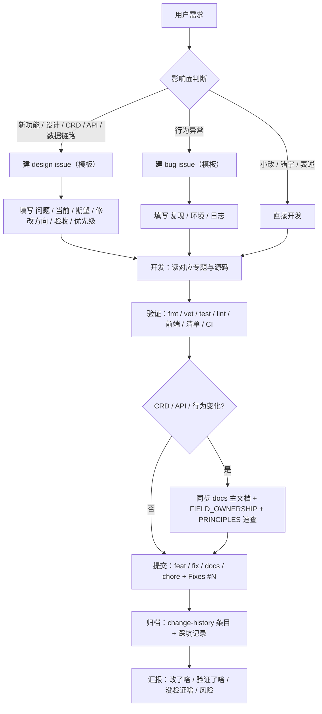

# Agent 工作流

> 维护层：agent | last-reviewed：2026-08-18 | 事实源：源码与 docs/agents/
> 本文件是能操作当前机器与仓库的 Agent 的默认流程。每次任务从"开工"走到"汇报"，不跳步。
> 只收打包内容的远程 AI 走 [docs/remote-ai/README.md](../remote-ai/README.md)。

## 总览



## 1. 开工

- 读 `AGENTS.md` 与 [docs/agents/README.md](README.md)。
- 按本文第 8 节解析任务五要素，缺项用默认假设补齐并在开工陈述中复述。
- 扫 [docs/journal/README.md](../journal/README.md) 与 [docs/lessons/README.md](../lessons/README.md)，确认没有已知坑影响本次任务。
- 记录任务目标与成功标准，避免做一半跑偏。

## 2. 需求分类与 issue 决策

| 情况 | 动作 |
| --- | --- |
| 只改小逻辑、文档错字、表述 | 直接开发，不建 issue |
| 新功能、新设计、数据链路、CRD/API 契约变化 | 建 design issue |
| 行为异常、集群问题 | 建 bug issue |

判断标准：是否改变对外契约（CRD 字段、API 路由、数据库结构、字段所有权）。不确定时先问用户，不擅自建 issue。

- issue 用仓库模板创建（标题前缀 `bug:` / `feat:` / `design:`，正文按模板填写）。
- 开发提交时用 `Fixes #N` 关联，让 issue 随合并自动关闭。

## 3. 开发

- 默认读 `docs/agents/` 文档与**源码**；`docs/` 人类专题仅按需作为背景，事实以源码、生成清单和可执行测试为准。
- 涉及 CRD/Controller/API 先核对 [PRINCIPLES.md](PRINCIPLES.md) 与 `docs/kubernetes/FIELD_OWNERSHIP.md`。
- 遵守 `AGENTS.md` 边界：Reconcile 幂等、保留 OwnerReference/finalizer/Watch/索引语义、不手改生成文件。
- 改动尽量最小、可回滚；不为风格统一做无关重构。

## 4. 验证（按影响面执行）

- Go 控制面：`make fmt`、`make vet`、`make test`、`make lint`。
- Dashboard Backend：`gofmt -w . && go vet ./... && go test ./...`。
- Frontend：`cd dashboard/frontend/my-app && npm ci && npm run check`。
- 清单渲染：`kubectl kustomize config/dev`、`config/demo`、`dashboard/deploy`。
- 一键启动 / 长跑前：先跑 `bash hack/preflight.sh`（FAIL 项必须修复才能启动；长跑由 `start-longrun.sh` 强制 `PREFLIGHT_REQUIRE_GUARD=1`）。
- 工具链自检：`make selfcheck`（已并入 `make verify`）——全部 `*.sh` `bash -n`、`hack/*.mjs` `node --check`、三套清单渲染；脚本类改动必须过此项。
- 文档：`make docs-check`；生成包：`make context-pack`。
- UI / 视觉验证：需要“看”页面或监控面板时，用 [UI_VERIFICATION.md](UI_VERIFICATION.md)，一条命令截图 + 读面板文本。
- CI：推送后等 workflow 全绿（代码检查 / 源码与部署验证 / E2E 测试；docs-only 改动只跑"文档检查"），轮询节奏见 4.1。
- 没有环境的项如实写"未验证"，禁止用旧结果或清单推断冒充。

## 4.1 CI 轮询节奏

- 推送后**立刻开始轮询，不要长 sleep 干等**：每 30 秒查一次，直到所有相关 run 有结论。
- 预期耗时：普通 job 3-6 分钟；E2E / 镜像构建最慢（冷缓存首次会更久），最多等到 10 分钟。
- 10 分钟仍无结论：先确认是失败、排队还是缓存冷启动，再决定重推或排查，并如实汇报。
- 常用命令：
  - `gh run list --limit 1`：看最新一次 push 的 run 与结论。
  - `gh run view <run-id> --json jobs --jq '.jobs[] | "\(.name): \(.conclusion)"'`：看每个 job 结论。
  - `gh run view <run-id> --log-failed`：失败时取失败 job 日志定位原因，不盲改重推。
- docs-only 提交只会触发"文档检查"；代码提交才会触发 lint / 单元测试 / E2E / 部署验证。

## 4.2 夜间长时运行

- 无人值守长时运行（维持 + 施压 + 采集 → 分析 + 修复）走 [hack/night-run/README.md](../../hack/night-run/README.md)。
- 由 Codex 桌面自动化触发：00:00 Phase A（只采集不推码）、04:30 Phase B（按决策矩阵处理，**全部走 PR 不推 main**，早上用户审阅合并）；非运行日自动空跑。
- Phase A 的问题档案在 `.runtime/night-run/<日期>/problems.md`（不入库）；Phase B 修完必须同步 `change-history/` 与受影响 docs。


### 4.2.1 长时运行结束必须清理（2026-08-17 硬步骤）

- 大负载/长时运行结束（无论成败）必须执行：① `make cluster-down`；② **删除长跑 `TenantModelPolicy`**（`kubectl delete tenantmodelpolicy <name>`，会自动删除 SimulatorInstance 与模拟器 Deployment；`replicas=0` 不是停止态，Orchestrator 会按流量把实例重新扩起来，见 docs/lessons/deploy-cluster-down-revive.md）；③ 验证 `kubectl get pods -n hello-k8s-ai-system` 只剩系统组件；④ 确认 Windows 空闲内存 ≥ 5GB、C 盘不被 pagefile 继续增长。
- `cluster-down` 只缩 Deployment 不删 CR：之后再 `kubectl apply` 全量清单会复活 controller 并按 CR spec 重建负载（见 docs/lessons/deploy-cluster-down-revive.md），必须先处理 CR。
- 任何一次因内存/环境问题的干预后，先读 docs/journal/2026-08-17-host-memory-governance.md 主题再动手。
## 5. 提交

- 提交信息：`feat:` / `fix:` / `docs:` / `chore:` / `refactor:` + 中文描述 +（`Fixes #N`）。
- 中文提交信息用文件方式（`git commit -F`），避免终端编码丢失（见 docs/lessons/process-chinese-commit-file.md）。
- UI / 面板视觉改动：提交前在条目 `change-history/<条目>/screenshots/` 下补 `before-<page>.png` 与 `after-<page>.png`（见 [UI_VERIFICATION.md](UI_VERIFICATION.md) 快照约定）。
- 提交前检查 `git status`：不提交 `.env`、`bin/`、`dist/`、`.runtime/`、覆盖率文件；`change-history/` 与文档改动记得一起提交。

## 6. 归档与同步

- 交付后必须在 `change-history/` 追加日期条目，四件套齐全：`README.md` + `IMPLEMENTATION_DETAILS.md` + `TEST_REPORT.md` + `MIGRATION_AND_ROLLBACK.md`，格式沿用现有条目。
- 详略规范：README 一页内概述"为什么改、改成什么、关键行为"；三个细节文件完整记录背景（改动前状态）、实现（文件与逻辑）、验证（命令与真实结果）、回滚与风险。禁止简写成一行结论；没有验证证据的写"未验证"。
- 按本文第 9 节执行同步：更新本目录受影响文档（踩坑 / 原则 / 流程）、重新生成上下文包、列出人类文档待同步清单。
- 人类文档（`docs/` 专题、`FIELD_OWNERSHIP.md`、白皮书）默认只在用户明确要求时代笔；但本次改动导致 README 或 `docs/` 中访问方式、架构、行为描述过期时，必须同步更新并纳入本次提交（硬约束，如端口收敛、入口变化、CRD 语义变化）。
- 交付前做文档漂移检查：`grep` README 与受影响专题中是否仍描述旧行为；过期即修或列入"人类文档待同步清单"。

## 7. 汇报

- 固定格式：改了什么 / 验证了什么（命令与结果）/ 没验证什么 / 真实风险（模板见本文第 8 节）。
- 涉及部署或集群的结论必须附验证证据；没有证据就写"未验证"。


## 8. 提示词协议（原 PROMPTING.md，2026-08-18 并入）

### 8.1 任务五要素解析

收到用户消息后，先显式提取五要素；缺项按默认假设补齐，并在开工陈述里复述：

| 要素 | 要问自己的问题 | 缺失时的默认假设 |
| --- | --- | --- |
| 目标 | 用户要达成的最终结果是什么？ | 按字面最小解释，不脑补扩展 |
| 边界 | 改哪里、不改哪里？哪些是禁区？ | 只动任务相关文件；不碰生成文件、不无关重构 |
| 约束 | 风格、规模、提交方式、是否先出方案？ | 保仓库风格；最小改动；中文提交；单 commit；模糊或高风险先给方案 |
| 验收 | 怎样算完成？ | 能跑的检查都跑：fmt / vet / test / lint / 前端 check / docs-check |
| 交付 | 汇报格式、是否提交推送、文档同步？ | 四段式汇报；按第 9 节归档；行为变化时同步人类文档 |

### 8.2 默认假设清单（用户没明说时使用）

1. **最小改动**：只解决任务本身，不做风格统一、改名、顺手重构。
2. **保风格**：注释语言、提交信息格式（`feat:` / `fix:` / `docs:` / `chore:` / `refactor:` + 中文 + `Fixes #N`）、目录结构都沿仓库现状。
3. **先方案后动手**：任务模糊、影响面大或用户说"先别改/你怎么看"时，只输出分析与方案，不写代码。
4. **验证再交付**：所有能本机执行的验证都执行；没有环境的项写"未验证"，禁止用旧结果冒充。
5. **四段式汇报**：改了什么 / 验证了什么（命令与结果）/ 没验证什么 / 真实风险。
6. **同步义务**：交付后按第 9 节登记 change-history、更新受影响文档、重新生成上下文包。
7. **单 commit**：一个逻辑闭环一个 commit；过程提交用 amend/squash 收敛。

### 8.3 澄清协议

- **能自己查证的不问**：代码、文档、git 历史能回答的问题，先查再动手。
- **必须问的三类情况**：目标冲突或明显歧义；权限不足；验证依赖外部状态（需要用户提供环境、账号或数据）。
- 提问用"我打算这样做 + 可选方案 + 默认选哪个"，不抛开放式问题。

### 8.4 开工陈述模板

```text
我理解任务：<目标>。
范围：<文件/模块>；不做：<明确排除项>。
约束：<最小改动 / 保风格 / 先方案 / 单 commit 等>。
计划：<步骤概览>。有偏差请打断我。
```

### 8.5 任务转交模板（给另一个 Agent / 远程 AI）

```text
仓库：<路径>；当前分支 <分支>；基线提交 <sha>。
任务：<目标>。
范围：<文件/模块清单；写权限边界>。
约束：<保仓库风格；最小改动；不改业务；单 commit>。
验证：<必须执行的命令清单>。
已知上下文：<相关 issue / change-history / 之前会话结论>。
交付：<提交并推送 / 只出 diff / 只出方案>；完成后汇报四段式。
```

转交远程 AI 时附 `make context-pack` 生成的全量包，并注明包生成时间（CONTEXT_PACK.md 顶部）。

### 8.6 交付检查清单（提交前逐项勾）

- [ ] 只包含任务范围内改动；`git status` 无意外文件（`.env` / `bin/` / `dist/` / `.runtime/` / 覆盖率文件）。
- [ ] 生成文件未手改；需要时通过 `make manifests generate YEAR=2026` 更新并核对差异。
- [ ] 能跑的验证都跑过，结果记录在汇报里。
- [ ] change-history 条目已建；README 索引已登记。
- [ ] 受影响文档已同步或列入"人类文档待同步清单"。
- [ ] 提交信息符合仓库风格；单 commit；关联 issue 用 `Fixes #N`。

## 9. 同步协议（原 SYNC.md，2026-08-18 并入）

### 9.1 谁维护什么

| 层 | 内容 | 维护者 |
| --- | --- | --- |
| human | `docs/` 专题（叙事 / 教程 / 白皮书） | 人；Agent 改代码时必须同步 MAP 映射文档（见第 4 节验证与 AGENTS.md） |
| agents | `docs/agents/` + `docs/journal/` + `docs/lessons/` | 本地 Agent，人审核 |
| remote-ai | `docs/remote-ai/` + 上下文包 | 人 + Agent 代笔；远程 AI 通过交付物提建议 |
| 时间线 | `change-history/` | Agent 每次交付追加条目 |

### 9.2 触发条件

- 任何代码、CRD、API、行为、部署方式的变更交付后。
- 文档自身结构或规则大改后。
- 发现文档漂移（README 或 `docs/` 描述与当前行为不一致，例如访问地址、架构边界、CRD 语义）。

### 9.3 同步步骤（Agent 每次交付后执行）

1. 追加 `change-history/YYYY-MM-DD-<主题>/` 条目（新条目单文件四 section：背景与决策 / 实现摘要 / 测试与验证 / 迁移与回滚；旧条目四件套不重写，两代格式并存，规范见 change-history/README.md）。
   - UI / 面板视觉改动：条目下附 `screenshots/before-<page>.png` 与 `after-<page>.png` 成对快照。
   - 详略规范：一页内概述"为什么改、改成什么、关键行为"；禁止简写成一行结论，无验证证据写"未验证"。
2. 更新受影响文档：踩了新坑 → `docs/journal/`（3-5 行流水账，定期蒸馏到 `docs/lessons/`）；契约或原则变化 → `PRINCIPLES.md`；流程变化 → 本文。
3. 按 docs/MAP.yaml 检查本次源码变更命中的映射文档，同一提交内同步（`make docs-check` 强制）。
4. 重新生成派生文件：`make docs-sync`（README 时间线段 / status.md / llms.txt / 所有权表）。
5. 核对 README 与受影响人类文档：访问方式、架构、行为类过期必须同提交修；其余过期项列"人类文档待同步清单"交给用户。
6. 提交信息与最终汇报中注明对应 `change-history/` 条目。

### 9.4 时间戳规则

- 每个受维护文档头部维护一行元数据：`> 维护层：<human|agent|remote> | last-reviewed：YYYY-MM-DD | 事实源：<源码路径>`。
- 变更只影响本层时，只更新本层时间戳；跨层影响按第 9.3 节执行。

### 9.5 给远程 AI 的同步义务

- 交付物必须带日期，并声明"基于的包生成时间"（`CONTEXT_PACK.md` 顶部）。
- 发现包内文档与源码不一致时，作为交付物列出差异，不静默按文档写代码。
- 对 `docs/agents/`、`docs/remote-ai/`、`docs/journal/`、`docs/lessons/`、`change-history/` 的建议可以直接给；对 `docs/` 人类文档的建议单独标注"人类文档"，由用户转交。

## 10. CI 轮询节奏（原 SYNC.md 第 7 节，2026-08-18 并入）

- 推送后每 30 秒轮询一次 run 结论（`gh run list` / `gh run view --json jobs`），**不要 sleep 到固定大间隔**（见 docs/lessons/process-ci-poll-30s.md）。
- 预期耗时：普通 job 3-6 分钟；E2E / 镜像构建最慢，冷缓存首次更久；最多等到 10 分钟再停下排查。
- 失败先取 `gh run view <run-id> --log-failed` 定位原因，不盲改重推；docs-only 提交只触发"文档检查"。
