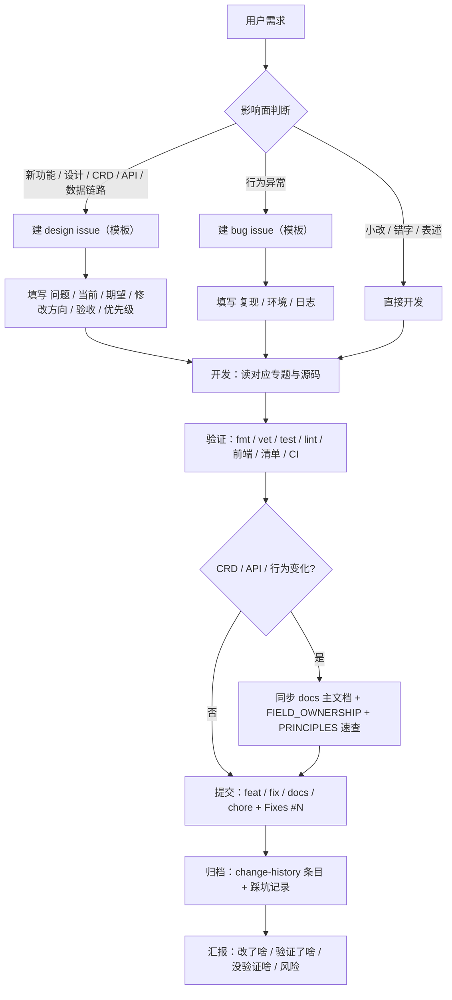

# Agent 工作流

> 维护层：agents ｜ 最后同步：2026-08-16 ｜ 对应变更：change-history/2026-08-16-ui-visual-verification/
> 本文件是能操作当前机器与仓库的 Agent 的默认流程。每次任务从"开工"走到"汇报"，不跳步。
> 只收打包内容的远程 AI 走 [docs/remote-ai/WORKFLOW.md](../remote-ai/WORKFLOW.md)。

## 总览

## 1. 开工

- 读 `AGENTS.md` 与 [docs/agents/README.md](README.md)。
- 读 [PROMPTING.md](PROMPTING.md)，按任务五要素解析目标，缺项用默认假设补齐并在开工陈述中复述。
- 扫 [KNOWN_PITFALLS.md](KNOWN_PITFALLS.md)，确认没有已知坑影响本次任务。
- 记录任务目标与成功标准，避免做一半跑偏。

## 2. 需求分类与 issue 决策

| 情况 | 动作 |
| --- | --- |
| 只改小逻辑、文档错字、表述 | 直接开发，不建 issue |
| 新功能、新设计、数据链路、CRD/API 契约变化 | 建 design issue |
| 行为异常、集群问题 | 建 bug issue |

判断标准：是否改变对外契约（CRD 字段、API 路由、数据库结构、字段所有权）。不确定时先问用户，不擅自建 issue。

- issue 用仓库模板创建（标题前缀 `bug:` / `feat:` / `design:`，正文按模板填写）。
- 开发提交时用 `Fixes #N` 关联，让 issue 随合并自动关闭。

## 3. 开发

- 默认读 `docs/agents/` 文档与**源码**；`docs/` 人类专题仅按需作为背景，事实以源码、生成清单和可执行测试为准。
- 涉及 CRD/Controller/API 先核对 [PRINCIPLES.md](PRINCIPLES.md) 与 `docs/kubernetes/FIELD_OWNERSHIP.md`。
- 遵守 `AGENTS.md` 边界：Reconcile 幂等、保留 OwnerReference/finalizer/Watch/索引语义、不手改生成文件。
- 改动尽量最小、可回滚；不为风格统一做无关重构。

## 4. 验证（按影响面执行）

- Go 控制面：`make fmt`、`make vet`、`make test`、`make lint`。
- Dashboard Backend：`gofmt -w . && go vet ./... && go test ./...`。
- Frontend：`cd dashboard/frontend/my-app && npm ci && npm run check`。
- 清单渲染：`kubectl kustomize config/dev`、`config/demo`、`dashboard/deploy`。
- 文档：`make docs-check`；生成包：`make context-pack`。
- UI / 视觉验证：需要“看”页面或监控面板时，用 [UI_VERIFICATION.md](UI_VERIFICATION.md)，一条命令截图 + 读面板文本。
- CI：推送后等 workflow 全绿（代码检查 / 源码与部署验证 / E2E 测试；docs-only 改动只跑"文档检查"），轮询节奏见 4.1。
- 没有环境的项如实写"未验证"，禁止用旧结果或清单推断冒充。

## 4.1 CI 轮询节奏

- 推送后**立刻开始轮询，不要长 sleep 干等**：每 30 秒查一次，直到所有相关 run 有结论。
- 预期耗时：普通 job 3-6 分钟；E2E / 镜像构建最慢（冷缓存首次会更久），最多等到 10 分钟。
- 10 分钟仍无结论：先确认是失败、排队还是缓存冷启动，再决定重推或排查，并如实汇报。
- 常用命令：
  - `gh run list --limit 1`：看最新一次 push 的 run 与结论。
  - `gh run view <run-id> --json jobs --jq '.jobs[] | "\(.name): \(.conclusion)"'`：看每个 job 结论。
  - `gh run view <run-id> --log-failed`：失败时取失败 job 日志定位原因，不盲改重推。
- docs-only 提交只会触发"文档检查"；代码提交才会触发 lint / 单元测试 / E2E / 部署验证。

## 5. 提交

- 提交信息：`feat:` / `fix:` / `docs:` / `chore:` / `refactor:` + 中文描述 +（`Fixes #N`）。
- 中文提交信息用文件方式（`git commit -F`），避免终端编码丢失（见 KNOWN_PITFALLS.md）。
- 提交前检查 `git status`：不提交 `.env`、`bin/`、`dist/`、`.runtime/`、覆盖率文件；`change-history/` 与文档改动记得一起提交。

## 6. 归档与同步

- 交付后必须在 `change-history/` 追加日期条目，四件套齐全：`README.md` + `IMPLEMENTATION_DETAILS.md` + `TEST_REPORT.md` + `MIGRATION_AND_ROLLBACK.md`，格式沿用现有条目。
- 详略规范：README 一页内概述"为什么改、改成什么、关键行为"；三个细节文件完整记录背景（改动前状态）、实现（文件与逻辑）、验证（命令与真实结果）、回滚与风险。禁止简写成一行结论；没有验证证据的写"未验证"。
- 按 [SYNC.md](SYNC.md) 执行同步：更新本目录受影响文档（踩坑 / 原则 / 流程）、重新生成上下文包、列出人类文档待同步清单。
- 人类文档（`docs/` 专题、`FIELD_OWNERSHIP.md`、白皮书）默认只在用户明确要求时代笔；但本次改动导致 README 或 `docs/` 中访问方式、架构、行为描述过期时，必须同步更新并纳入本次提交（硬约束，如端口收敛、入口变化、CRD 语义变化）。
- 交付前做文档漂移检查：`grep` README 与受影响专题中是否仍描述旧行为；过期即修或列入"人类文档待同步清单"。

## 7. 汇报

- 固定格式：改了什么 / 验证了什么（命令与结果）/ 没验证什么 / 真实风险（模板见 [PROMPTING.md](PROMPTING.md)）。
- 涉及部署或集群的结论必须附验证证据；没有证据就写"未验证"。
