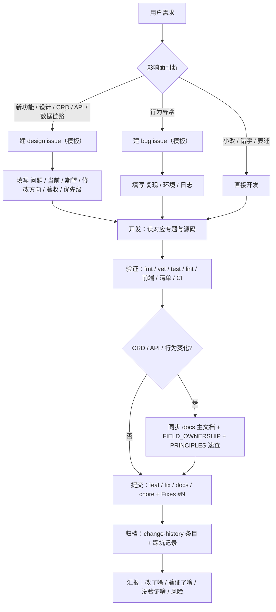

# Agent 工作流

> 本文件是能操作当前机器与仓库的 Agent 的默认流程。每次任务从"开工"走到"汇报"，不跳步。
> 只收打包内容的远程 AI 走 [docs/remote-ai/WORKFLOW.md](../remote-ai/WORKFLOW.md)。

## 总览

## 1. 开工

- 读 `AGENTS.md` 与 [docs/agents/README.md](README.md)。
- 扫 [KNOWN_PITFALLS.md](KNOWN_PITFALLS.md)，确认没有已知坑影响本次任务。
- 记录任务目标与成功标准，避免做一半跑偏。

## 2. 需求分类与 issue 决策

| 情况 | 动作 |
| --- | --- |
| 只改小逻辑、文档错字、表述 | 直接开发，不建 issue |
| 新功能、新设计、数据链路、CRD/API 契约变化 | 建 design issue |
| 行为异常、集群问题 | 建 bug issue |

判断标准：是否改变对外契约（CRD 字段、API 路由、数据库结构、字段所有权）。不确定时先问用户，不擅自建 issue。

- issue 用仓库模板创建（标题前缀 `bug:` / `feat:` / `design:`，正文按模板填写）。
- 开发提交时用 `Fixes #N` 关联，让 issue 随合并自动关闭。

## 3. 开发

- 按任务读 `docs/` 对应专题与源码；事实以源码、生成清单和可执行测试为准。
- 涉及 CRD/Controller/API 先核对 [PRINCIPLES.md](PRINCIPLES.md) 与 `docs/kubernetes/FIELD_OWNERSHIP.md`。
- 遵守 `AGENTS.md` 边界：Reconcile 幂等、保留 OwnerReference/finalizer/Watch/索引语义、不手改生成文件。
- 改动尽量最小、可回滚；不为风格统一做无关重构。

## 4. 验证（按影响面执行）

- Go 控制面：`make fmt`、`make vet`、`make test`、`make lint`。
- Dashboard Backend：`gofmt -w . && go vet ./... && go test ./...`。
- Frontend：`cd dashboard/frontend/my-app && npm ci && npm run check`。
- 清单渲染：`kubectl kustomize config/dev`、`config/demo`、`dashboard/deploy`。
- 文档：`make docs-check`；生成包：`make context-pack`。
- CI：推送后等三个 workflow（代码检查 / 源码与部署验证 / E2E 测试）全绿。
- 没有环境的项如实写"未验证"，禁止用旧结果或清单推断冒充。

## 5. 提交

- 提交信息：`feat:` / `fix:` / `docs:` / `chore:` / `refactor:` + 中文描述 +（`Fixes #N`）。
- 中文提交信息用文件方式（`git commit -F`），避免终端编码丢失（见 KNOWN_PITFALLS.md）。
- 提交前检查 `git status`：不提交 `.env`、`bin/`、`dist/`、`.runtime/`、覆盖率文件；`change-history/` 与文档改动记得一起提交。

## 6. 归档

- 交付后必须在 `change-history/` 追加日期条目：`README.md`（变更概述）、`IMPLEMENTATION_DETAILS.md`、`TEST_REPORT.md`、`MIGRATION_AND_ROLLBACK.md`，格式沿用现有条目。
- 若改了 CRD/API/行为：同步更新 `docs/` 主文档、`FIELD_OWNERSHIP.md`、[PRINCIPLES.md](PRINCIPLES.md) 速查、白皮书。
- 踩了新坑：追加 [KNOWN_PITFALLS.md](KNOWN_PITFALLS.md)。

## 7. 汇报

- 固定格式：改了什么 / 验证了什么（命令与结果）/ 没验证什么 / 真实风险。
- 涉及部署或集群的结论必须附验证证据；没有证据就写"未验证"。