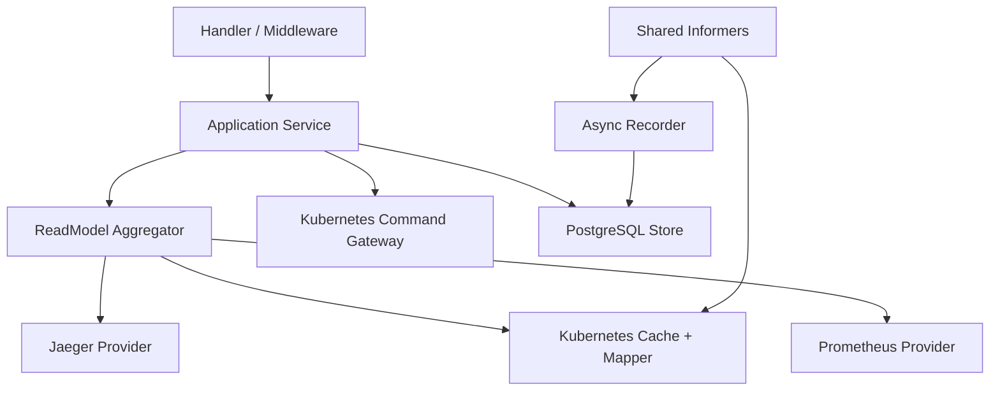
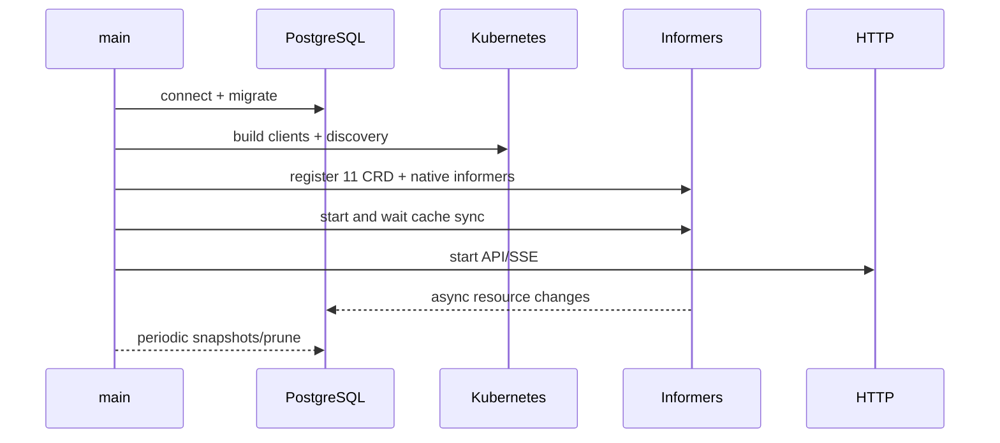

# Backend 架构

> 维护层：human | last-reviewed：2026-08-18 | 事实源：dashboard/backend/internal/kubernetes/、dashboard/backend/internal/api/ 等

## 1. Backend 的角色

Dashboard Backend 是 Backend-for-Frontend、Read Model Aggregator 和受控 Command Gateway。它把 Kubernetes 的领域对象、Prometheus 时间序列、Jaeger Trace 与 PostgreSQL 历史转换为页面可稳定消费的契约。

它不是：Controller、Scheduler、Prometheus/Jaeger 替代品或 Kubernetes 状态镜像数据库。Simulator 倍速的事实仍在 Kubernetes `SimulationClock`；Backend 只提供受控入口和读模型，不拥有进程内时间。

## 2. 分层

“Service” 在当前代码中由 `internal/app` 装配和 Handler/Aggregator/Gateway 组合承担，不一定存在名为 `service/` 的目录。文档描述职责边界，不虚构包。

| 层 | 当前包 | 责任 |
| --- | --- | --- |
| Entry/Config | `cmd/server`、`internal/config` | 环境变量、日志、启动/关闭、依赖装配。 |
| App | `internal/app` | 创建 client/cache/store/provider/server，启动顺序和 graceful shutdown。 |
| Handler/Middleware | `internal/api` | 路由、参数、strict JSON、envelope、CORS、request ID、timeout、recovery、SSE。 |
| Aggregator | `internal/readmodel` | 页面级 Configuration/Traffic/Workloads/Overview，跨源聚合和 partial。 |
| Kubernetes | `internal/kubernetes` | client、informer cache、unstructured mapper、写命令 gateway。 |
| Provider | `internal/providers/prometheus`、`jaeger` | 安全查询模板、外部 API、归一化、超时/缓存。 |
| Storage | `internal/store` | 迁移、snapshot、events、audit、idempotency、trace index、retention。 |
| Clock | `internal/clock` | authoritative UTC 当前时间，并投影 Kubernetes 中的 Simulator desired/applied rate 与收敛状态。 |
| DTO | `internal/model` | 对页面稳定的领域响应类型。 |

## 3. 启动顺序

实际实现可在 HTTP 启动与 cache 同步之间保留 liveness，但 readiness 必须反映 cache 是否就绪。PostgreSQL 是否阻止 readiness 由 `DATABASE_REQUIRED` 决定；命令依赖幂等/审计，DB 不可用时不可用。

## 4. Kubernetes Client

Backend 同时使用：

- Dynamic client：读取 11 个 CRD并写受控配置，避免复制根 module 的 Go API 包耦合。
- Typed client：Pod、Node、Service、Event、Deployment、ReplicaSet、Lease。
- Discovery：启动时读取 API Server 版本并放入 bootstrap/source metadata。

连接策略：未指定 kubeconfig 时尝试 in-cluster；本地使用 `KUBECONFIG` 与可选 context。默认 QPS 50、Burst 100，防止聚合页并发查询击穿 API Server。

## 5. Informer 与 Cache

### Watch 范围

| 类别 | 资源 |
| --- | --- |
| platform.study.com/v1 | 全部 11 个 CRD |
| core/v1 | Pod、Node、Service、Event |
| apps/v1 | Deployment、ReplicaSet |
| coordination.k8s.io/v1 | Lease |

默认 resync 10 分钟、初次 cache sync timeout 2 分钟。读 API 从内存 cache 获取最新态，不在每次页面请求直接 List API Server。

事件 Handler 比较 resourceVersion，产生 resource change，送往：

- SSE hub：通知客户端数据可能失效。
- Recorder：异步持久化 `resource_events`。
- Snapshot 仍由独立周期任务写，不为每个事件创建全量快照。

Recorder buffer 4096；满时记录 drop 并继续 informer，避免数据库阻塞 watch。这是可用性优先的取舍，也意味着 `resource_events` 不是无损事件溯源。

## 6. Mapper

Mapper 将 unstructured CR 和原生对象转换为稳定 DTO：

- 统一 metadata、resourceVersion、generation、timestamp、Condition。
- 把 quantities/durations 转为明确单位。
- 保留未知/缺失状态，而不是填假默认值。
- 通过 name、label、annotation、owner UID 关联 Tenant/Model/Instance/Deployment/Pod/Lease。
- 区分 desired（Spec）、observed（Status）、derived（展示计算）。

CRD 字段变化必须同步更新 Mapper tests；否则 API 仍能编译但页面可能静默丢字段。

## 7. ReadModel Aggregator

Aggregator 生成：

- Configuration：Model、WorkerNode、Tenant、Policy、Orchestrator、SimulationClock 及相关派生资源 metadata/status。
- Traffic：Tenant 请求、实例分配、性能与运行态。
- Workloads：CRD、Pod、Deployment、Node、Service、Lease、Event。
- CurrentSnapshot/Overview：上述数据 + metrics + traces + clock + source freshness。

无 `at` 或 `at` 距现在不超过约 2 秒时从 cache 构造；更旧时从 PostgreSQL 取最后一个 `captured_at <= at` 的 JSON snapshot。历史 snapshot 不再访问 cache 填补缺失字段。

Overview 对多个 Prometheus 查询和 Jaeger 查询并发 fan-out。可选 provider 失败设置 `partial=true` 和 warnings，Kubernetes 数据仍返回。

## 8. Provider

### Prometheus

- API 使用 `metricId`，不是任意 PromQL。
- 服务端 catalog 产生 query/query_range，限定 tenant/model/instance/node matcher。
- 时间窗口最大 7 天；step 5 秒至 1 小时；短时缓存 TTL 5 秒。
- 响应归一化为 series/points/unit/warnings。

### Jaeger

- 调用 Query HTTP API：services、traces、trace detail。
- 搜索窗口最大 24 小时，limit 1..100。
- 未提供 service 时发现最多 4 个 `hello-k8s-ai*` 服务。
- 归一化 Trace summary 与 Span tree；查询后写 `trace_index` 便于历史关联。

两者都必须有独立 timeout。Backend readiness 不应因为它们 disabled/unavailable 而失败，但 capabilities/overview 必须如实报告。

## 9. Command Gateway

通用配置可写 Kind：Model、WorkerNode、Tenant、TenantModelPolicy、TenantNodePolicy、ModelNodePolicy、Orchestrator。

Orchestrator 可写字段与 CRD 一致，含扩容步长 maxScaleUpBatch；白名单外字段会被 Backend 写接口拒绝。

`SimulationClock/default.spec.rate` 通过 `PATCH /clock/rate` 单独处理：只允许 1..20，支持缺失时创建、resourceVersion、dry-run、幂等与审计；不允许第二个 Clock、delete 或 Status 写入。

禁止：SimulatorInstance、TenantPerformance、TenantRuntime、所有 Status、Deployment、Pod、Lease。这些是 Controller/Simulator 派生状态。

写流程：

1. 严格解析命令，拒绝未知字段和超过 1MiB body。
2. 检查数据库可用，取得/创建幂等记录。
3. 对批次每个资源做 allowlist 和 Spec 字段过滤。
4. 使用 API Server dry-run 预验证全部对象。
5. 顺序 create/update/delete，并带 resourceVersion 防丢失更新。
6. 写 audit，保存 idempotent response。
7. 返回命令响应；Controller 结果随后通过 watch/SSE 回显。

注意：步骤 5 不是跨对象原子事务。前置 dry-run 降低中途失败，但不保证全有或全无。

## 10. PostgreSQL

数据库保存历史和可靠命令外围，不参与 Reconcile。默认 pool max 20、min 2；migration 嵌入二进制，在事务与 advisory lock 内执行。默认每 30 秒 snapshot、保留 720h（30 天），每日 prune。

DB 必需时不可用会导致 readiness 失败；即使配置可选，mutation 仍应禁用，因为无法完成幂等和审计保证。详见 [DATABASE_DESIGN.md](DATABASE_DESIGN.md)。

### Segment Sampler（issue #51）

`internal/segment.Sampler` 是独立后台 goroutine：轮询 `running` 切面，做事件分类（Orchestrator 扩缩决策 / SimulatorInstance spec / TimelineGap / 副本曲线 / 指标阈值）、Prometheus 指标分桶（1min min/avg/max/p95）、关键事件触发高保真窗口（5s，默认）并平静 60s 回基线（30s）。生命周期由 `/api/v1/experiments` API 推进；采样器自动发现与自愈（后端重启后恢复对残留 running 切面的采样），终态自动冲刷内存分桶。

## 11. 错误处理

- 所有响应有 requestId；日志使用结构化 JSON 并携带 request ID。
- HTTP problem 使用稳定 code/message/retryable/details，不返回 Go 内部堆栈。
- 参数/JSON 错误为客户端错误；provider timeout 可形成 partial；cache/required DB 不可用影响 readiness。
- Panic recovery 返回内部错误并记录；安全 headers 和显式 CORS origin 生效。
- SSE 不使用普通 write timeout；其他请求受配置 timeout 中间件约束。
- 冲突、幂等键重用但 payload 不同、未知 Kind、非法历史窗口必须是可区分错误。

## 12. 扩展规则

- 新页面先定义 Read Model，再决定来源；不要直接把 unstructured CR 暴露给 React。
- 新 metric 先加入服务端 catalog 与单位/维度，再开放 API。
- 新 mutation 先确认字段所有者、RBAC、dry-run、幂等、审计、冲突和恢复语义。
- 新 DB 表先写数据所有权、保留、备份和删除策略；不要用表绕过 Kubernetes。
