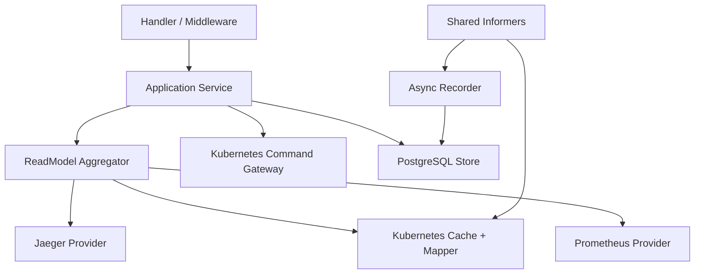
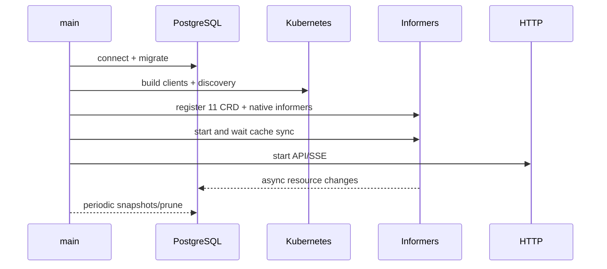

# Backend 架构

> 维护层：human | last-reviewed：2026-08-21 | 事实源：dashboard/backend/internal/kubernetes/、dashboard/backend/internal/api/ 等

## 1. Backend 的角色

Dashboard Backend 是 Backend-for-Frontend、Read Model Aggregator 和受控 Command Gateway。它把 Kubernetes 的领域对象、Prometheus 时间序列、Jaeger Trace 与 PostgreSQL 历史转换为页面可稳定消费的契约。

它不是：Controller、Scheduler、Prometheus/Jaeger 替代品或 Kubernetes 状态镜像数据库。Simulator 倍速的事实仍在 Kubernetes `SimulationClock`；Backend 只提供受控入口和读模型，不拥有进程内时间。

## 2. 分层

“Service” 在当前代码中由 `internal/app` 装配和 Handler/Aggregator/Gateway 组合承担，不一定存在名为 `service/` 的目录。文档描述职责边界，不虚构包。

| 层 | 当前包 | 责任 |
| --- | --- | --- |
| Entry/Config | `cmd/server`、`internal/config` | 环境变量、日志、启动/关闭、依赖装配。 |
| App | `internal/app` | 创建 client/cache/store/provider/server，启动顺序和 graceful shutdown。 |
| Handler/Middleware | `internal/api` | 路由、参数、strict JSON、envelope、CORS、request ID、timeout、recovery、SSE。 |
| Aggregator | `internal/readmodel` | 页面级 Configuration/Traffic/Workloads/Overview，跨源聚合和 partial。 |
| Kubernetes | `internal/kubernetes` | client、informer cache、unstructured mapper、写命令 gateway。 |
| Provider | `internal/providers/prometheus`、`jaeger` | 安全查询模板、外部 API、归一化、超时/缓存。 |
| Storage | `internal/store` | 迁移、snapshot、events、audit、idempotency、trace index、retention。 |
| Clock | `internal/clock` | authoritative UTC 当前时间，并投影 Kubernetes 中的 Simulator desired/applied rate 与收敛状态。 |
| DTO | `internal/model` | 对页面稳定的领域响应类型。 |

## 3. 启动顺序

实际实现可在 HTTP 启动与 cache 同步之间保留 liveness，但 readiness 必须反映 cache 是否就绪。PostgreSQL 是否阻止 readiness 由 `DATABASE_REQUIRED` 决定；命令依赖幂等/审计，DB 不可用时不可用。

## 4. Kubernetes Client

Backend 同时使用：

- Dynamic client：读取 11 个 CRD并写受控配置，避免复制根 module 的 Go API 包耦合。
- Typed client：Pod、Node、Service、Event、Deployment、ReplicaSet、Lease。
- Discovery：启动时读取 API Server 版本并放入 bootstrap/source metadata。

连接策略：未指定 kubeconfig 时尝试 in-cluster；本地使用 `KUBECONFIG` 与可选 context。默认 QPS 50、Burst 100，防止聚合页并发查询击穿 API Server。

## 5. Informer 与 Cache

### Watch 范围

| 类别 | 资源 |
| --- | --- |
| platform.study.com/v1 | 全部 11 个 CRD |
| core/v1 | Pod、Node、Service、Event |
| apps/v1 | Deployment、ReplicaSet |
| coordination.k8s.io/v1 | Lease |

默认 resync 10 分钟、初次 cache sync timeout 2 分钟。读 API 从内存 cache 获取最新态，不在每次页面请求直接 List API Server。

事件 Handler 比较 resourceVersion，产生 resource change，送往：

- SSE hub：通知客户端数据可能失效。
- Recorder：异步持久化 `resource_events`。
- Snapshot 仍由独立周期任务写，不为每个事件创建全量快照。

Recorder buffer 4096；满时记录 drop 并继续 informer，避免数据库阻塞 watch。这是可用性优先的取舍，也意味着 `resource_events` 不是无损事件溯源。

## 6. Mapper

Mapper 将 unstructured CR 和原生对象转换为稳定 DTO：

- 统一 metadata、resourceVersion、generation、timestamp、Condition。
- 把 quantities/durations 转为明确单位。
- 保留未知/缺失状态，而不是填假默认值。
- 通过 name、label、annotation、owner UID 关联 Tenant/Model/Instance/Deployment/Pod/Lease。
- 区分 desired（Spec）、observed（Status）、derived（展示计算）。

CRD 字段变化必须同步更新 Mapper tests；否则 API 仍能编译但页面可能静默丢字段。

## 7. ReadModel Aggregator

Aggregator 生成：

- Configuration：Model、WorkerNode、Tenant、Policy、Orchestrator、SimulationClock 及相关派生资源 metadata/status。
- Traffic：Tenant 请求、实例分配、性能与运行态。
- Workloads：CRD、Pod、Deployment、Node、Service、Lease、Event。
- CurrentSnapshot/Overview：上述数据 + metrics + traces + clock + source freshness。

无 `at` 或 `at` 距现在不超过约 2 秒时从 cache 构造；更旧时从 PostgreSQL 取最后一个 `captured_at <= at` 的 JSON snapshot。历史 snapshot 不再访问 cache 填补缺失字段。

Overview 对多个 Prometheus 查询和 Jaeger 查询并发 fan-out。可选 provider 失败设置 `partial=true` 和 warnings，Kubernetes 数据仍返回。

## 8. Provider

### Prometheus

- API 使用 `metricId`，不是任意 PromQL。
- 服务端 catalog 产生 query/query_range，限定 tenant/model/instance/node matcher。
- 时间窗口最大 7 天；step 5 秒至 1 小时；短时缓存 TTL 5 秒。
- 响应归一化为 series/points/unit/warnings。

### Jaeger

- 调用 Query HTTP API：services、traces、trace detail。
- 搜索窗口最大 24 小时，limit 1..100。
- 未提供 service 时发现最多 4 个 `hello-k8s-ai*` 服务。
- 归一化 Trace summary 与 Span tree；查询后写 `trace_index` 便于历史关联。

两者都必须有独立 timeout。Backend readiness 不应因为它们 disabled/unavailable 而失败，但 capabilities/overview 必须如实报告。

## 9. Command Gateway

通用配置可写 Kind：Model、WorkerNode、Tenant、TenantModelPolicy、TenantNodePolicy、ModelNodePolicy、Orchestrator。

Orchestrator 可写字段与 CRD 一致，含扩容步长 maxScaleUpBatch；白名单外字段会被 Backend 写接口拒绝。

`SimulationClock/default.spec.rate` 通过 `PATCH /clock/rate` 单独处理：只允许 1..20，支持缺失时创建、resourceVersion、dry-run、幂等与审计；不允许第二个 Clock、delete 或 Status 写入。

禁止：SimulatorInstance、TenantPerformance、TenantRuntime、所有 Status、Deployment、Pod、Lease。这些是 Controller/Simulator 派生状态。

写流程：

1. 严格解析命令，拒绝未知字段和超过 1MiB body。
2. 检查数据库可用，取得/创建幂等记录。
3. 对批次每个资源做 allowlist 和 Spec 字段过滤。
4. 使用 API Server dry-run 预验证全部对象。
5. 顺序 create/update/delete，并带 resourceVersion 防丢失更新。
6. 写 audit，保存 idempotent response。
7. 返回命令响应；Controller 结果随后通过 watch/SSE 回显。

注意：步骤 5 不是跨对象原子事务。前置 dry-run 降低中途失败，但不保证全有或全无。

## 10. PostgreSQL

数据库保存历史和可靠命令外围，不参与 Reconcile。默认 pool max 20、min 2；migration 嵌入二进制，在事务与 advisory lock 内执行。默认每 30 秒 snapshot、保留 720h（30 天），每日 prune。

DB 必需时不可用会导致 readiness 失败；即使配置可选，mutation 仍应禁用，因为无法完成幂等和审计保证。详见 [DATABASE_DESIGN.md](DATABASE_DESIGN.md)。

### Segment Sampler（issue #51）

`internal/segment.Sampler` 是独立后台 goroutine：轮询 `running` 切面，做事件分类（Orchestrator 扩缩决策 / SimulatorInstance spec / TimelineGap / 副本曲线 / 指标阈值）、Prometheus 指标分桶（1min min/avg/max/p95）、关键事件触发高保真窗口（5s，默认）并平静 60s 回基线（30s）。生命周期由 `/api/v1/experiments` API 推进；采样器自动发现与自愈（后端重启后恢复对残留 running 切面的采样），终态自动冲刷内存分桶。

## 11. 错误处理

- 所有响应有 requestId；日志使用结构化 JSON 并携带 request ID。
- HTTP problem 使用稳定 code/message/retryable/details，不返回 Go 内部堆栈。
- 参数/JSON 错误为客户端错误；provider timeout 可形成 partial；cache/required DB 不可用影响 readiness。
- Panic recovery 返回内部错误并记录；安全 headers 和显式 CORS origin 生效。
- SSE 不使用普通 write timeout；其他请求受配置 timeout 中间件约束。
- 冲突、幂等键重用但 payload 不同、未知 Kind、非法历史窗口必须是可区分错误。

## 12. 扩展规则

- 新页面先定义 Read Model，再决定来源；不要直接把 unstructured CR 暴露给 React。
- 新 metric 先加入服务端 catalog 与单位/维度，再开放 API。
- 新 mutation 先确认字段所有者、RBAC、dry-run、幂等、审计、冲突和恢复语义。
- 新 DB 表先写数据所有权、保留、备份和删除策略；不要用表绕过 Kubernetes。
## 13. AIOps 智能分析层（#92/#93，M0+M1）

- 模块 `internal/aiops/`：Service（worker 轮询 pending 分析）+ OpenAI 兼容 LLM Provider（json_object 强制、429/5xx 重试、4xx 不重试、预算硬限制）+ 硬指标打分/规则兜底。
- 触发：实验 complete/fail 时 `EnqueueAnalysis(segmentID)`，`aiops_analyses.segment_id` 唯一保证幂等。
- 状态机：`pending → running(L1) → aggregating(L2) → completed/failed`，`l1_done/l1_total` 进度落库（前端可显示）；失败按 `attempts` 重试（`AIOPS_MAX_ATTEMPTS_PER_ANALYSIS` 默认 2，claim 时 +1），未达上限回 `pending` 下轮重试，达上限落 `failed`。
- L1 全量覆盖：实体批量一次 LLM 调用（固定 JSON schema），LLM 失败用规则兜底补齐，单实体失败不影响其它。
- L2 混合打分：硬指标（错误率/TTFT p95/QPS 达成/事件数/重启数）规则先算，LLM 基于 L1 摘要 + 硬指标出分；分维度 goal/stability/efficiency/anomaly + overall + verdict + reason。
- 预算：单次分析 LLM 调用 ≤ `AIOPS_MAX_CALLS_PER_ANALYSIS`（默认 8）、单次 ≤ `AIOPS_MAX_TOKENS_PER_CALL`；启动回收 stale（`AIOPS_STALE_REQUEUE_INTERVAL` 默认 10min）。
- 单向依赖：只读 segments 数据 + 写 `aiops_*` 表，不反向依赖其它模块。
- 运行时开关（面板 `POST /aiops/settings` 的 `enabled`，仅服务端内存）：关闭后 `EnqueueAnalysis` 直接短路，实验照常完成但不入队分析；重启恢复部署级启用态。
- M2 意图执行（#94）：`internal/aiops/command.go` 解析一句话 → 结构化意图（LLM 严格 JSON + 模板目录校验，编造 id 拒绝）；`POST /aiops/commands` 落库 parsed，`confirm` 时 gate 校验（节点/租户必须存在）后按序执行：写流量（`SetTenantQPS`）→ 调倍速（`SetSimulationRate`）→ 创建并启动实验（store + aggregator 快照），每步追加 `steps`，任一失败整体 `failed`。执行编排在 api 层复用既有写通道，不新增越权入口。
- M3 时间聚合（#95）：`aggregator.go` 定时把窗口内切面 L2 总结聚合为 L3 窗口认知、当日 L3 聚合为 L4 日总结（LLM + 规则兜底，Upsert 幂等，已结束窗口跳过）；`alerts.go` 对分数序列跑规则（连续低分/趋势下滑），触发写 `aiops_alerts`（alert_id 由规则+切面+窗口派生，幂等）。粒度/阈值可配置：`AIOPS_WINDOW_GRANULARITY`、`AIOPS_ALERT_THRESHOLD`、`AIOPS_ALERT_CONSECUTIVE`。
- 同步对话（#110 阶段二）：`chat.go` 组装「结论型」上下文（最近 L3 窗口总结 / 最近警戒 / 最近已完成分析分数，目标 ≤6000 字符），`POST /aiops/chat` SSE 流式返回（lifecycle/tool/text 事件，AG-UI 轻量子集）；`llm.go` 新增流式调用（stream=true 逐 delta 回调）。限制：消息 ≤ `AIOPS_CHAT_MAX_MESSAGE_LEN`（默认 4000）、按会话限流 `AIOPS_CHAT_RATE_PER_MINUTE`（默认 6 次/分钟）、模型白名单 `AIOPS_CHAT_MODELS`（默认仅 `AIOPS_MODEL`）。
- 面板配置与调用审计（#110 阶段四）：`Settings`/`ConfigureLLM` 提供掩码状态与运行时写入（`configMu` 保护，key 仅存内存，重启由环境变量恢复）；`GET/POST /aiops/settings` 暴露掩码态，key 不落库不回显。`AuditChat` 在流式对话结束后写 `aiops_audit_log`（模型/耗时/消息长度/token 用量/结果；流式请求带 `stream_options.include_usage`，从末 chunk usage 解析），审计失败只记日志，不影响对话主流程。日配额（#124）：`CheckDailyQuota` 按 `aiops_audit_log.created_at` 统计 24h 调用次数与 token 总量，对话入口超限返回 429 `DAILY_QUOTA_EXCEEDED`，分析入队短路跳过、执行前拒绝；上限 `AIOPS_DAILY_MAX_CALLS`（默认 300）与 `AIOPS_DAILY_MAX_TOKENS`（默认 2,000,000）。
- 异步任务可见性（#110 阶段一）：`aiops_jobs` 表即队列（segment 唯一、幂等入队，job_id 复用 analysis_id），worker 每轮用 `FOR UPDATE SKIP LOCKED` 认领 pending（attempts+1/started_at），收尾回写 done/failed + finished_at + last_error；启动时 `RequeueStaleAIOpsJobs` 回收崩溃遗留。`GET /aiops/jobs`（独立 handler，与 analyses 列表解耦）暴露状态，前端「异步任务」区块 10s 轮询。
- 提示词工程化（#112 阶段 A/B）：提示词模板迁入 `internal/aiops/prompts/`（go:embed + 每层版本 + 渲染 sha256 哈希，调用日志记录版本/哈希）；每层输出过运行时 schema 校验（枚举/范围/长度，`schema.go`），解析或校验失败重试 1 次再规则兜底，失败原因记日志；`CompleteJSON` 返回非流式 usage（token 用量），每次调用结构化日志记录；每层输入预算与截断优先级「分数 > 结论 > 现象 > 事件」（L2 摘要区 4000 rune、L3 ≤24 子级、L4 ≤96 窗口、对话上下文 6000 rune，裁剪记日志）。阶段 C 收口：上下文组装器统一收口（`assembler.go`，L1/L2/聚合/对话都走预算与截断），对话检索器补充最近意图命令（`recentCommands`）；生成参数分层（分析层 temperature 0.1、对话层 0.5，0 省略走服务端默认）。阶段 D 对话追溯：`POST /aiops/chat` 回答成功后写 `aiops_chat_messages`（user+assistant 两条，assistant 携带引用的 window/alert/command ID 数组，失败只记日志不影响响应）；读侧 `GET /aiops/chat/messages`（sessionId 必填 + limit 1..200，按时间正序）供前端打开面板时回填历史，存储不可用时不阻塞对话主流程。

