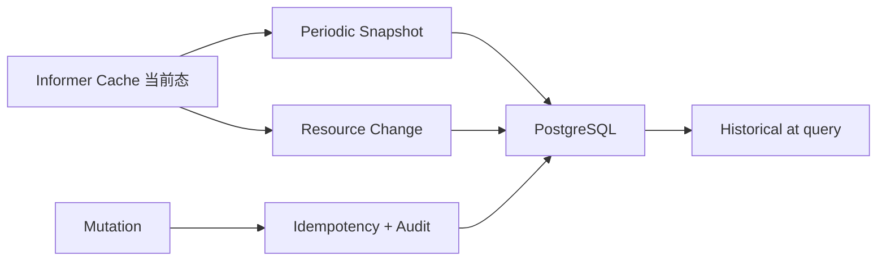

# Database 设计

> 维护层：human | last-reviewed：2026-08-21 | 事实源：dashboard/backend/internal/store/、dashboard/backend/deploy/

## 1. 角色和边界

PostgreSQL 是 Dashboard 的历史、审计和可靠命令辅助存储。它回答“过去采集到什么、谁提交过什么、该幂等键是否执行过”，不回答“当前 CR/Pod 真相是什么”。

Controller 不读该数据库。DB 恢复到旧备份不会回滚 Kubernetes；Kubernetes 当前态也不会自动恢复丢失的审计历史。

## 2. 连接与迁移

- driver/pool：pgx v5。
- 默认 pool：max 20、min 2（以 config 源码为准）。
- migrations 嵌入 Backend binary。
- 启动时在事务内获得 advisory lock，按版本顺序执行，写 `schema_migrations`。
- `DATABASE_REQUIRED=true` 时连接/迁移失败阻止 readiness。

迁移必须向前兼容滚动部署：先加 nullable/default 字段，再部署读写代码，最后清理旧字段。单实例 dev 不能证明多副本滚动安全。

## 3. 表说明

### `schema_migrations`

记录 migration version 和应用时间。它证明 schema 版本，不证明业务数据完整。

### `resource_events`

保存 informer 观察到的对象变更：resource identity、resourceVersion、event type、payload/时间等。

用途：诊断资源变化、构建轻量事件时间线。限制：Recorder 缓冲满会 drop，Kubernetes watch/resync 也不是永久事件日志，因此不能当无损审计或确定性 event sourcing。

### `resource_snapshots`

按 `captured_at` 保存完整 `CurrentSnapshot` JSON。默认每 30 秒采集，查询旧 `at` 时选 `captured_at <= at` 的最新一条。

用途：历史页面与 replay frame。限制：两个快照之间的短暂状态可能不可见；JSON schema 随应用演进，需要兼容解码/版本字段。

### `audit_log`

保存写命令与结果，用于回答何时对哪个资源做了什么。生产化前必须加入经过认证的 actor、来源/IP/tenant scope 和数据脱敏策略。

### `trace_index`

保存 Backend 查询/观察到的 Trace 元数据，便于和资源/时间关联。它不是 Span 存储；Trace 详情仍来自 Jaeger。Jaeger 数据丢失后索引可能只剩元数据。

`segment_id`（可空，幂等加列）把切面窗口内观察到的 Trace 关联到实验归档；实验结束时 Backend 检索一次 Jaeger 并回填关联，历史 Trace 不重复回填（`segment_id IS NULL` 时才更新）。

### `clock_state`

为未来权威逻辑时钟预留。当前运行时没有以该表驱动 pause/rate/seek；Simulator 倍速来自 Kubernetes `SimulationClock`，不从数据库读取。不要因表存在就宣称全系统逻辑时间已实现。

### `segments`

切面生命周期主表（issue #51）：一次调度实验的不可变归档单元。`status` 取值 `pending`（配置快照已记录）→ `running`（混合采样进行中）→ `completed` / `failed`（终点快照 + 摘要）→ 封存只读。`config_snapshot` 在创建时定格；`start_snapshot` / `end_snapshot` 是实验开始/结束时刻的完整全局快照；`summary` 汇总时长、事件计数与分桶数。生命周期只由 API 层推进，采样器只读 `running` 状态。

### `segment_events`

切面内事件（六类：`decision` / `alert` / `error` / `gap` / `burst` / `phase_change`），每条带事件时间、实体与精简 payload。Pod 个体事件不进切面——切面记录群体演化，防止 0→几百 Pod 的事件风暴。数据来源：Orchestrator `lastScaling`（扩缩决策，按指纹去重）、SimulatorInstance spec 变化、TimelineGap 记录、副本数曲线差异、指标阈值（错误率 / TTFT）。

### `segment_metrics`

切面内指标聚合：1 分钟桶的 `min/max/avg/p95`，按 `(segment_id, metric_name, bucket_start)` 幂等 upsert。混合采样器在基线模式（默认 30s）与高保真窗口（默认 5s）下持续拉取 Prometheus 并累积分桶；重叠查询按秒去重，防止同一采样点重复计入。

记录 idempotency key、请求指纹、pending/completed 状态和序列化响应。默认约 24h 保留：

- 相同 key/请求可重放响应。
- key 已存在但 fingerprint 不同则冲突。
- pending 的崩溃恢复语义需结合实现与测试继续加强。

### AIOps 表（`005_aiops.sql`，M0+M1；M2/M3 启用其余）

| 表 | 作用 |
| --- | --- |
| `aiops_analyses` | 切面分析主记录：状态机 + L1 进度 + `scores`/`summary` JSONB。 |
| `aiops_entity_summaries` | L1 实体总结（analysis_id + entity_kind/entity_name 唯一）。 |
| `aiops_window_summaries` | L3/L4 时间聚合（M3 启用，level 字段区分）。 |
| `aiops_alerts` | 持续低分警戒（M3 启用）。 |
| `aiops_commands` | 意图执行记录（M2 启用，状态机 parsed→confirmed→gate→executing→verified→done/rejected/failed）。 |
| `aiops_audit_log` | 同步对话调用审计（#110 阶段四：模型/耗时/消息长度/token 用量/结果，009 迁移补 prompt/completion 列）。 |
| `aiops_jobs` | 异步任务队列（#110 阶段一：segment 唯一、status/attempts/last_error/起止时间，SKIP LOCKED 认领）。 |
| `aiops_chat_messages` | 对话问答对（#112 阶段 D，010 迁移：session_id + role + content + 引用的 window/alert/command ID JSONB，按会话倒序检索最近 N 条）。 |

写入方主要是 `internal/aiops/`（worker）；`aiops_audit_log` 由同步对话（M4）在流结束后写入；`aiops_chat_messages` 由对话回答成功后写入（`ChatRecord`，user+assistant 两条），`aiops_jobs` 由 worker 认领/回写（DB 即队列），API 其余只读。数据所有权见 FIELD_OWNERSHIP/总纲 #92：分析结果不反向驱动 Controller。M2 意图命令由用户确认后执行（steps JSONB 记录每步结果）；M3 窗口/警戒为定时产出，`aiops_alerts.alert_id` 幂等（同规则+切面+窗口不重复触发）。

## 4. 写入路径

### Segment Sampler

`internal/segment.Sampler` 是唯一向 `segments` 三张子表写入的运行时组件（生命周期状态由 API 层写）。它以最小节拍轮询 `running` 切面：事件分类、快照副本数差异、Prometheus 指标分桶；检测到关键事件（决策/告警/错误/gap/突变）后进入高保真窗口，平静后回基线。后端重启会自动恢复对残留 `running` 切面的采样（自愈），终态切面由采样器冲刷内存分桶后停止跟踪。

### Resource Recorder

Informer callback 只做非阻塞 enqueue；后台 worker 批量/异步写 DB。队列大小 4096，满时 log/drop，优先保证 cache 不被 DB 拖住。

运营上应新增：queue depth、drop counter、write latency、DB error 指标和告警；否则 resource_events 缺口可能无声发生。

### Snapshotter

按间隔从 Aggregator/Cache 获取完整当前 snapshot 并插入。快照写入失败不应停止控制面，但会造成历史空洞，Backend 必须在 replay timeline 和 warnings 中体现。

### Command transaction

幂等与 audit 使用 DB；Kubernetes 写入是外部副作用，无法和 PostgreSQL 一笔 ACID 事务提交。正确语义是可恢复 saga：记录 pending -> 调 K8s -> 保存结果。当前实现提供基本幂等，但生产前应测试 Backend 在每个断点崩溃的恢复行为。

## 5. Retention

当前默认 snapshot retention 720h（30 天），每日 prune。Prometheus/Jaeger dev retention 均为 168h（PVC），因此同一个历史时间点仍可能只有 Kubernetes snapshot，没有指标或 Trace（例如服务当时未运行或保留期已过）。

容量规划应根据：

- CR/Pod/Event 数量和 snapshot JSON 大小。
- 30 秒采样频率（每日 2,880 个 snapshot）。
- resource event 变更率。
- audit 与 idempotency 流量。
- index/TOAST/vacuum 开销。

生产建议：snapshot 压缩或规范化/分区、时间索引、分层 retention、autovacuum 观测、归档导出。

## 6. 备份与恢复

当前清单未提供备份。生产最低要求：

1. 定义 RPO/RTO。
2. 自动 base backup + WAL/PITR 或托管 PostgreSQL。
3. 备份加密、访问控制、异地副本。
4. 定期在隔离环境做恢复演练。
5. 恢复后将 DB 历史与 Kubernetes 当前态标注为不同时间线，不自动反向写集群。

恢复验证应覆盖 migration、snapshot 解码、audit、idempotency 过期和 Backend readiness。

## 7. 高可用与安全

开发清单的单 PostgreSQL StatefulSet + RWO PVC 不是 HA。生产应使用托管服务或成熟 Operator，至少具备多副本、自动 failover、TLS、Secret rotation、NetworkPolicy、PDB 和监控。

不得继续使用 `change-me-before-production`；不要把真实 DATABASE_URL 提交到 Git。`sslmode=disable` 仅限受控本地环境。

## 8. Schema 演进规则

- 每个 snapshot 添加明确 schema/version 或保持宽容解码。
- 大字段迁移采用在线策略，避免锁表。
- 删除前确认 retention 窗口内旧 Backend 是否仍读取。
- migration 必须有升级测试；关键变更还需恢复/回滚计划。
- 数据修复脚本需要审计、dry-run 和幂等，不在启动路径偷偷重写历史。
