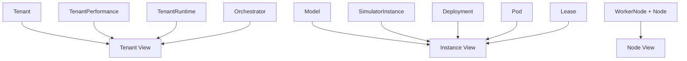
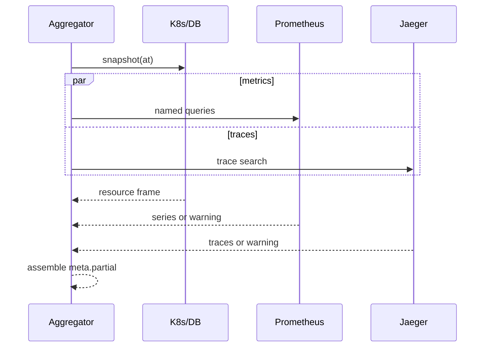

# 数据聚合

## 1. 聚合目标

前端不应理解 11 个 CRD、OwnerReference、Pod label、PromQL 和 Jaeger raw span。Aggregator 将这些来源转换为页面读模型，同时保留来源、新鲜度和不完整性。

## 2. 当前态聚合



关联优先级：

1. UID/OwnerReference（生命周期最可靠）。
2. 平台 labels/annotations（跨资源身份）。
3. 明确 Spec references，如 tenantRef/modelRef/nodeRef。
4. 约定名称仅作为补充，不能替代 UID 防止同名重建串线。

## 3. 主要派生值

| 值 | 公式/来源 | 注意 |
| --- | --- | --- |
| free GPU | WorkerNode.spec.gpu - status.usedGPU | 业务单位，不是真实设备 telemetry。 |
| free concurrency | spec.maxConcurrency - status.usedConcurrency | 使用量由 scheduled simulator Pods 推算。 |
| instance freshness | now - status.observedAt | 控制器新鲜窗口约 30s；UI 可分层显示。 |
| desired/available gap | spec.replicas - status.availableReplicas | Pending 不一定是错误，需看 Deployment/Pod/Event。 |
| allocated QPS sum | Σ instance.spec.traffic.qps | 应等于 Tenant.spec.qps，特殊过渡期可短暂不一致。 |
| Tenant SLO state | TenantPerformance 与 up/down 阈值比较 | 扩容使用 OR（任一高）；缩容正常使用 BOTH 低。 |
| cooldown remaining | lastScaleUp/Down + cooldown - now | 使用真实墙钟；不受 Simulator timeScale 影响。 |
| node scheduling fact | Pod.spec.nodeName | Policy 只能解释候选，不等于 Scheduler 最终理由。 |

派生值只在 DTO 中，不能写回 Controller-owned Status。

## 4. Configuration 聚合

读取 Model、WorkerNode、Tenant 及 metadata/conditions，输出表单/表格所需类型。当前 UI 不显示全部 Policy/Orchestrator，但 Backend Command Gateway 可以处理它们。

历史 Configuration 直接从 snapshot 解码；不得把当前 resourceVersion 贴到历史对象，否则用户可能误以为可更新。

## 5. Traffic 聚合

按 Tenant 关联：

- Tenant Spec：requested QPS、priority、四个阈值。
- SimulatorInstances：模型、副本、可用副本、分配 QPS、score、effectiveScore、performance、phase、observedAt。
- TenantPerformance：聚合 TTFT/Queue、sampleCount、phase。
- TenantRuntime：可用副本总量/phase。
- Orchestrator：策略和最近 scaling。

Backend 展示 Traffic Controller 已持久化的分配，不重新运行 Largest Remainder。这样页面与控制面事实一致。

## 6. Workloads 聚合

| 资源 | 关键展示 |
| --- | --- |
| Deployment | desired/updated/ready/available/unavailable、conditions。 |
| Pod | nodeName、phase、Ready、restart/container state、labels、owner。 |
| Node | Ready/pressure、schedulable、labels/taints（视 DTO）。 |
| Service | selector/ports/cluster IP，用于诊断静态服务。 |
| Lease | holderIdentity、renewTime、duration，用于 Simulator leader。 |
| Event | involved object、reason、message、count、first/last seen。 |

ReplicaSet 已被 informer 监听和记录，但当前 Workloads DTO 没有直接列表。这可用于将来解释 Deployment rollout，也可能是当前无必要开销，需要评估。

## 7. Overview fan-out

Overview 通常并发获取：

- Kubernetes/current snapshot 主体。
- 5 个核心 Prometheus metric queries。
- Jaeger trace summaries。
- Clock/capabilities/freshness。



Kubernetes/DB frame 是页面骨架。Prom/Jaeger 失败时对应 section availability=unavailable，顶层 partial=true。不要因可选 provider 失败把 frame 返回成空对象。

## 8. 历史选择

```text
没有 at                      -> live informer cache
at 与服务器现在相差 <= 2 秒    -> live informer cache
更旧 at                       -> latest snapshot where captured_at <= at
没有满足条件的 snapshot        -> historical unavailable（不回退 current）
```

历史 snapshot 的 capturedAt 是证据时间；用户请求的 at 只是选择边界。前端应同时显示两者，避免认为数据恰好采于游标时间。

Prometheus/Jaeger 的 retention 与 DB snapshot 不同。某个历史 frame 有 CR/Pod 数据但无指标/Trace 是正常 partial，不应被填 0；0 是观测值，unavailable 是缺失。

## 9. 聚合一致性

单个 informer cache 也不是跨对象 API transaction：对象可能来自相邻 resourceVersion。响应通过 `sourceVersions`、servedAt、observedAt 和 conditions 表达一致性，不承诺全局 etcd snapshot。

常见短暂状态：

- Tenant QPS 已改，Traffic Controller 尚未更新实例分配。
- Orchestrator 已改 replicas，Deployment 尚未 patch。
- Deployment desired 已变，availableReplicas 尚未更新。
- Simulator old leader 失联，新 leader 尚未写 observedAt。
- Snapshot 已写入，但 Prometheus 查询窗口尚未包含最新 scrape。

UI 应展示“正在收敛”，不能把每个短暂差异都标为永久错误。

## 10. 扩展 Aggregator 的检查表

- 新字段来自哪个来源、由谁写？
- 是 desired、observed 还是 derived？
- 单位和 nil/unknown/zero 如何区分？
- 关联使用 UID 还是名称？对象重建如何处理？
- latest 和 historical 都能提供吗？缺失如何表示？
- provider 失败是否能 partial？超时和查询成本是多少？
- 是否会误把展示计算写回控制面？
- Mapper/Aggregator/Frontend contract tests 是否同步？
