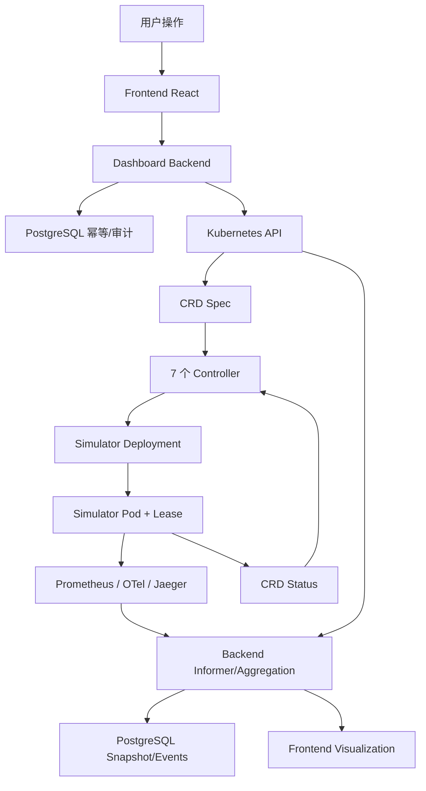
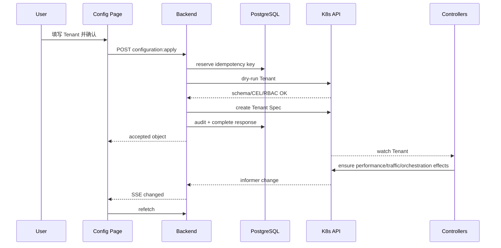
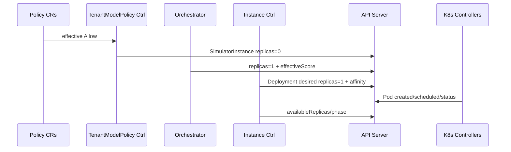
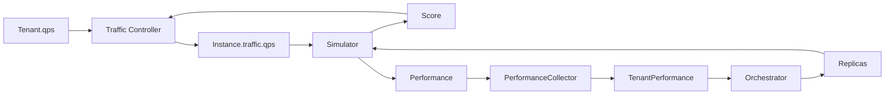

# 端到端数据流

## 1. 完整闭环

用户给出的线性链路实际包含反馈：Controller 和 Simulator 反复通过 CR Status/Spec 影响下一轮，不是一次请求结束。

## 2. 每一步的数据、生产者、消费者和存在理由

| # | 步骤 | 数据是什么 | 谁产生 | 谁消费 | 为什么存在 |
| ---: | --- | --- | --- | --- | --- |
| 1 | 用户操作 | Model/Node/Tenant 表单、QPS、时间/筛选、删除确认 | 人类 | React | 把业务意图与观察问题结构化。 |
| 2 | Frontend React | Typed command/query、Idempotency-Key、resourceVersion、`at` | 页面/API client | Backend Handler | 隐藏 HTTP 细节，区分 latest/historical 与草稿。 |
| 3 | Dashboard Backend | 严格验证后的命令或页面查询 | Handler/Application | Gateway/Aggregator/Store | 集中权限、契约、聚合和错误语义。 |
| 4 | Database（命令侧） | idempotency pending/result、audit log | Backend | Backend 重试/审计者 | 防止重复副作用并保留操作证据。 |
| 5 | Kubernetes API | 用户可写 CR 的 Spec/metadata、resourceVersion | Backend Gateway/kubectl | API Server/etcd/Controller watches | 声明式持久化意图、校验和并发控制。 |
| 6 | CRD | Tenant/Model/Node/Policy/Orchestrator 等领域状态 | 用户/Controller/Simulator 按所有权 | 各 Controller、Backend | 作为组件间稳定业务语言和事实边界。 |
| 7 | Controller | SimulatorInstance、倍速、Deployment、流量、聚合、容量、扩缩状态 | 七个 Reconciler | API Server、下游 Controller/Simulator | 把高层意图持续收敛为运行资源。 |
| 8 | Simulator 工作负载 | Deployment Spec、Pod template、affinity、env、ServiceAccount | Instance Controller/K8s controllers | Scheduler/kubelet/Simulator | 将实例池副本映射为实际可运行进程。 |
| 9 | Pod/Lease | Pod 状态、nodeName、leader holder | K8s/Scheduler/Simulator leader election | Instance/WorkerUsage/Backend/Simulator Pods | 证明实际调度与唯一 reporter。 |
| 10 | Simulator Tick | QPS、score、queue、TTFT、observedAt、reporterID、simulationElapsedMs | Leader SimEngine | CR Status、Prometheus、OTel | 产生控制环反馈和诊断证据。 |
| 11 | Prometheus/OTel/Jaeger | 时间序列、Span、管道健康 | Controller/Simulator/Collector | Backend/Grafana/运维者 | 回答趋势、延迟和具体调用路径。 |
| 12 | Backend Informer | CR/Pod/Deployment/Lease/Event 最新 cache | API Server watches | Mapper/Aggregator/SSE/Recorder | 降低 API Server 压力并提供低延迟当前态。 |
| 13 | Backend Aggregation | Configuration/Traffic/Overview、source freshness、partial warnings | Aggregator + providers | Frontend、Snapshotter | 将多源技术对象转换为页面读模型。 |
| 14 | Database（读侧） | resource_events、完整 snapshots、trace index | Recorder/Snapshotter/Provider | historical APIs | 在不复制当前事实的前提下支持历史浏览。 |
| 15 | Frontend Visualization | 表格、状态、指标曲线、事件、Span tree | React Query + UI | 人类 | 解释 desired/observed、收敛、故障和历史。 |

## 3. 配置操作例：创建 Tenant

如果此时没有 Policy/Model/Orchestrator，Tenant 仍是合法配置，但不会自动出现完整实例池。页面应解释缺失依赖，而不是把 Tenant 创建标为失败。

## 4. 策略到 Pod

节点选择要区分：项目 Controller 计算合法节点集合并写 affinity；Kubernetes Scheduler 选择具体 nodeName。Dashboard 解释调度时应同时展示 Policy 候选、PodScheduled Condition 和 Event。

## 5. 性能与流量反馈

### 流量环

Traffic 只使用新鲜 Running Score。分配是整数且守恒；分数全零时等权 fallback。输出进入下一 Simulator Tick。

### 扩缩容环

PerformanceCollector 把实例样本稳健聚合。Orchestrator 对 up/down 阈值和 cooldown 做决策，写 replicas。Deployment/Pod ready 后 availableReplicas 改变，Simulator score 和 QPS 再调整。

## 6. Observability 回流

Prometheus/Jaeger 不直接参与 Controller 决策；控制输入来自 CR Status。这样外部可观测栈故障不会改变扩缩容行为。Backend 将它们用于页面趋势与诊断：

- 当前对象：Kubernetes cache。
- 趋势/比率/分位数：Prometheus。
- 单次 Reconcile/Tick 路径：Jaeger。
- 过去对象切面：PostgreSQL snapshot。

## 7. 数据一致性与时间

一个页面响应可能组合：

- 14:00:05 的 cache 状态。
- 14:00:00..14:00:05 的 Prometheus scrape/query。
- 最近 15 分钟 Trace。
- 14:00:00 的 DB snapshot。

所以每个 section 必须携带 observed/captured/queried time。`servedAt` 只是 Backend 返回时间，不是所有数据的观测时间。

## 8. 故障如何传播

| 故障 | 控制面影响 | Backend/API | Frontend |
| --- | --- | --- | --- |
| Policy 引用缺失 | 不创建/清理实例，Condition | cache 如实返回 | 显示依赖缺失 |
| Pod Pending | available=0、Phase Pending | 聚合 Event/affinity | 显示调度证据 |
| Simulator leader 失联 | observedAt 变旧，score 不再可信 | freshness stale | 警告；Traffic/Perf 忽略样本 |
| Prometheus down | Controller 不受影响 | Overview partial | 指标 unavailable，资源仍显示 |
| Jaeger down | Controller 不受影响 | Trace warning | Trace 区域退化 |
| DB required down | Controller 不受影响 | Backend not ready、commands unavailable | 禁止写入/显示错误 |
| SSE 丢事件 | 无 | stream 非持久 | 30s poll/REST resync 修复 |

## 9. 数据链路验收问题

新人应能对任一页面数值回答：

1. 原始字段/指标/Span 在哪里？
2. 谁写它，谁无权写？
3. 采集/观测时间是什么？
4. 是否经过 Aggregator 派生？公式是什么？
5. 是当前态、历史快照还是本地草稿？
6. 过期/缺失时如何显示和影响控制？

答不出其中任何一项，就不应把该数值标为权威。
