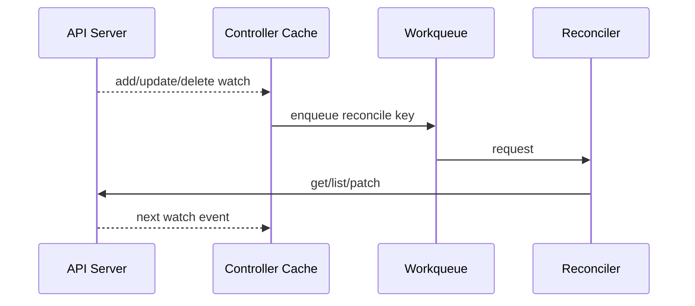
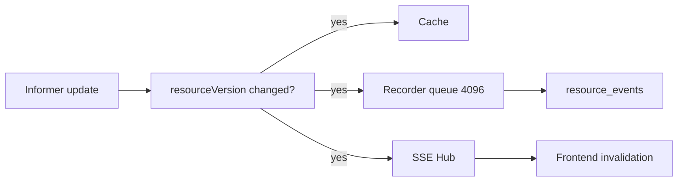

# 事件流

> 维护层：human | last-reviewed：2026-08-18 | 事实源：dashboard/backend/internal/

项目中“事件”有五种不同含义。把它们混在一起会造成错误的可靠性假设。

## 1. 五类事件

| 类型 | 来源 | 持久性 | 用途 |
| --- | --- | --- | --- |
| Kubernetes Watch event | API Server/informer | 临时流，可 relist/resync | 触发 Controller/Backend cache 更新 |
| Kubernetes Event object | Scheduler/Deployment 等 | 集群 TTL，不保证长期 | 人类诊断 FailedScheduling 等 |
| Backend resource_event | Informer Recorder -> PostgreSQL | 默认保留，可能 drop | 历史变化辅助诊断 |
| SSE notification | Backend Hub | 内存、可丢 | 通知 Frontend query 失效 |
| Audit log | Backend mutation | PostgreSQL | 记录用户命令及结果 |

它们都不是完整的业务 event sourcing log。

## 2. Controller Watch

Watch 可断线、resourceVersion 可过期；client-go 自动 relist/resync。Reconciler 必须从当前状态计算，而不是依赖“恰好收到过每条事件”。

## 3. Backend Informer 到 PostgreSQL/SSE

Recorder 和 SSE 都选择非阻塞：慢 DB/客户端不会阻塞 informer。代价：

- Recorder queue 满时 resource_event 可丢。
- SSE client buffer 满时通知可丢。
- 因此 snapshot + REST resync 是恢复机制。

## 4. SSE 协议语义

主要事件：

- `resource.changed`：某资源类别/版本发生变化；客户端 debounce 后 refetch。
- `resync-required`：客户端声明 Last-Event-ID 或连接状态不足以增量恢复，必须全量拉取。

SSE event ID 不是 durable offset；Backend 重启会丢内存状态。前端不应把 SSE payload 直接合并为权威对象。

## 5. Kubernetes Event

Backend informer 读取 core/v1 Event，限制/聚合后用于 Overview。关键字段：type、reason、message、count、first/last time、involvedObject UID、source/reportingController。

当前项目 Controller 没有完整领域 EventRecorder，因此：

- Scheduler/Deployment 的 `FailedScheduling`、rollout 事件可见。
- 扩缩容 reason 主要在 Orchestrator Status/metrics/Trace，不一定有 Kubernetes Event。
- Traffic allocation/Performance stale 也主要在 Status/metrics/log。

未来加 EventRecorder 仍不能把 Kubernetes Event 当审计，因为其 TTL/聚合语义不保证长期。

## 6. Audit 与资源变化区别

| 问题 | Audit | resource_event |
| --- | --- | --- |
| 谁请求了修改？ | 是（生产需可信 actor） | 通常不知道用户意图 |
| API Server 是否接受？ | 记录命令结果 | 观察最终资源变更 |
| Controller 后续做了什么？ | 不完整 | 可看到 CR/Deployment 变化，但可能 drop |
| 是否无损？ | 目标应可靠 | 否 |
| 能否重放控制面？ | 否 | 否 |

关联 requestId、resource UID、resourceVersion 和时间，可把意图与结果拼成诊断链；不能假设一一对应（Controller 会多次 patch）。

## 7. 推荐未来领域事件

如果产品需要长期回答“为什么扩容/流量如何变化”，建议定义版本化 DomainEvent 或 OperationRun 模型，至少包含：

- eventId、eventType、schemaVersion、occurredAt。
- actor/component、tenant/model/instance refs + UID。
- input versions/trigger hash。
- decision/action/reason、before/after。
- correlation/trace ID。
- idempotency/dedup key。

事件要写入可靠存储并定义 retention/privacy；不要只增加日志字符串。

## 8. 排障方法

从“意图”向“结果”追：

1. audit：命令是否被接受、requestId/idempotency key。
2. CR metadata/resourceVersion：Spec 是否变化。
3. Controller logs/metrics/Trace：是否 Reconcile/为什么 no-op/error。
4. Status/Condition/pending plan：收敛到哪一步。
5. Deployment/Pod/Event/Lease：Kubernetes 数据面证据。
6. Backend resource_event/snapshot：Dashboard 是否采到变化。
7. SSE/Frontend network/query cache：页面是否 refetch。

不要先看页面颜色就猜 Controller 故障。

## 9. AIOps 分析事件（M0+M1）

切面 complete/fail 时 Backend 将分析任务入队（`aiops_analyses`，幂等）；AIOps worker 按状态机推进（pending→running→aggregating→completed/failed），L1 实体总结与 L2 分数写入 `aiops_*` 表。该链路异步、只读切面数据，不阻塞实验生命周期；分析失败在 `error_text` 记录并落 failed 状态，前端可展示。

M2（#94）：`POST /aiops/commands` 把一句话意图解析落库（`aiops_commands`，parsed），用户确认后执行编排产生实验创建/流量/倍速事件（steps 落库）。M3（#95）：定时器驱动 L3 窗口/L4 日总结（`aiops_window_summaries`）与分数序列警戒（`aiops_alerts`），均为异步只读聚合，不改变实验生命周期事件流。M4（#110 阶段二）：`POST /aiops/chat` 按需读取结论型上下文（窗口总结/警戒/已完成分析）后流式生成回答，SSE 事件 `lifecycle → tool* → text* → lifecycle`，只读不写，不产生实验事件。
