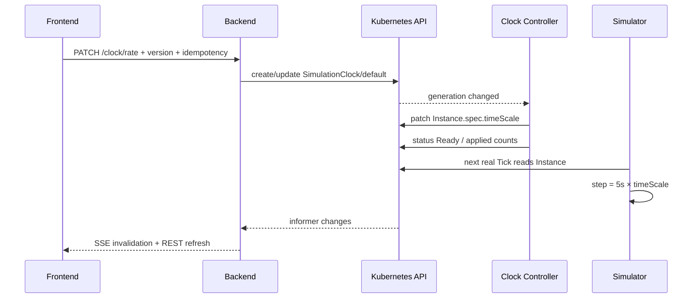
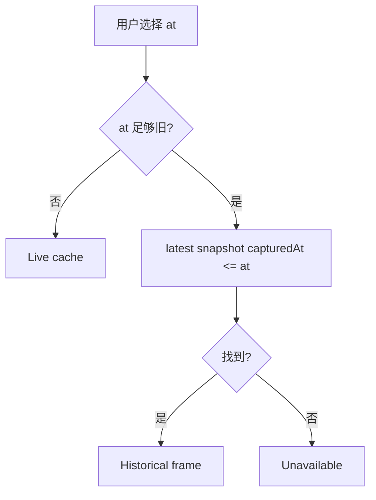

# 时间、倍速与历史回看

> 维护层：human | last-reviewed：2026-08-18 | 事实源：dashboard/backend/internal/store/

## 1. 当前时间域

| 时间/状态 | 来源 | 当前语义 |
| --- | --- | --- |
| Server/Actual Time | Backend host UTC | `time.Now()`；HTTP、审计和页面当前时间。 |
| Logical Time | Backend Clock DTO | 当前仍等于 Actual；没有 pause、Seek 或 Controller 逻辑时间。 |
| Simulator Time Scale | `SimulationClock/default.spec.rate` | 1..20；只控制 Simulator 离散事件引擎每个真实 Tick 推进的模拟时长。 |
| Observed/Captured/Queried Time | CR Status、snapshot、Provider | 数据真正被观测、采集或查询的时间。 |

Frontend 历史时间条与 Simulator 倍速是两项独立能力：前者选择只读历史切面，后者修改当前运行的模拟引擎。倍速不会把页面时间、Kubernetes metadata 或 Controller 冷却时间乘以倍率。

## 2. 倍速控制链路



关键边界：

- `SimulationClock.spec.rate` 是用户期望，`status.appliedRate` 和同步计数描述 CR 字段收敛。
- `SimulatorInstance.spec.timeScale` 是 Controller 派生字段，用户和通用配置 API 不直接写。
- timeScale 不进入 Deployment Pod template；更新不会触发滚动重启。
- Simulator 每个真实 Tick GET Instance，运行中变化通常在下一 Tick 生效。
- Clock Ready 只证明 Kubernetes 字段已同步；进程实际读取由 `hello_k8s_ai_simulator_time_scale` 和 Tick Trace 验证。

## 3. Simulator 内部如何使用倍速

默认真实 Tick 为 5 秒。若 rate=10：

```text
simulationStep = 5s × 10 = 50 simulated seconds
newRequests ~ Poisson(perReplicaQPS × 50s)
coldStartElapsed += 50s
```

Queue、TTFT 和冷启动按模拟时间推进；Status、Metrics 和 Trace 仍每 5 秒真实时间发布。倍速变化只影响后续步长，不回写过去，也不按进程暂停的墙钟差补算。

rate 上限 20 用于限制每 Tick 工作量；SimEngine 仍有实体请求上限和虚拟队列保护。高倍速会让两个真实控制周期之间经过更多模拟时间，因此 Queue/TTFT 变化可能更快，但 Traffic、Performance 和 Orchestrator 的周期没有加速。

## 4. Latest 与 Historical

无 `at`：

- Kubernetes 当前态来自 Backend informer cache。
- Prometheus/Jaeger 使用当前窗口。
- Frontend 在 capabilities、连接、收敛和数据库条件满足时允许倍速命令。
- SSE/轮询更新页面。

指定足够旧的 `at`：



历史 frame 是离散快照，不是 etcd 事务快照或 Simulator checkpoint。请求时间与实际 `capturedAt` 可能不同；没有快照时返回 unavailable，不能用 current 数据填充。

## 5. Replay 的真实含义

当前 `/replay` 提供 snapshot timeline，`/replay/frame` 返回选定历史 Overview。它支持历史浏览，不支持：

- 按事件重新执行 Controller；
- 复现相同随机请求；
- 从过去分叉继续运行；
- pause/Seek；
- 让 Controller cooldown、Lease 或 Kubernetes 时间跟随 Simulator 倍速；
- 保证 Prometheus、Jaeger 与 snapshot 属于同一事务时刻。

历史 overview 对超出 Provider 保留能力的目标时间会在 `meta.warnings` 中明确告警：Prometheus 保留窗口（部署 retention 168h；`PROMETHEUS_RETENTION` 为覆盖告警比对值，默认 24h 可调）早于窗口时提示指标可能不完整；Jaeger 已配置 badger 持久化（TTL 168h），超过保留窗口或 `JAEGER_RETENTION` 比对值的历史 Trace 提示可能已丢失。

文案应使用“历史浏览/快照回看”。`simulationRun=false` 仍是正确能力声明；它与 `simulationRate=true` 不冲突。

### 实验切面生命周期（issue #51）

`/api/v1/experiments` 把"一次调度实验"固化为不可变归档单元：`pending`（配置快照定格）→ `running`（后台混合采样器写入事件/指标/Trace 关联）→ `completed` / `failed`（终点快照 + 摘要）→ 封存。切面是时间段数据，起点与终点各有完整全局快照，中间是事件序列与 1 分钟指标分桶；因此"没有数据"与"数据过期丢失"可区分——只要实验两端快照存在，切面就有可分析的开头和结尾。

混合采样对标 Jaeger adaptive sampling：基线 30s 采样；检测到关键事件（扩缩决策、告警、错误率突变、TTFT 超阈值、副本数快速变化、时间线缺口）后进入 5s 高保真窗口，事件平静 60s 后回基线。Pod 个体事件不进切面，只记录群体演化（副本曲线、事件计数、指标聚合），防止 0→几百 Pod 时事件风暴。参数全部走环境变量（`SEGMENT_BASELINE_INTERVAL` 等），不硬编码。

### 时间段切面（Run Segment）

除点查询外，`GET /api/v1/segment?start=<RFC3339>&end=<RFC3339>` 提供**时间段切面**：返回起点快照（start 之前最近）、终点快照（end 之前最近）、`[start,end]` 区间的指标与 Trace，以及针对段起止点的覆盖告警。它回答"一次调度/实验从什么状态开始、到什么状态结束、中间发生了什么"，适合故障复盘与容量分析。约束：`start < end`、窗口上限 24 小时、任一端无快照时返回 `unavailable` 与明确告警（不伪造数据）。前端 trace 页的"时间段切面（Run Segment）"面板选择起点/终点快照后调用该接口。

## 6. 新鲜度与一致性

Traffic/Performance 对 `SimulatorInstance.status.observedAt` 使用约 30 秒真实时间窗口。即使 rate=20，也不会把 freshness 缩成 1.5 秒。Orchestrator 的 scale-up/scale-down cooldown 同样使用真实时间，避免倍速调整意外绕过容量保护。

一次倍速更新会出现正常最终一致窗口：

1. Clock Spec 已更新，旧 Status 的 observedGeneration 落后；
2. Controller 逐个 Patch Instance；
3. Clock Status 报告目标值与同步计数一致；
4. 各 Simulator 在自己的下一 Tick 读取新值；
5. Prometheus 在下一次 scrape 后可见新 gauge。

Frontend 在已有 Clock 尚未收敛时禁用第二次提交，防止用户连续覆盖无法辨认；resourceVersion 冲突要求重新拉取。

## 7. Retention 不一致

| 来源 | 当前开发保留 |
| --- | --- |
| PostgreSQL snapshot | 默认 30 天 |
| Prometheus | 24 小时 |
| Jaeger | 未配置持久化，可能更短 |
| Kubernetes Event | 集群 TTL，非项目控制 |

历史 Overview 需要 section-level availability。不要用 0 或空数组混淆“查询成功但没有数据”和“来源已经超出保留期”。

## 8. API 与 Frontend 规则

- `GET /clock` 同时返回真实 server/actual/logical time，以及 Simulator 的 desired/applied rate、resourceVersion、同步计数和 convergence。
- `PATCH /clock/rate` 只接受 1..20，必须有 `Idempotency-Key`；已有对象更新携带 resourceVersion。
- Frontend 提供 1x、2x、5x、10x、20x，历史模式、Backend 不可写、cache 未连接、命令 pending 或上一版本未收敛时禁用。
- Clock 对象不存在时，Controller 会创建 1x；Backend 专用接口也能以用户选择的 rate 创建默认对象。
- Backend server/actual/logical time 仍是权威 UTC；`simulationTime` 仍为空。


## 9. 未来完整逻辑时间

若要实现 pause、Seek、分支或确定性 replay，仍需单独设计：

| 能力 | 必需状态 |
| --- | --- |
| 可恢复运行 | SimulationRun、anchor、phase、owner/leader |
| 确定性 | seed、engine version、输入 resourceVersions |
| Checkpoint | queue、RNG、replicas、last event offset |
| 时间边界 | 每个 Controller 明确使用 actual 或 simulation time |
| Replay | 只读原始 run 或创建分叉，不改生产 current CR |
| Observability | 同时记录 actual 与 simulation timestamp |

现有 `SimulationClock` 只解决动态加速 Simulator 引擎，不应扩展解释为上述能力已经完成。

## 10. AIOps 异步分析链

AIOps 分析（#93）在实验终态后异步执行，与时间域无关：不推进模拟时钟、不阻塞 replay；分析进度/分数只读 `aiops_analyses`。前端轮询展示，不做本地推断。
