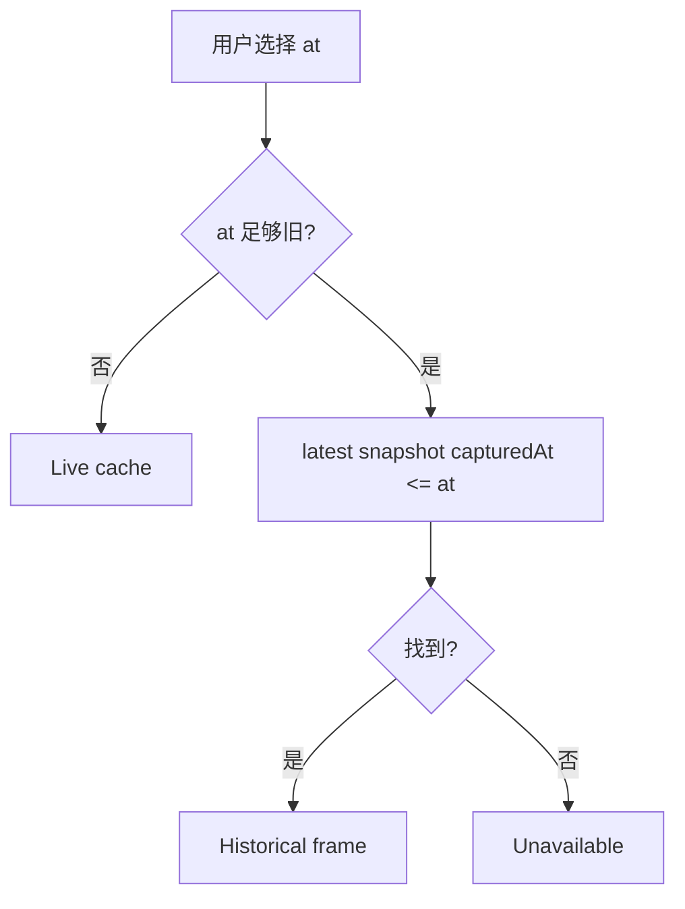

# 时间与回放

## 1. 当前有三种时间概念

| 时间 | 来源 | 当前行为 |
| --- | --- | --- |
| Server/Actual Time | Backend host UTC | `time.Now()`，权威当前时间。 |
| Logical Time | Backend Clock DTO | 当前等于 Actual，rate=1、running。 |
| Observed/Captured/Queried Time | CR Status、snapshot、provider | 各数据真正被观测/采集的时间。 |

Frontend 时间条是浏览上下文，不驱动 Controller/Simulator。数据库虽有 `clock_state` 表，但运行时未用它实现可写时钟。

## 2. Latest 查询

无 `at`：

- Kubernetes 当前态来自 Backend informer cache。
- Prometheus/Jaeger 使用以当前时间为终点的窗口。
- Frontend 允许命令（仍需 capabilities）。
- SSE/轮询可更新页面。

指定 `at` 但与 now 相差不超过约 2 秒，Backend 仍按 live 处理，以避免时间漂移造成不必要 snapshot 查询。

## 3. Historical 查询

历史 frame 是离散快照：

- 请求 at 可能是 14:00:17，实际返回 capturedAt 14:00:00。
- 14:00:01..14:00:16 的瞬态不一定可见。
- snapshot JSON 代表当时 Aggregator 结构，不是 etcd 事务快照。
- 无快照时返回 unavailable，禁止 current fallback。

## 4. Replay 的真实含义

当前 `/replay` 提供 snapshot timeline，`/replay/frame` 返回选定历史 Overview。它支持“回看”，不支持：

- 按事件逐条重新执行 Controller。
- 复现相同 Simulator 随机请求。
- 从过去分叉并继续运行。
- pause/seek/2x Controller cooldown。
- 保证 Prometheus/Jaeger 与 snapshot 同一时刻。

文案应使用“历史浏览/快照回看”，不使用“确定性回放”承诺。

## 5. 新鲜度

### 控制环新鲜度

Traffic/Performance 对 Simulator observedAt 使用约 30 秒窗口，并防御有限未来时钟偏差。过期样本不参与流量/聚合。

### 页面新鲜度

Backend/Frontend 应展示：

- servedAt：响应时间。
- capturedAt：DB snapshot 时间。
- observedAt：CR/Metric/Trace 数据时间。
- queriedAt：provider 查询时间。
- age/freshness：相对当前或历史游标的派生。

Historical 页面不应拿真实 now 计算所有数据为“陈旧”；应明确“历史切面”，并以该切面内部时间解释。

## 6. Retention 不一致

| 来源 | 当前开发保留 |
| --- | --- |
| PostgreSQL snapshot | 默认 30 天 |
| Prometheus | 24 小时 |
| Jaeger | 未配置持久化，可能更短 |
| Kubernetes Event | 集群 TTL，非项目控制 |

所以历史 Overview 需要 section-level availability。不要用 0/空数组模糊“查询成功但没有数据”和“来源已过 retention”。

## 7. 真正逻辑时间需要什么

仅让 Backend 返回 `now × rate` 不够，因为：

- Simulator ticker/coldStart 用 `time.Now()`。
- Controller freshness/cooldown 用真实时间。
- Lease、Kubernetes metadata、Prometheus scrape 仍是真实时间。
- 随机 seed 和队列在进程内。

目标设计应引入 Kubernetes 原生 `SimulationRun` / `SimulationClock`（名称待评审）：

| 能力 | 必需状态 |
| --- | --- |
| 可恢复时钟 | anchor actual/logical、rate、paused、generation、owner/leader |
| 确定性 | seed、engine version、输入配置 resourceVersions |
| Tick | 由逻辑时间驱动或记录逻辑 delta |
| Freshness/cooldown | 明确使用 actual 或 logical，同一决策链一致 |
| Checkpoint | queue、RNG、replicas/inputs、last event offset |
| Replay | 只读原始 run 或创建分叉 run，不改生产 current CR |
| Observability | Span/metric 同时标 actual 与 simulation time |

## 8. API/Frontend 规则

- `/clock` 当前必须声明 `rate=1`、不可控制能力。
- capabilities `simulationRunSupported=false` 时按钮 disabled，并解释原因。
- Historical mode 禁止 mutation。
- 切 Latest 必须清除 query `at` 并 refetch，不能只移动 UI 游标。
- snapshot schema 变化需要版本兼容。
- 未来逻辑时间 mutation 需要幂等、leader/ownership、审计和冲突保护。
