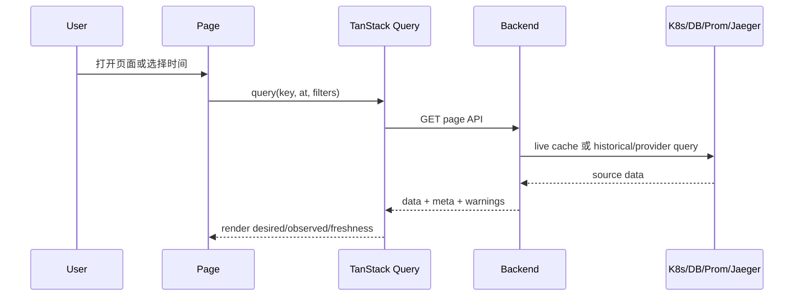
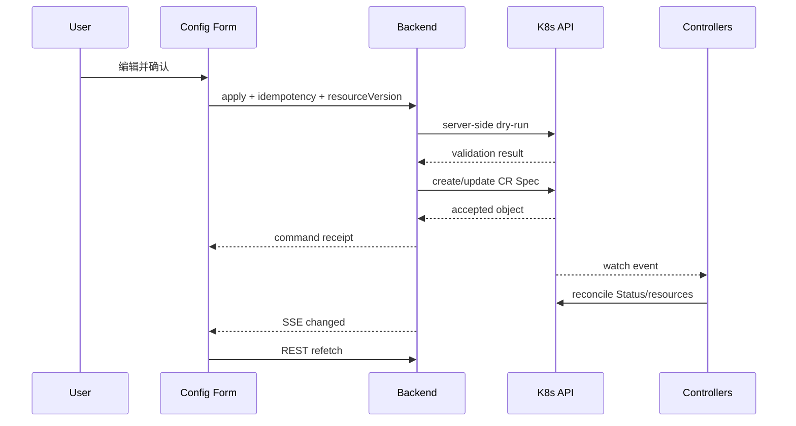
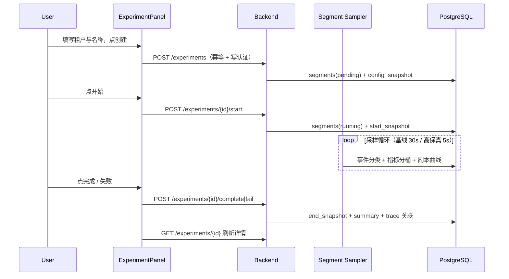
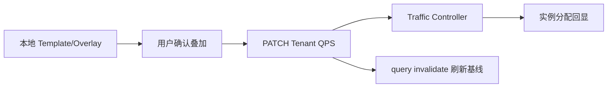

# Frontend 数据流

> 维护层：human | last-reviewed：2026-08-21 | 事实源：dashboard/frontend/my-app/src/components/features/traffic/、dashboard/frontend/my-app/src/components/features/trace/ 等

## 1. 读取链路

Query key 必须包含所有影响结果的参数，尤其是 `at`、tenant、metric/trace filter；否则 latest 与 historical 缓存可能串用。

## 2. 配置写入链路

HTTP mutation 成功只表示意图被 API Server 接受。页面应继续显示收敛中的 Pending/Condition，直到 Controller 反馈。

## 3. 实验切面写入链路（issue #51）

写接口复用既有幂等与认证链路；列表只读、10s 自动刷新（运行中的实验可见状态推进）。

## 4. 页面与 Endpoint 对应

| 页面/组件 | 读 API | 写 API | 刷新策略 |
| --- | --- | --- | --- |
| App shell / ClusterStatus | `/bootstrap`、`/capabilities`、`/clock`、`/replay` | 无 | 首次 + SSE 失效 + 30s poll |
| ExecutionControls | `/bootstrap`、`/clock` | `PATCH /clock/rate` | 提交后等待 resource.changed，REST 刷新 desired/applied/converged |
| Config | `/configuration[?at]` | `/configuration:apply`、DELETE configuration | mutation 后 invalidate；历史不刷新为 latest |
| Traffic baseline | `/traffic[?at&tenant]` | `PATCH /tenants/{name}/traffic`（应用叠加时写入目标 QPS） | SSE + query invalidate；未应用的本地草稿不触发远端 |
| Data Overview | `/overview[?at&filters]` | 无 | latest 约 15s；historical 固定 |
| Experiment 面板 | `/experiments[?status]`、`/experiments/{id}` | `POST /experiments`、`/experiments/{id}/start|complete|fail` | 列表 10s 轮询；详情创建/结束后失效重取 |
| Metrics detail | `/metrics/query` | 无 | 查询窗口/step 决定缓存 |
| Trace list/detail | `/traces`、`/traces/{id}` | 无 | latest 可刷新；detail 按 traceId 缓存 |
| AI 洞察（AiInsightPanel） | `/aiops/analyses[?status]`、`/aiops/analyses?segmentId=`、`/aiops/jobs` | 无（只读；M2 意图执行接入后加写） | 列表 15s 轮询；详情进行中 10s 轮询、完成/失败后停止；异步任务（`/aiops/jobs` 独立接口）10s 轮询；任务卡片显示「已试 N 次」与失败原因 |
| 警戒（AlertList） | `/aiops/alerts` | 无 | 30s 轮询；M3 未启用时后端 404 → 显示未接入空态 |
| 窗口总结（WindowSummaryPanel） | `/aiops/windows` | 无 | 30s 轮询；M3 未启用时后端 404 → 显示未接入空态 |
| AI 助手浮窗（AiChatWidget） | `POST /aiops/chat`（SSE）、`GET /aiops/chat/messages`、`GET/POST /aiops/settings` | 无（只读回答；密钥只在服务端） | 按需流式；404 → 显示未启用提示；会话本地存储；回答同时落库服务端 `aiops_chat_messages`（#112 阶段 D，可追溯引用来源）；打开面板时拉取历史回填空会话（失败静默降级）；设置面板含 AI 分析开关（`enabled`，关闭后不入队新分析）；429 → 展示配额/限流提示 |
| Global stream | `/stream` | 无 | EventSource 重连 + REST resync |

编排策略表单字段与 CRD/Backend 白名单一致：含 scaleUpCooldownSeconds、scaleDownCooldownSeconds、min/maxReplicas、maxScaleUpBatch（扩容步长）与 allowScaleToZero。

## 4. Latest 与 Historical 切换

1. 用户在 TimeTravelBar 选择 snapshot。
2. `timeSlice` 保存 `selectedSnapshot` 和 `mode=historical`。
3. 所有支持历史的 query 使用 snapshot timestamp 作为 `at`。
4. Config/Traffic mutation UI 禁用，并显示只读原因。
5. 用户点击 Latest 后清除 `at`，query 回到 live cache。

禁止只让某个页面带 `at`、其他页面仍读当前态；这会产生“同屏跨时间”误导。如果某个 provider 无历史，应在该 section 显示 unavailable/partial。

## 5. SSE 与轮询

Backend 的 SSE channel 每客户端有有限缓冲，慢客户端可能错过事件；`Last-Event-ID` 不提供真实历史回放，只触发 `resync-required`。因此前端策略是：

- 事件只触发 invalidation，不直接修改对象。
- 多个事件 350ms 合并，避免刷新风暴。
- 30 秒轮询作为最终安全网。
- 网络恢复时先拉 bootstrap，再刷新当前页面。
- Historical 页面不因 live resource.changed 自动改变内容。

## 6. 错误与 Partial 数据

| 场景 | 前端行为 |
| --- | --- |
| Kubernetes cache 未同步 | 显示 not ready，保留重试；不要展示假默认集群。 |
| PostgreSQL 必需且不可用 | 命令禁用，readiness 失败；当前态读取可能仍有诊断价值但以 API 响应为准。 |
| Prometheus 不可用 | Overview 指标 section warning，其余资源继续展示。 |
| Jaeger 不可用 | Trace section warning，不清空配置/工作负载。 |
| 历史无 snapshot | 明确 unavailable，不回退 current。 |
| resourceVersion conflict | 提示数据已变化，refetch 后由用户重新确认。 |
| idempotent replay | 接受 Backend 已缓存响应，可提示命令未重复执行。 |
| SSE 断开 | 显示连接退化，依靠轮询并自动重连。 |

## 6.1 AIOps 分析异步链（#93）

切面实验 complete/fail 后，后端自动入队 AIOps 分析（`aiops_analyses`），状态机与 L1 进度可轮询；L2 分数/理由与 L1 实体总结经 `/aiops/analyses` 读取。前端只展示后端状态机结果，不做本地推断；`AIOPS_ENABLED=false` 时接口 404，前端显示未启用空态。

M2 意图执行（#94）：AI 面板一句话 → `POST /aiops/commands` 返回解析预览（模板 id/流量/倍速/目标租户），用户确认后 `POST /aiops/commands/{id}/confirm` 执行；确认前不产生任何写操作。M3（#95）：`/aiops/windows`（L3/L4）与 `/aiops/alerts` 轮询展示窗口认知与警戒。

## 7. Traffic 叠加应用到真实命令

当前链路：

应用时把 Overlay 解析为明确的租户目标 QPS（当前 QPS + 模板起始增量，控制面为常量值），带幂等键并显示影响对象与目标值；失败时提示具体错误且不加入本地 overlay，不假装应用成功。历史模式只读，禁止应用。控制面暂不支持时段曲线（TrafficPlan CR 级别能力），曲线仅作场景预览。

## 8. 防止 Mock 回归

- CI 搜索生产路径中的 mock/localStorage 导入；测试 fixture 必须位于明确测试目录。
- ClusterStatus 初始态应是 unknown/loading，不是 connected。
- 无 Backend 时展示 error/empty，不生成默认 Worker/Tenant。
- Storybook/组件测试若使用 fixture，UI 明确测试环境，不能进入生产 bundle 的数据选择逻辑。

## 9. 录制快照（fixtures）与 dev:mock

- `src/lib/mocks/fixtures/` 保存 GET 端点真实响应快照，`scripts/record-fixtures.mjs` 幂等重录；manifest.json 记录来源与大小，供审计。
- dev:mock 由 `plugins/mock-fixtures.ts`（vite `--mode mock` 插件）拦截 `/api/v1` GET 返回 fixtures，写请求 405（只读）；快照空数组用 `dev-fixtures/` 样例补齐（meta.devSamples），不写控制面。
- overview 与 trace detail 分属不同录制窗口时 traceId 可能不匹配；dev:mock 对缺失 detail 用摘要合成单 span 兜底，生产 API 不做该处理。
- AIOps 契约演示数据已删除（后端 M2/M3 就绪，真实模式返回真实数据；dev:mock 下 aiops 接口 404，组件显示未启用/空态）。
