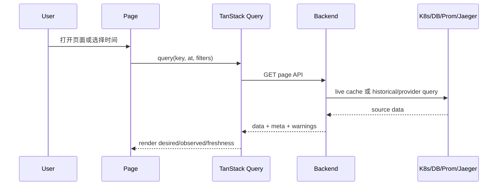
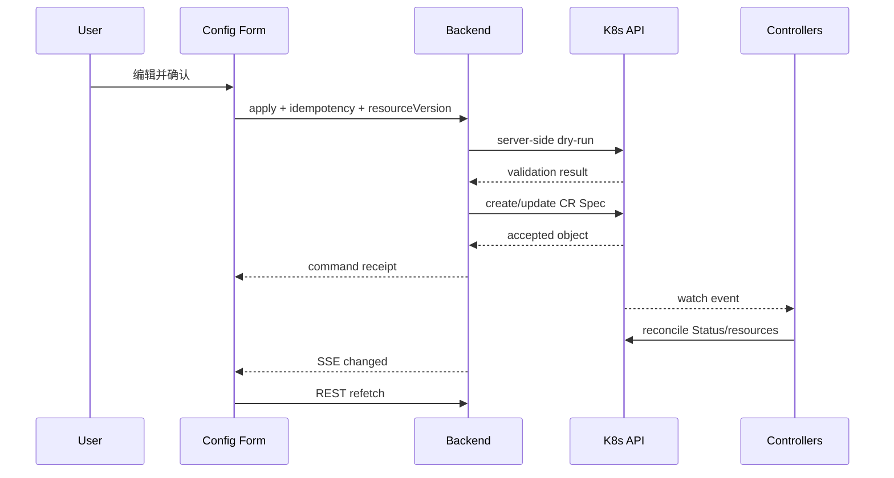
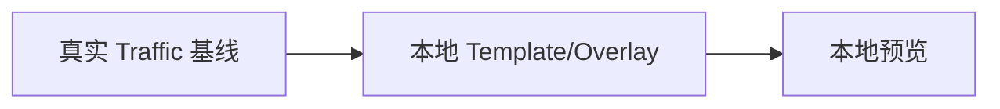
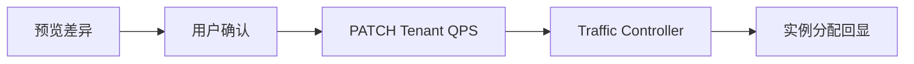

# Frontend 数据流

## 1. 读取链路

Query key 必须包含所有影响结果的参数，尤其是 `at`、tenant、metric/trace filter；否则 latest 与 historical 缓存可能串用。

## 2. 配置写入链路

HTTP mutation 成功只表示意图被 API Server 接受。页面应继续显示收敛中的 Pending/Condition，直到 Controller 反馈。

## 3. 页面与 Endpoint 对应

| 页面/组件 | 读 API | 写 API | 刷新策略 |
| --- | --- | --- | --- |
| App shell / ClusterStatus | `/bootstrap`、`/capabilities`、`/clock`、`/replay` | 无 | 首次 + SSE 失效 + 30s poll |
| Config | `/configuration[?at]` | `/configuration:apply`、DELETE configuration | mutation 后 invalidate；历史不刷新为 latest |
| Traffic baseline | `/traffic[?at&tenant]` | Backend 有 PATCH tenant traffic；UI 当前未接 Overlay | SSE + query invalidate；草稿不触发远端 |
| Data Overview | `/overview[?at&filters]` | 无 | latest 约 15s；historical 固定 |
| Metrics detail | `/metrics/query` | 无 | 查询窗口/step 决定缓存 |
| Trace list/detail | `/traces`、`/traces/{id}` | 无 | latest 可刷新；detail 按 traceId 缓存 |
| Global stream | `/stream` | 无 | EventSource 重连 + REST resync |

## 4. Latest 与 Historical 切换

1. 用户在 TimeTravelBar 选择 snapshot。
2. `timeSlice` 保存 `selectedSnapshot` 和 `mode=historical`。
3. 所有支持历史的 query 使用 snapshot timestamp 作为 `at`。
4. Config/Traffic mutation UI 禁用，并显示只读原因。
5. 用户点击 Latest 后清除 `at`，query 回到 live cache。

禁止只让某个页面带 `at`、其他页面仍读当前态；这会产生“同屏跨时间”误导。如果某个 provider 无历史，应在该 section 显示 unavailable/partial。

## 5. SSE 与轮询

Backend 的 SSE channel 每客户端有有限缓冲，慢客户端可能错过事件；`Last-Event-ID` 不提供真实历史回放，只触发 `resync-required`。因此前端策略是：

- 事件只触发 invalidation，不直接修改对象。
- 多个事件 350ms 合并，避免刷新风暴。
- 30 秒轮询作为最终安全网。
- 网络恢复时先拉 bootstrap，再刷新当前页面。
- Historical 页面不因 live resource.changed 自动改变内容。

## 6. 错误与 Partial 数据

| 场景 | 前端行为 |
| --- | --- |
| Kubernetes cache 未同步 | 显示 not ready，保留重试；不要展示假默认集群。 |
| PostgreSQL 必需且不可用 | 命令禁用，readiness 失败；当前态读取可能仍有诊断价值但以 API 响应为准。 |
| Prometheus 不可用 | Overview 指标 section warning，其余资源继续展示。 |
| Jaeger 不可用 | Trace section warning，不清空配置/工作负载。 |
| 历史无 snapshot | 明确 unavailable，不回退 current。 |
| resourceVersion conflict | 提示数据已变化，refetch 后由用户重新确认。 |
| idempotent replay | 接受 Backend 已缓存响应，可提示命令未重复执行。 |
| SSE 断开 | 显示连接退化，依靠轮询并自动重连。 |

## 7. Traffic 草稿到真实命令的未来设计

当前草稿链路：

建议目标链路：

实现时必须：把 Overlay 解析为明确的 Tenant QPS 或未来 TrafficPlan CR；显示影响对象与时间；带幂等键；审计；等待资源回显；失败时保留草稿而不是假装应用成功。

## 8. 防止 Mock 回归

- CI 搜索生产路径中的 mock/localStorage 导入；测试 fixture 必须位于明确测试目录。
- ClusterStatus 初始态应是 unknown/loading，不是 connected。
- 无 Backend 时展示 error/empty，不生成默认 Worker/Tenant。
- Storybook/组件测试若使用 fixture，UI 明确测试环境，不能进入生产 bundle 的数据选择逻辑。
