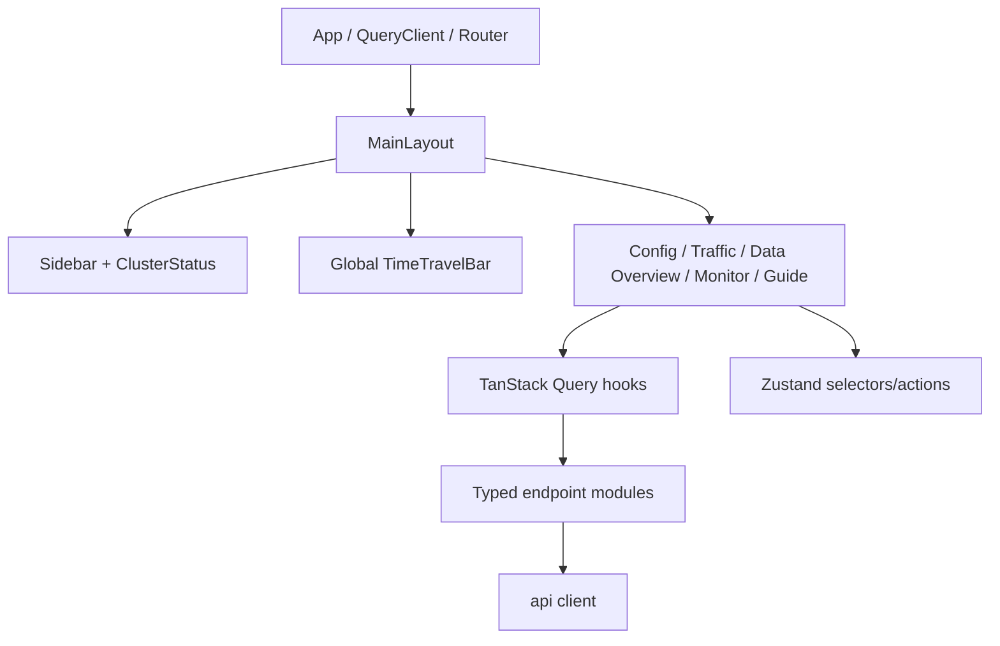
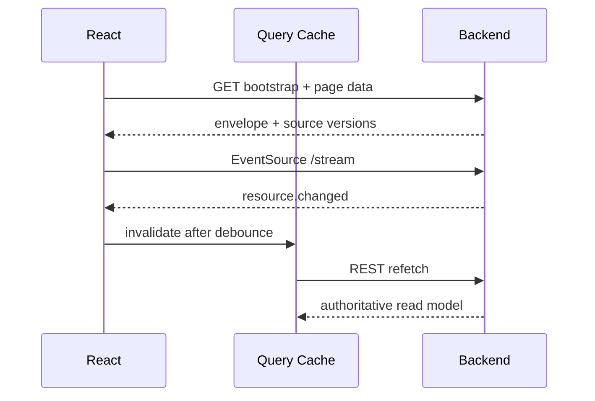

# Frontend 架构

> 维护层：human | last-reviewed：2026-08-21 | 事实源：dashboard/frontend/my-app/src/components/features/config/、dashboard/frontend/my-app/src/

## 1. 定位

Frontend 是控制面的人类界面，不是业务事实源。它负责：

- 展示 Backend 规范化后的当前态、历史快照、指标和 Trace。
- 收集用户配置并调用受控命令 API。
- 管理时间游标、页面布局、Traffic 场景草稿等纯客户端交互状态。
- 明确展示 offline、partial、stale、historical 和 read-only 状态。

它不应：直接访问 Kubernetes/Prometheus/Jaeger/PostgreSQL；在浏览器重算扩缩容；用 localStorage/Mock 代替生产数据；在历史模式提交命令。

## 2. 技术与入口

| 项目 | 当前实现 |
| --- | --- |
| Framework | React 19.2 |
| Language/Build | TypeScript 6、Vite 8 |
| Router | React Router 7 |
| Remote state | TanStack Query 5 |
| Client/UI state | Zustand 5 |
| Charts | ECharts 6 |
| Forms/Validation | react-hook-form、Zod |
| Styling | Tailwind CSS 4、Radix/shadcn primitives |
| App entry | `src/main.tsx` -> `src/app/App.tsx` -> `src/app/router.tsx` |

生产容器由 Node 24 构建，再由 unprivileged Nginx 1.29 提供静态文件和 `/api/` 代理。

## 3. 组件分层

### 目录职责

| 路径 | 职责 |
| --- | --- |
| `src/app/` | Provider、Router、lazy route、全局错误边界。 |
| `src/components/features/` | Config、Traffic、Trace/Data Overview、Monitor、Guide 业务 UI。 |
| `src/components/shared/` | Layout、TimeTravelBar、通用对话框和反馈。 |
| `src/api/endpoints/` | 每个领域的 HTTP/SSE 调用。 |
| `src/api/queries/` | TanStack Query key、query/mutation 组合。 |
| `src/stores/` | control plane、time、traffic 等客户端状态。 |
| `src/types/` | API 与页面领域类型。 |
| `src/lib/` | 常量、格式化、验证、client ID。 |

## 4. 状态所有权

| 状态 | 所有者 | 持久性 | 原因 |
| --- | --- | --- | --- |
| Configuration/Traffic/Overview/Trace | TanStack Query | 内存缓存，可 refetch | 远端服务状态，不能由 Zustand 复制。 |
| Cluster/provider/clock 能力与倍速提交状态 | `controlPlaneSlice` + Backend sync | 内存 | 跨页面连接、收敛与能力提示。 |
| latest/historical、selected snapshot、viewport | `timeSlice` | 内存 | 全局浏览上下文，不是服务事实。 |
| Traffic templates/overlays | `trafficSlice` | 设计草稿（内存） | 应用时经 `PATCH /tenants/{name}/traffic` 写入控制面；未应用的本地草稿刷新会丢失。 |
| 表单临时值/对话框 | React local/form state | 组件生命周期 | 不需要全局共享。 |
| Monitor 健康状态 | 页面本地 state | 组件生命周期 | Grafana 探活只服务于页面外壳，不进入 Backend 状态。 |
| Guide 模板/参数 | 静态常量 | 不持久化 | 指南只展示，不产生请求；模板只预填表单。 |

生产路径不写 localStorage。旧文档中的配置、模板、805 mock 切面持久化说明已废弃。

## 5. 远端同步

`useBackendSync` 在应用外壳层工作：

1. 首次读取 `/bootstrap` 和 replay timeline。
2. 创建 `/stream` EventSource。
3. 收到 `resource.changed` 后 350ms debounce，失效/刷新相关 queries。
4. 每 30 秒安全轮询，覆盖 SSE 丢包、代理断线或服务重启。
5. 如果收到 `resync-required` 或连接恢复，做完整 REST resync。

SSE 是通知，不是数据源。事件本身不包含页面完整状态，也不提供持久重放。

## 6. 时间模式

- **Latest**：请求不带 `at`，读 Backend live cache，可使用支持的 mutation。
- **Historical**：从 replay timeline 选择 snapshot，查询带 `at`，页面只读。
- 目标时间早于最早 snapshot 时前端不选中任何快照（跳转 no-op，保持当前选择），查询由 Backend 返回 unavailable；不回退到最新快照冒充历史。
- Backend 把距现在 2 秒内的 `at` 视为 live；更旧时间点查数据库最后一个 `captured_at <= at` 的 snapshot。
- Backend 逻辑时钟仍等于 UTC 真实时间，不支持 pause/seek。
- ExecutionControls 提供 1x、2x、5x、10x、20x Simulator 倍速；它调用 Backend 后等待 Clock/Instance 收敛，不在浏览器自行加速。

Historical 模式、Backend 写能力不可用、Kubernetes cache 未连接、请求 pending 或上一代 Clock 未收敛时，倍速选择禁用。Frontend 不能仅通过 UI 插值声称 Simulator 已采用新值。

## 7. API 客户端约定

- 默认 base URL `/api/v1`，可由 `VITE_API_BASE_URL` 覆盖。
- 解析统一 `{data, meta}` envelope；错误解析 `{error, meta}` problem。
- mutation 生成 `Idempotency-Key`，配置更新带 resourceVersion/If-Match 语义。
- Orchestrator 配置含单次扩容步长 maxScaleUpBatch（0=默认 10），表单/表格/预置模板与 Guide 页同步展示。
- 历史模式禁用写按钮，而不只依赖 Backend 拒绝。
- 对 partial response 保留 warnings，避免有一个 provider 失败就清空全部页面。
- AIOps（`src/types/aiops.types.ts` + `src/api/endpoints/aiopsApi.ts`）与后端 `internal/model/aiops.go` 字段对齐：分析/实体/分数（M0/M1）、命令与模板目录（M2）、窗口/警戒（M3）全部走真实 API；`AiInsightPanel` 顶部嵌入 `CommandInput`（一句话 → 解析预览 → 确认执行，确认前无写操作）。确认面板从 `GET /aiops/limits` 拉取硬限制（峰值 QPS/倍速/波形/潮汐周期）展示「可执行范围」提示条，用户可清楚看到流量为何被约束。
- 全局浮窗（#110 阶段三）：`AiChatWidget` 挂在 `MainLayout`，右下角气泡 → 对话面板；`POST /aiops/chat` SSE 流式渲染，工具步骤（读取切面总结/生成回答）以指示器展示；会话存 localStorage（仅聊天记录与会话 id，不含密钥），未启用时 404 显示提示；失败态按错误类别展示可读文案（#124：配额/限流/未启用/网络，见 PAGE_STRUCTURE 浮窗节）；打开面板时经 `GET /aiops/chat/messages` 拉取服务端历史回填空会话（#112 阶段 D 读侧，失败静默降级）。
- 面板配置（#110 阶段四 + 开关）：`AiChatWidget` 头部「设置」入口切换对话/配置视图；`GET/POST /aiops/settings` 读写掩码状态（key 不回显、不落前端存储）与 AI 分析开关（`enabled`），保存后刷新「已配置」标识。
- 异步任务可见性（#110 阶段一）：`AIOpsJobList` 挂 `AiInsightPanel` 顶部（CommandInput 之下），10s 轮询 `/aiops/jobs`；进行中计数 + 状态徽章 + 重试次数 + 失败原因；任务失败原因前端可直接查看（attempts/last_error 经 `/aiops/jobs` 语义查询）。

## 8. 设计系统原则

- 颜色与徽标表达数据语义：Ready/Running、Pending/Stale、Failed/Unavailable 必须同时有文字，不能只靠颜色。
- 时间、QPS、毫秒、请求数、GPU/并发单位要从 API unit 或字段语义明确格式化。
- Source freshness 和更新时间应靠近对应数据，而不是只在全局角落显示。
- 历史模式使用明显只读标识；危险删除和流量提交需要确认。
- 大型对象列表优先表格/筛选，Trace 使用树，指标使用时间序列；不要用同一种卡片承载所有信息。

## 9. dev:mock 与录制快照

- `src/lib/mocks/fixtures/` 是真实 Backend 响应快照（只读），由 `scripts/record-fixtures.mjs` 遍历 GET 端点重录，不手工改内容。
- `dev:mock`（vite `--mode mock`）由 `plugins/mock-fixtures.ts` 拦截 `/api/v1` GET 提供预览（写请求 405）；录制快照中的空资源数组用 `dev-fixtures/` 样例补齐，`meta.devSamples` 标注仅预览。
- Trace detail 与 overview 快照录制窗口不一致时，dev:mock 用摘要合成单 span 兜底；生产链路不受影响。
- AIOps 契约演示 fixtures 已删除（后端 M2/M3 就绪）：dev:mock 下 `/aiops/*` 返回 404，组件显示未启用/空态；真实模式直连后端。

## 10. 已知前端技术债

- Traffic Overlay 应用后已写 Backend（常量目标 QPS）；未应用的模板/Overlay 仍是内存草稿，刷新会丢失，页面保留 Draft 标识。
- Traffic QPS 当前趋势更接近单点/本地曲线，尚未完整使用 Prometheus 历史曲线。
- 缺少组件与浏览器 E2E 测试；`npm run check` 主要验证 lint、build 和状态契约。
- Route 名 `/trace` 已承载 Data View，多年后可能与产品信息架构冲突，应在稳定 API 前统一命名。
