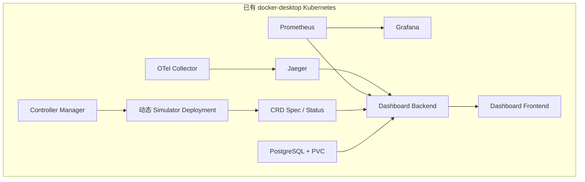

# 部署架构

## 1. 目标集群

本地部署目标固定为用户已有的 Docker Desktop Kubernetes：

| 项目 | 约束 |
| --- | --- |
| kubectl Context | `docker-desktop`，且必须是当前 Context |
| Namespace | `hello-k8s-ai-system` |
| Node | Docker Desktop 本地容器，全部 Ready、架构一致 |
| StorageClass | `standard` |
| 集群生命周期 | 部署脚本不创建、不重置、不删除 |

旁边的 `minikserve-demo` Kind 集群不属于该部署。

## 2. 完整拓扑

静态入口仍保持两个清晰边界：

- `config/dev`：11 个 CRD、Controller/Simulator RBAC、Controller、OTel Collector、Jaeger、Prometheus、Grafana。
- `dashboard/deploy`：PostgreSQL、Backend、Frontend 与 Backend RBAC。

`config/demo` 包含静态 Model、Tenant、TenantModelPolicy、Orchestrator 和 `SimulationClock/default`（1x）；WorkerNode 与 Node Policy 由脚本按目标集群节点生成。

## 3. 镜像交付

旧部署使用 `controller:latest` 并让 Node 从 Docker Hub 拉取，导致明确的 `ImagePullBackOff`。当前流程改为：

1. 在 Docker Desktop Engine 构建四个项目镜像。
2. 在同一 Engine 拉取五个第三方运行镜像。
3. 用 `docker image save` 生成临时镜像包。
4. 找到与 Kubernetes Node 同名的 Docker 容器。
5. 使用节点内 `ctr --namespace k8s.io images import` 导入全部镜像。
6. 导入成功后才 apply 清单。

镜像导入覆盖全部 Node，因此 Controller、Backend、Frontend 和 Simulator 无论被调度到哪个 Node，都不会因项目镜像不存在而回退到 Docker Hub。

## 4. 部署顺序

| 顺序 | 动作 | 失败策略 |
| ---: | --- | --- |
| 1 | 只读检查 Context、Node、StorageClass、Docker Node 容器 | 立即停止，不修改集群 |
| 2 | 拉取与构建镜像 | 最多重试；失败不 apply |
| 3 | 镜像导入所有 Node | 任一 Node 失败则停止 |
| 4 | apply CRD、RBAC、Controller、可观测性 | 等待 CRD Established 和全部 rollout |
| 5 | 创建/复用 PostgreSQL Secret，部署 Dashboard | PVC 存在但 Secret 丢失时拒绝猜密码 |
| 6 | 写入动态演示配置 | 只使用非 control-plane Node |
| 7 | 验证完整数据链路 | 任一硬门失败则生成诊断 |
| 8 | 启动端口转发 | 端口冲突只警告，不推翻已成功部署 |

## 5. 工作负载与存储

| 工作负载 | 镜像 | 存储 |
| --- | --- | --- |
| Controller Manager | `hello-k8s-ai-controller:dev` | 无 |
| Simulator | `hello-k8s-ai-simulator:dev` | CR Status / Lease |
| PostgreSQL 17 | `postgres:17-alpine` | `standard`，10Gi RWO PVC |
| Dashboard Backend | `hello-k8s-ai-dashboard-backend:dev` | 无本地卷，历史写 PostgreSQL |
| Dashboard Frontend | `hello-k8s-ai-dashboard-frontend:dev` | 无 |
| Prometheus / Jaeger / Grafana | 固定版本 | 当前仍为开发型易失存储 |

PostgreSQL 密码不再写死在 Git。首次部署生成随机密码，后续复用 Kubernetes Secret。

## 6. 自动验收门

| 门 | 自动检查 |
| --- | --- |
| Kubernetes | 11 个 CRD Established，Controller rollout |
| CR/Controller | 演示 SimulatorInstance 出现且副本至少为 1 |
| Simulator | Deployment Ready，`status.observedAt` 非空 |
| 时间倍速 | Clock desired/applied=1、Ready，Instance timeScale=1，Simulator 指标存在 |
| Metrics | Prometheus 查询到 `hello_k8s_ai_simulator_leader` |
| Trace | Jaeger `/api/services` 出现 `hello-k8s-ai-*` |
| Database | Backend ready，`/replay` 返回 `snapshot-*` |
| Backend | `/configuration` 返回 `tenant-sample` |
| Frontend | Service 代理返回页面 HTML |

这些检查通过后，脚本才输出“完整系统部署并验收通过”。

## 7. 生产边界

当前方案针对受控本机开发环境。Prometheus/Jaeger/Grafana 未持久化，PostgreSQL 单副本，未配置 OIDC、用户级授权、TLS、完整 NetworkPolicy、备份或 HA。不要把本地一键成功写成生产就绪。

## 部署约束与静态工作负载（原 operations/CLUSTER_INFORMATION 第 5/6 节，2026-08-18 并入）

## 5. 仓库部署约束

| 项目 | 声明值 |
| --- | --- |
| Context | `docker-desktop` |
| Namespace | `hello-k8s-ai-system` |
| StorageClass | `standard` |
| 镜像交付 | Docker build/save + 每 Node `ctr -n k8s.io images import` |
| 动态 WorkerNode | 从非 control-plane Kubernetes Node 名生成 |
| 数据库 | PostgreSQL 17，10Gi PVC，随机 Secret |
| 停止语义 | 工作负载缩到 0，保留集群/CRD/CR/Secret/PVC |

## 6. 部署后应出现的静态工作负载

| Kind | Name | 副本 |
| --- | --- | ---: |
| Deployment | `hello-k8s-ai-controller-manager` | 1 |
| Deployment | `hello-k8s-ai-otel-collector` | 1 |
| Deployment | `hello-k8s-ai-jaeger` | 1 |
| Deployment | `hello-k8s-ai-prometheus` | 1 |
| Deployment | `hello-k8s-ai-grafana` | 1 |
| StatefulSet | `hello-k8s-ai-dashboard-postgresql` | 1 |
| Deployment | `hello-k8s-ai-dashboard-backend` | 1 |
| Deployment | `hello-k8s-ai-dashboard-frontend` | 1 |

Controller 还会按 SimulatorInstance 动态创建 `simulator-<instance>` Deployment。
