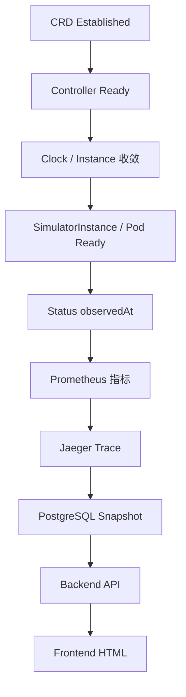

# 验证指南

## 1. 提交前一条命令

在项目根目录执行：

```bash
make verify
```

该命令只做源码和静态部署验证，不创建或修改 Kubernetes 集群。

| 检查项 | 实际命令 | 目的 |
| --- | --- | --- |
| Go 格式 | `make fmt-check` | 检查根模块和 Backend 的全部 Go 文件，不自动改写。 |
| Controller | `make test` | 执行 vet 和非 E2E 测试。 |
| Backend | `make test-backend` | 执行独立 Go module 的 vet 和测试。 |
| E2E 编译 | `make test-e2e-compile` | 在没有 Docker/Kind 时提前发现编译错误。 |
| Frontend | `make test-frontend` | 执行 npm 锁文件安装、lint、类型检查、构建和状态契约验证。 |
| 部署清单 | `make verify-deploy` | 检查 Shell 语法并渲染三套 Kustomize。 |
| Go lint | `make lint` | 执行仓库固定版本的 golangci-lint。 |

CRD/API 或 RBAC 标记变化时，再执行：

```bash
make manifests generate YEAR=2026
git diff --exit-code -- api/v1 config/crd config/rbac
```

第二条命令应在生成文件已经提交后无输出退出。不要手工修改生成的 CRD、RBAC 或 DeepCopy 文件。

## 2. 独立 E2E

```bash
make test-e2e
```

E2E 使用固定名称 `hello-k8s-ai-test-e2e` 和固定 Kind 节点镜像，不复用 `docker-desktop` 或 `minikserve-demo`。无论测试成功还是失败，Makefile 都会尝试删除测试集群，并保留原始测试退出码。

测试覆盖 Controller 启动、受保护 Metrics、Model 能力基准首次调度、Orchestrator 节点放置约束，以及运行中把 Clock 从 1x 调到 10x后 Simulator 指标生效且 Pod UID 不变。失败时测试会输出 Controller 日志、Kubernetes Events 和 Pod 描述。

## 3. 完整栈部署验收

```bash
make cluster-up
```

`cluster-up` 不以清单 apply 成功作为完成条件，会依次检查：



任一硬门失败都会退出非 0，并把 Node、工作负载、Event、Controller 日志和 Backend 日志写入 `.runtime/last-failure.log`。

部署后查看状态：

```bash
make cluster-status
```

## 4. CI 自动化

现有 GitHub Actions 分为三条工作流：

| 工作流 | 覆盖范围 |
| --- | --- |
| `test.yml` | Controller、Backend、Frontend、生成文件、Kustomize 和四类 Docker 镜像。 |
| `lint.yml` | golangci-lint 配置和源码检查。 |
| `test-e2e.yml` | 固定版本 Kind 上的真实 Controller/Simulator E2E，并在结束时兜底清理集群。 |

CI 会在 `go mod tidy` 后检查 `go.mod/go.sum` 是否发生变化，避免工作流静默修改依赖文件。

## 5. 结果声明规则

- 源码测试通过，不等于完整栈已经在目标集群 Ready。
- Kustomize 能渲染，不等于镜像能启动或外部依赖可访问。
- E2E 编译通过，不等于 Kind E2E 已运行。
- 只有实际执行 `make cluster-up` 的自动验收后，才能声明 Metrics、Trace、数据库、Backend 和 Frontend 全链路可用。
