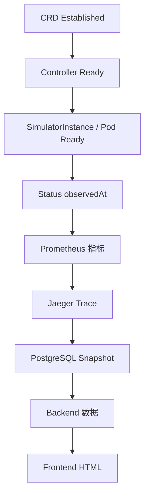

# 验证指南

## 1. 部署时自动验证

`make cluster-up` 不以“清单 apply 成功”作为完成条件。它会继续验证：



任何硬门失败都会退出非 0，并将 Node、工作负载、Event、Controller 日志与 Backend 日志写到 `.runtime/last-failure.log`。

## 2. 部署后快速检查

```bash
make cluster-status
```

还可单独查看：

```bash
kubectl --context docker-desktop -n hello-k8s-ai-system \
  get deployment,statefulset,pod,service,pvc,lease -o wide

kubectl --context docker-desktop get \
  models,workernodes,tenants,tenantmodelpolicies,tenantnodepolicies,modelnodepolicies,\
simulatorinstances,tenantperformances,tenantruntimes,orchestrators
```

## 3. 静态与源码验证

```bash
bash -n setup.sh hack/local-cluster.sh hack/cleanup-obsolete.sh
make help
kubectl kustomize config/dev >/tmp/control-plane.yaml
kubectl kustomize config/demo >/tmp/demo.yaml
kubectl kustomize dashboard/deploy >/tmp/dashboard.yaml

make fmt vet test lint
(cd dashboard/backend && gofmt -w . && go vet ./... && go test ./...)
(cd dashboard/frontend/my-app && npm ci && npm run check)
```

CRD 修改时额外执行：

```bash
make manifests generate
git diff --exit-code -- api/v1 config/crd config/rbac
```

## 4. 本轮证据边界

2026-08-13 当前交付环境已完成 Shell 语法、Makefile 无 Go 解析与三套 Kustomize 渲染检查。当前环境没有 Docker、kubectl、Go 和目标集群，因此没有在这里伪造镜像构建、rollout、Metrics、Trace、数据库或浏览器通过结论。

用户提供的集群快照证明目标 Context、10 个 Ready Node、Kubernetes v1.36.1 和 `standard` StorageClass 存在，同时证明旧 `controller:latest` 会 `ImagePullBackOff`。最终运行结果仍以用户执行 `bash setup.sh` 的自动验收为准。

## 5. E2E 隔离

自动化测试仍可使用：

```bash
make test-e2e
```

它只操作固定 Kind 集群 `hello-k8s-ai-test-e2e`。日常完整栈部署绝不调用 Kind，也绝不复用或删除 `minikserve-demo`。
