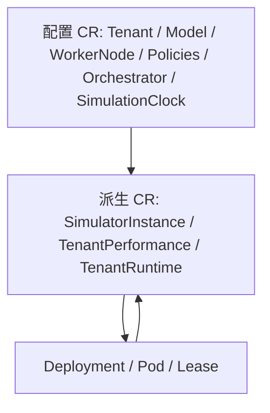

# CRD 设计

## 1. 通用约定

- API Group/Version：`platform.study.com/v1`。
- Scope：11 个 CRD 全部是 Cluster-scoped。
- Spec 表达期望；Status 表达观测/派生结果。
- 引用使用对象 `metadata.name`，不使用 displayName。
- Status 启用 subresource；标准 Conditions 为 map list（key=`type`）。
- 生成清单位于 `config/crd/bases`，不得手工修改；源类型在 `api/v1`。

Backend 通过 dynamic informer 读取全部 CRD；通用 Command Gateway 允许写 7 个配置 CR：Model、WorkerNode、Tenant、三类 Policy、Orchestrator。集群唯一的 `SimulationClock/default` 通过专用 Clock API 写入，避免通用接口创建第二个 Clock 或删除全局配置。

## 2. Model

### 用途

描述一个模型实例的资源成本、最大并发、冷启动和静态性能参数。它是 Orchestrator 计算可行放置和 Simulator 计算服务时间的输入。

### 字段

| 区域 | 字段 | 语义/约束 | 写入者 |
| --- | --- | --- | --- |
| spec | `displayName` | 非空展示名 | 用户/Backend |
| spec | `gpuUnits` | >=1；约定 800 表示 0.8 卡一类业务单位 | 用户/Backend |
| spec | `maxConcurrency` | >=1 | 用户/Backend |
| spec | `absoluteScore` | >=1；单个已预热副本的理想能力基准，调度必填 | 用户/Backend |
| spec | `coldStartMs` | >=0 | 用户/Backend |
| spec.performance | `prefillBaseMs` | 默认 50ms | 用户/Backend |
| spec.performance | `prefillPerTokenUs` | 默认 500us/token | 用户/Backend |
| spec.performance | `decodePerTokenMs` | 默认 20ms/token | 用户/Backend |
| status | `absoluteScore` | 旧版本兼容字段 | 禁止新增写入；Orchestrator 仅在 Spec 缺失的旧对象上回退读取 |
| status | `conditions` | 当前实现通常为空 | 未定义内部 writer |

### 生命周期与关联

- 被 TenantModelPolicy、ModelNodePolicy 和 SimulatorInstance 引用。
- TenantModelPolicy Controller watch Model generation；Model 删除/失效会阻止或清理实例。
- Simulator 读取性能参数；Orchestrator 从 `spec.absoluteScore` 取得首次调度分数。
- 删除前应检查引用；Kubernetes CRD schema 当前不提供跨对象 referential integrity。

### Dashboard / Backend

- Config 页面展示和编辑包含 `absoluteScore` 的 Spec；Data View 展示 Status/关联实例。
- Backend dynamic cache 读取；Mapper 转成 ModelConfig/overview。
- Backend Command Gateway 将 `absoluteScore` 列入 Model Spec 白名单，并在缺失时拒绝请求。

## 3. WorkerNode

### 用途

把 Kubernetes Node 映射为业务 GPU/并发容量。对象名应与实际 Node 名一致，Simulator node affinity 和已调度 Pod 统计依赖该名称。

| 区域 | 字段 | 语义/约束 | 写入者 |
| --- | --- | --- | --- |
| spec | `displayName` | 非空展示名 | 用户/Backend |
| spec | `gpu` | >=1，总业务 GPU 单位 | 用户/Backend |
| spec | `maxConcurrency` | >=1 | 用户/Backend |
| status | `usedGPU` | >=0，已调度 Simulator Pod 对应 Model.gpuUnits 合计 | WorkerNodeUsage |
| status | `usedConcurrency` | >=0，Model.maxConcurrency 合计 | WorkerNodeUsage |
| status | `conditions` | UsageReady 等 | WorkerNodeUsage |

生命周期：先有真实 Node，再创建同名 WorkerNode；Policy 引用它；Pods 调度到该 Node 后 Controller 更新 Status。它不是 Node 的替代品：Node Ready/taint/pressure 来自 core/v1 Node。

Dashboard：Config 展示容量/使用；Data View 同时展示 WorkerNode 与 core Node。Backend 从 dynamic WorkerNode informer 和 typed Node/Pod informer聚合。

## 4. Tenant

### 用途

表达请求总量、优先级和扩缩容迟滞阈值。Traffic、PerformanceCollector 和 Orchestrator 都以 Tenant 为主入口。

| 区域 | 字段 | 语义/约束 | 默认 |
| --- | --- | --- | ---: |
| spec | `displayName` | 非空 | - |
| spec | `priority` | P1（最高）到 P5 | - |
| spec | `qps` | >=0，总请求 QPS | - |
| spec | `ttftThresholdMs` | 扩容上阈值，>=1，必填 | - |
| spec | `queueThreshold` | 扩容上阈值，>=1，必填 | - |
| spec | `ttftScaleDownThresholdMs` | 缩容下阈值，>=1，必填 | - |
| spec | `queueScaleDownThreshold` | 缩容下阈值，>=1，必填 | - |
| status | `conditions` | 当前无项目内 Controller writer | - |

CEL 要求 TTFT down < up 且 Queue down < up，形成迟滞，防止在单个阈值附近频繁抖动。

生命周期/关联：Policy、Orchestrator、SimulatorInstance、TenantPerformance、TenantRuntime 引用它；后两者和 Instance 通常以 Tenant owner/名称关联。删除 Tenant 会触发 owner/finalizer 清理相关实例和派生资源。

Dashboard：Config 编辑；Traffic 展示 QPS/阈值；Data View 展示全关联。Backend `PATCH /tenants/{name}/traffic` 只改 `spec.qps`。

## 5. TenantModelPolicy

### 用途

决定 Tenant 是否可使用 Model，是 SimulatorInstance 存在性的业务门。**必须存在显式 Allow；任意 Deny 覆盖 Allow。**

| 区域 | 字段 | 语义 | 写入者 |
| --- | --- | --- | --- |
| spec | `tenantRef.name` | Tenant metadata.name | 用户/Backend |
| spec | `modelRef.name` | Model metadata.name | 用户/Backend |
| spec | `effect` | `Allow` / `Deny` | 用户/Backend |
| status | `conditions` | Ready/原因 | TenantModelPolicy Controller |

生命周期：创建/修改触发同组合全部 policy 聚合；允许且依赖存在时确保一个 SimulatorInstance；拒绝、依赖删除或 policy 删除时删除对应实例。Controller 使用 finalizer 处理删除。

Dashboard：当前 Config UI 未编辑，但 Data View 展示；Backend 可读写并对 Spec allowlist。

## 6. TenantNodePolicy

### 用途

定义 Tenant 可以使用哪些 WorkerNode。实现把 Tenant Allow 当基础 allowlist，Deny 覆盖 Allow；没有可用 Allow 时可能得到空候选集，而不是“默认所有节点”。

| 区域 | 字段 | 语义 | 写入者 |
| --- | --- | --- | --- |
| spec | `tenantRef.name` | Tenant | 用户/Backend |
| spec | `nodeRef.name` | WorkerNode/实际 Node 名 | 用户/Backend |
| spec | `effect` | Allow/Deny | 用户/Backend |
| status | `conditions` | 预留 | 当前无 writer |

SimulatorInstance Controller watch 其 generation 并重新生成 Deployment affinity；Orchestrator 也用它过滤扩容可行节点。空 Conditions 不代表失败。

Dashboard：当前 UI 不可编辑；Data View 可展示；Backend 可读写 Spec。

## 7. ModelNodePolicy

### 用途

在 TenantNodePolicy 的候选集上施加模型约束。Deny 总是排除；如果该 Model 存在任意 Allow，则使用额外 allowlist；如果没有任何 Model Allow，则不额外收窄 Tenant 候选集。

| 区域 | 字段 | 语义 | 写入者 |
| --- | --- | --- | --- |
| spec | `modelRef.name` | Model | 用户/Backend |
| spec | `nodeRef.name` | WorkerNode/Node | 用户/Backend |
| spec | `effect` | Allow/Deny | 用户/Backend |
| status | `conditions` | 预留 | 当前无 writer |

SimulatorInstance Controller 和 Orchestrator 都读取；Dashboard/Backend 行为同 TenantNodePolicy。

## 8. SimulationClock

### 用途

保存集群唯一的 Simulator 离散事件时间倍速。对象名称固定为 `default`；Controller 缺失时自动创建 1x 默认对象。它不改变 Backend/Controller 墙钟、Kubernetes Lease、Prometheus 抓取或数据库采集周期。

| 区域 | 字段 | 语义/约束 | 写入者 |
| --- | --- | --- | --- |
| spec | `rate` | 1..20；每个真实 Tick 推进的模拟时间倍数 | kubectl / Backend `PATCH /clock/rate` |
| status | `observedGeneration` | Controller 已处理的 Spec generation | SimulationClock Controller |
| status | `appliedRate` | 当前已同步到全部实例的倍速 | SimulationClock Controller |
| status | `synchronizedInstances` / `totalInstances` | 本轮同步计数 | SimulationClock Controller |
| status | `conditions` | Ready；同步失败或输入非法时为 False | SimulationClock Controller |

Controller 将 `spec.rate` 扇出到全部 `SimulatorInstance.spec.timeScale`。Status Ready 代表 CR 字段已经收敛，不代表每个 Simulator 已完成下一个 Tick；运行进程是否读取新值由 `hello_k8s_ai_simulator_time_scale` 指标验证。

## 9. SimulatorInstance

### 用途

一个 Tenant-Model 对应一个实例池，是多个 Controller 与 Simulator 交换状态的中心资源。用户和 Backend 禁止直接写。

### Spec

| 字段 | 语义 | 写入者 |
| --- | --- | --- |
| `tenantRef.name` | Tenant | TenantModelPolicy Controller 创建时写，之后保持 |
| `modelRef.name` | Model | 同上 |
| `replicas` | 期望副本，>=0 | Orchestrator；创建初始 0 |
| `traffic.qps` | 分配到该实例池的整数 QPS，>=0 | Traffic Controller；创建初始 0 |
| `timeScale` | 1..20；当前 Simulator 引擎倍速 | SimulationClock Controller；创建初始 1 |

### Status

| 字段 | 语义 | 唯一/主要写入者 |
| --- | --- | --- |
| `performance.ttft` | 当前 TTFT，value + unit | Simulator Leader |
| `performance.queue` | 当前 Queue，value + unit | Simulator Leader |
| `effectiveScore` | Orchestrator 的单副本静态能力分 | Orchestrator |
| `score` | 冷启动和可用副本后的实例池实时分 | Simulator Leader |
| `availableReplicas` | Deployment available replicas | SimulatorInstance Controller |
| `observedAt` | 最近性能快照时间 | Simulator Leader |
| `reporterID` | 当前 leader Pod identity | Simulator Leader |
| `phase` | Running/Pending/Failed/Unknown | SimulatorInstance Controller |
| `conditions` | Ready 等 | SimulatorInstance Controller |

### 生命周期

TenantModelPolicy Controller 创建 -> Orchestrator 修改 replicas -> SimulatorInstance Controller 创建 Deployment -> Pod/Lease -> Simulator 写 Status -> Traffic/Performance/Orchestrator读取。Policy Deny/删除触发 Instance 删除；finalizer 先删除 Deployment 并更新 TenantRuntime。

Dashboard：Traffic 与 Data View 核心对象；Backend只读，并关联 Deployment/Pod/Lease/Prom/Trace。

## 10. TenantPerformance

### 用途

为每个 Tenant 聚合所有新鲜 Running SimulatorInstance 性能，给 Orchestrator 提供稳定输入。

| 区域 | 字段 | 语义 | 写入者 |
| --- | --- | --- | --- |
| spec | `tenantRef.name` | Tenant | PerformanceCollector 创建/确保 |
| status.performance | `avgTTFT`、`avgQueue` | value + unit | PerformanceCollector |
| status | `observedAt` | 输入样本中最新时间 | PerformanceCollector |
| status | `sampleCount` | 纳入聚合的有效实例样本数 | PerformanceCollector |
| status | `phase` | Running/Stale/Unknown | PerformanceCollector |
| status | `conditions` | MetricsReady 等 | PerformanceCollector |

生命周期：Tenant 存在即确保同名 TenantPerformance；每约 10 秒/相关事件重新聚合。没有新鲜样本时 Stale，不用旧值伪装 Running。

Dashboard：Traffic/Data View；Backend只读。用户不可创建/修改是期望边界，即使旧 sample YAML 有该 Kind。

## 11. TenantRuntime

### 用途

汇总 Tenant 的 Deployment 可用副本与总体 phase。

| 区域 | 字段 | 语义 | 写入者 |
| --- | --- | --- | --- |
| spec | `tenantRef.name` | Tenant | SimulatorInstance Controller |
| status | `instanceCount` | **当前实现是 available replicas 合计** | SimulatorInstance Controller |
| status | `phase` | Running/Pending/Failed/Unknown | SimulatorInstance Controller |
| status | `conditions` | RuntimeReady 等 | SimulatorInstance Controller |

字段名 `instanceCount` 容易被理解为 SimulatorInstance CR 数；Backend DTO 应称 `readyReplicaCount` 或明确说明，未来改 CRD 需版本迁移。

Dashboard：Traffic/Data View；Backend只读。

## 12. Orchestrator

### 用途

每个 Tenant 的扩缩容配置和最近执行记录。

### Spec

| 字段 | 语义/约束 | 默认 |
| --- | --- | ---: |
| `tenantRef.name` | Tenant | - |
| `scaleUpCooldownSeconds` | >=0，扩容方向独立冷却 | 60 |
| `scaleDownCooldownSeconds` | >=0，缩容方向独立冷却 | 120 |
| `allowScaleToZero` | 无流量时可越过 min 到 0 | false |
| `minReplicas` | >=0，且 <= max | 1 |
| `maxReplicas` | 0 或正整数，0 = 不限制（扩到容量上限为止），必填 | - |

### Status

| 字段 | 语义 | 写入者 |
| --- | --- | --- |
| `lastScaling` | time/action/instanceName/oldReplicas/newReplicas | Orchestrator |
| `lastScaleUpTime` | 上次扩容时间 | Orchestrator |
| `lastScaleDownTime` | 上次缩容时间 | Orchestrator |
| `conditions` | Ready/decision reason 等 | Orchestrator |

生命周期：用户创建后，Controller 读取 TenantPerformance、实例、模型/节点/策略和 WorkerNode 容量；决定 no-op/up/down；写 pending plan、实例副本/effectiveScore、自身 Status。实现期望一个 Tenant 一个 Orchestrator；多条是配置错误而不是投票。

Dashboard：当前 UI 未编辑，Traffic/Data View 展示；Backend 可读写 Spec。

## 13. 关系总表

| CRD | 主要输入给谁 | 主要由谁创建 | 用户可写 Spec | Dashboard 位置 |
| --- | --- | --- | --- | --- |
| Model | Orchestrator、Simulator、WorkerUsage | 用户 | 是 | Config/Data View |
| WorkerNode | Orchestrator、Instance Controller | 用户 | 是 | Config/Data View |
| Tenant | Traffic、Performance、Orchestrator | 用户 | 是 | Config/Traffic/Data View |
| TenantModelPolicy | TenantModelPolicy Controller | 用户 | 是 | Data View（未来 Config） |
| TenantNodePolicy | Instance/Orchestrator | 用户 | 是 | Data View（未来 Config） |
| ModelNodePolicy | Instance/Orchestrator | 用户 | 是 | Data View（未来 Config） |
| SimulationClock | SimulationClock Controller、Simulator | Controller 自动创建或用户/Backend | 是，仅 `default.spec.rate` | 全局执行控制/Data View |
| SimulatorInstance | 5 个 Controller + Simulator | TenantModelPolicy Controller | 否 | Traffic/Data View |
| TenantPerformance | Orchestrator | PerformanceCollector | 否 | Traffic/Data View |
| TenantRuntime | Dashboard/read model | SimulatorInstance Controller | 否 | Traffic/Data View |
| Orchestrator | Orchestrator Controller | 用户 | 是 | Traffic/Data View（未来 Config） |

字段级写入规则见 [FIELD_OWNERSHIP.md](FIELD_OWNERSHIP.md)。
