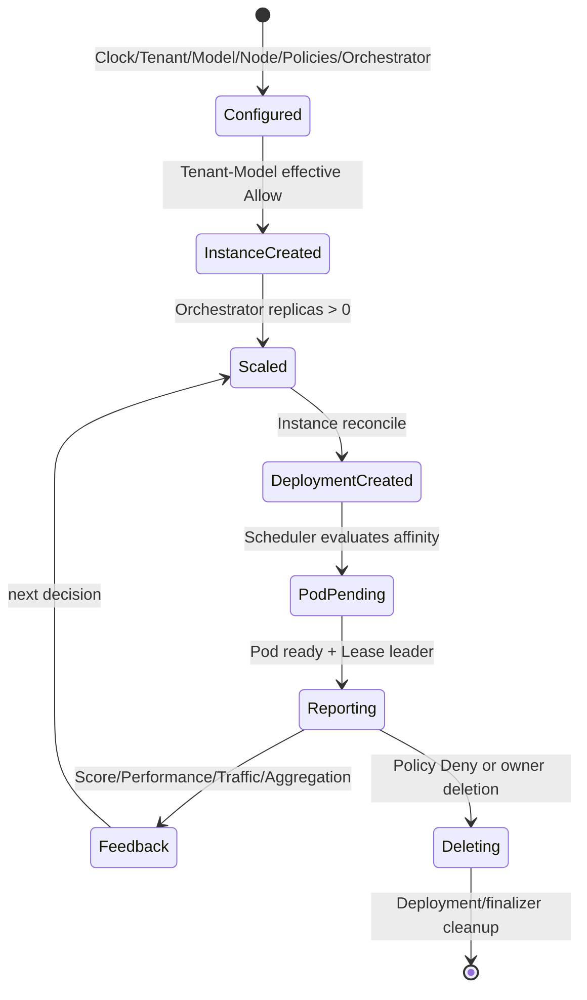
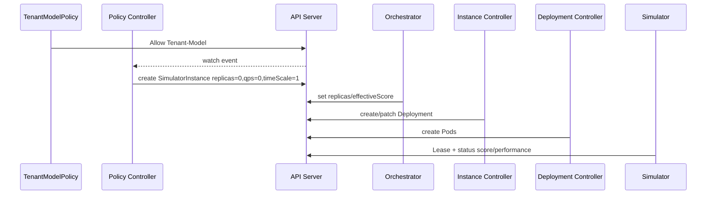
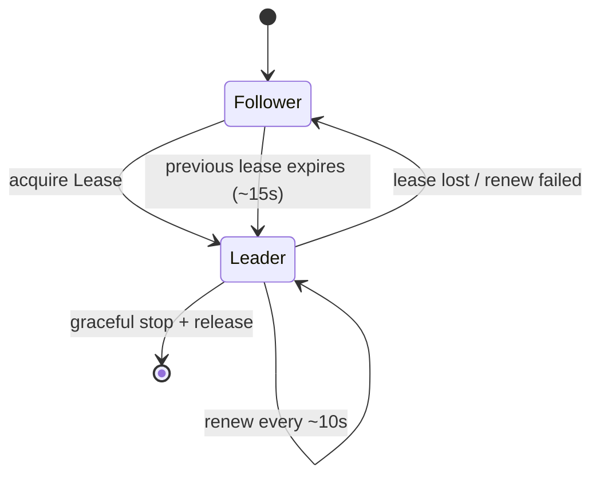
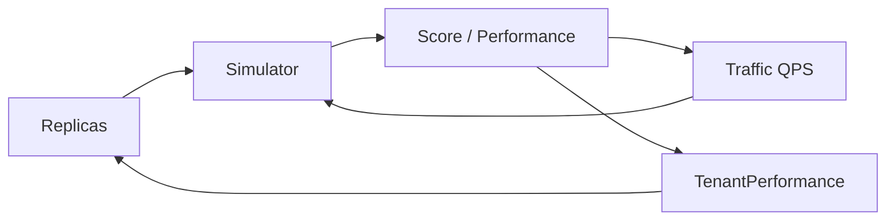

# 资源生命周期

> 维护层：human | last-reviewed：2026-08-18 | 事实源：internal/controller/

## 1. 从配置到运行

## 2. 配置创建阶段

建议顺序：

1. `SimulationClock/default`（可省略，Controller 会创建 1x）。
2. WorkerNode（metadata.name 与实际 Node 对齐）。
3. Model（包括资源/性能参数和必填的 `spec.absoluteScore`）。
4. Tenant（QPS 与迟滞阈值）。
5. TenantNodePolicy / ModelNodePolicy。
6. TenantModelPolicy Allow。
7. Orchestrator。

顺序不是 API 强制事务；Controller 会等待缺失依赖。CRD 会拒绝没有正数 `spec.absoluteScore` 的新 Model；先创建 Allow 但 Model 不存在时不应生成可运行工作负载。

## 3. SimulatorInstance 生命周期

### Phase

- Pending：期望副本未可用、候选节点无效、Deployment 尚在 rollout 等。
- Running：Deployment 可用状态满足实现条件。
- Failed：Deployment/依赖出现明确失败。
- Unknown：信息不足或初始化。

Phase 由 SimulatorInstance Controller 写，Simulator 不应因为单个 Tick 失败改 Phase。

## 4. Leader 生命周期

每个 Simulator Pod 竞争同一 Instance 的 Lease：

只有 Leader Tick 和写 SimulatorInstance 性能 Status。Follower 仍运行健康/指标端点，可通过 `leader=0` 区分。`reporterID` 与 Lease holder 用于诊断双写/切换。

## 5. 性能反馈生命周期

1. Leader 每约 5 秒真实时间读取 Instance/Model。
2. 用 timeScale、可用副本、effectiveScore、冷启动和 QPS 推进仿真。
3. 写 score/performance/observedAt/reporterID。
4. Traffic 读取新鲜 score，重分配下一轮 QPS。
5. PerformanceCollector 聚合新鲜 performance，写 TenantPerformance。
6. Orchestrator 读取 TenantPerformance，决定副本。

这是两个反馈环：分数-流量环通常更快，性能-扩缩容环受 10 秒 Reconcile 与 cooldown 限制。

### 倍速变更

Frontend/Backend 更新 `SimulationClock/default.spec.rate` 后，Clock Controller 逐个同步 Instance 并写 Ready；Simulator 在下一真实 Tick 读取新值。Deployment template 不包含 timeScale，因此 Pod UID 保持不变。高倍速加快引擎演进，但反馈发布、样本新鲜度和扩缩冷却仍按真实时间。

## 6. 扩容生命周期

1. TenantPerformance 超过任一上阈值或总副本低于 floor。
2. 检查 scale-up cooldown、maxReplicas、maxScaleUpBatch（单次扩容步长，0=默认 10）、Policy 和 WorkerNode 资源。
3. 选择实例/模型并计算 effectiveScore。
4. 持久化 pending plan 和 replica 变更。
5. Instance Controller patch Deployment。
6. Pod Pending -> Scheduled -> Ready。
7. availableReplicas 更新；Simulator 冷启动因子逐步提高；score 上升；Traffic 调整。
8. Orchestrator 完成 Status 并清理 pending annotation。

扩容 HTTP/Spec 成功不等于 Pod 已 Ready。Dashboard 应展示每个阶段和阻塞证据。

## 7. 缩容生命周期

触发：QPS=0，或 TTFT 与 Queue **同时**低于下阈值；还要满足 scale-down cooldown 和 min/floor。

Orchestrator 优先从副本较多、effectiveScore 较低的实例减少一个副本。Deployment 删除 Pod；WorkerNodeUsage 重新统计资源；Traffic 排除 replicas=0。无流量且 allowScaleToZero 时可到 0。

当前没有 request draining 或真实推理优雅下线语义，因为数据面是 Simulator。接入真实推理时必须新增终止/排空协议。

## 8. Policy 变更

### Tenant-Model Deny

- Policy Controller 删除 SimulatorInstance。
- Instance finalizer 删除 Deployment，owner/finalizer 链清理 Pod/Lease。
- TenantRuntime 重算。
- Traffic/Performance 下次 reconcile 移除该实例。

### Node Policy 收窄

- Instance Controller 修改 Deployment required affinity。
- Kubernetes rollout 可能重建 Pod；已运行 Pod 不一定仅因 requiredDuringScheduling affinity 变化立即驱逐，具体由 Pod template 变化/Deployment rollout 决定。
- 无候选节点时新 Pod Pending；不能把 Deny 忽略以求可用。

## 9. 删除与垃圾回收

| 删除对象 | 预期影响 |
| --- | --- |
| TenantModelPolicy | 重新聚合同组合；若无 Allow/有 Deny，删除 Instance。 |
| Tenant | OwnerReference/finalizer 链清理 Instances、TenantPerformance、TenantRuntime；Orchestrator/Policy 引用需显式治理。 |
| Model | 相关 Instance 不再有效并应清理；Policy 可能成为悬空引用。 |
| WorkerNode | 候选容量消失；实际 Kubernetes Node 不会随 CR 自动删除。 |
| SimulatorInstance | finalizer 删除 namespaced Deployment并重算 Runtime。 |
| Orchestrator | 停止后续自动扩缩，现有 replicas/Deployment 不必自动归零。 |
| SimulationClock | Controller 会重新创建 1x 默认对象；Backend API 不提供删除。 |

跨 scope OwnerReference 合法性和 garbage collection 需要实际集群测试；实现已使用 finalizer 避免单靠 GC。

## 10. 收敛时间

没有单一固定 SLA。上限由 watch 传播、Reconcile、Deployment scheduling、Tick（约 5s）、聚合/流量 Requeue（约 10s）、冷却（60/120s 默认）、Prom scrape（10s）、snapshot（30s）叠加。

因此 Dashboard 要展示每一层时间戳，不应把 30 秒内的短暂差异直接标为系统故障。超过新鲜窗口或多轮 Reconcile 仍不收敛时，再按排障文档定位。
