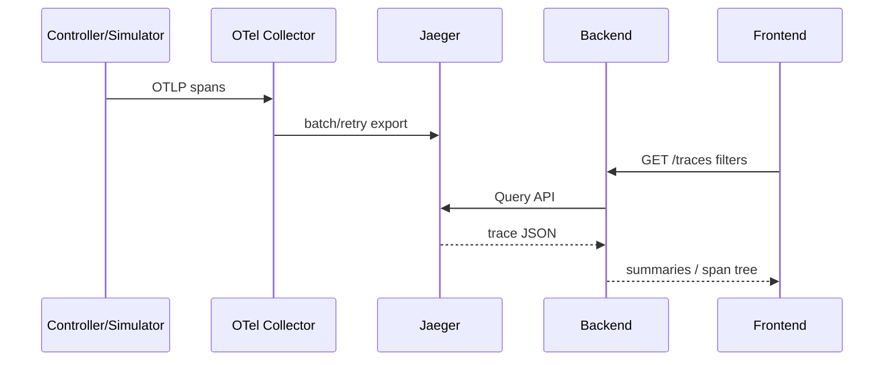

# Jaeger

## 1. 作用与边界

Jaeger 是 Trace/Span 查询后端。OTel Collector 把 Controller/Simulator spans 发给它；Grafana 和 Dashboard Backend 查询它。Jaeger 不存 Prometheus metrics，也不拥有 Kubernetes 状态。

## 2. 开发部署

| 配置 | 当前值 |
| --- | --- |
| Image | `cr.jaegertracing.io/jaegertracing/jaeger:2.20.0` |
| Replicas | 1 |
| Query/UI port | 16686 |
| OTLP gRPC/HTTP | 4317 / 4318 |
| Metrics | 8888 |
| Storage | badger 持久化（PVC `hello-k8s-ai-jaeger-data` 10Gi，spans TTL 168h） |
| Service | `hello-k8s-ai-jaeger` |

数据卷为 PVC（badger 持久化），Pod 重启不丢 Trace；TTL 168h。单副本 + RWO，重启/升级需先 scale 0 再扩 1（badger 目录锁，见 `docs/lessons/observability-pvc-single-replica.md`）。

## 3. 数据链路



## 4. Backend Provider

当前 provider 使用 Jaeger legacy Query HTTP API：

- `/api/services`
- `/api/traces`
- `/api/traces/{traceID}`

限制：窗口最多 24h，limit 1..100；未指定 service 时发现最多 4 个 `hello-k8s-ai*`。支持 service、operation、tenant、model、instance、min/max duration 等白名单参数。

Jaeger v2 部署是否在所有配置下继续提供这些 legacy endpoints，必须在实际镜像中运行验证。若 API 改变，优先升级 Provider 契约/适配器，不让 Frontend 直接绑定 Jaeger 原始格式。

## 5. 规范化模型

### Trace summary

应包括 traceID、root service/operation、start/end、duration、span count、error flag、关键 entity tags。

### Span tree

Backend 根据 spanID/parentSpanID 生成树，统一时间单位和 attributes。异常情况必须容忍：孤儿 Span、多个 root、缺失 process/service、时钟偏差。

`trace_index` 只保存查询到的 Trace metadata/entity/time，用于关联；详情仍向 Jaeger 查。

## 6. 页面展示

Data Overview 的 Trace 区域：

- 在当前/历史窗口搜索摘要。
- 按 service/operation/Tenant/Model/Instance/Duration 过滤。
- 选中 traceID 请求详情并显示 Span tree。
- 显示 provider queriedAt、availability 和 warnings。
- 可提供 Jaeger/Grafana deep link，但产品视图不依赖手工打开 Jaeger。

历史 snapshot 与 Trace retention 不同步：一个 20 天前的 snapshot 很可能没有当前 dev Jaeger Trace，应显示 unavailable，不是空系统。

## 7. 常见排障

完整部署已自动检查 Jaeger service 列表；如需手工查看：

```bash
kubectl --context docker-desktop -n hello-k8s-ai-system \
  port-forward svc/hello-k8s-ai-jaeger 16686:16686
```

### 没有 service

1. Controller/Simulator 是否配置 OTEL endpoint 且 SDK 未 disabled。
2. Collector receiver 是否接受 spans。
3. Collector exporter sent/failed metrics。
4. Jaeger 4317 service DNS/connection。
5. service.name 是否是 `hello-k8s-ai-*`，Backend auto-discovery 有前缀限制。

### Jaeger UI 有 Trace、Backend 无

1. `/api/services` 和 `/api/traces` 是否在 v2 实际可用。
2. Backend `JAEGER_URL` 是否指向 query port 16686，而非 OTLP 4317。
3. 时间单位/时区/窗口是否正确。
4. filter tag 名是否与 OTel resource/span attributes 对应。
5. provider timeout/limit 是否触发 warning。

### Trace 不完整

可能原因：采样、Collector drop/queue、进程强退未 flush、无上下文传播、异步 K8s watch 本来就不是同一 Trace。先判断“Span 丢失”还是“系统边界没有传播设计”。

## 8. 生产化

- 配置持久/可扩展 storage（例如受支持后端），定义 retention 与 compaction。
- 多副本 collector/query/ingester 的具体拓扑按 Jaeger v2 官方模式设计。
- 认证、TLS、NetworkPolicy；不要公开无保护 Query UI。
- Trace 属性脱敏、Tenant 访问隔离、采样和成本预算。
- 用 SLO 监控 ingest/query availability、latency、dropped spans。
- 在升级 Jaeger 时运行 Provider contract test，尤其是 legacy Query API。
