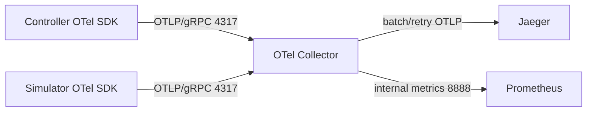

# OpenTelemetry

> 维护层：human | last-reviewed：2026-08-18 | 事实源：internal/observability/、config/observability/

## 1. 作用

OpenTelemetry 为 Controller Reconcile、业务操作、Simulator Tick、leader 变化和 Kubernetes client 请求建立 Trace。它回答“一次控制循环内部做了什么、哪里耗时/失败”，而不是保存资源当前态。

## 2. 端到端管道

Collector 清单版本 `otel/opentelemetry-collector-contrib:0.158.0`，receivers 支持 OTLP gRPC/HTTP；traces pipeline 为 memory_limiter -> batch -> otlp/jaeger，带 sending queue 和 retry。

## 3. SDK 启用与降级

`SetupTracing`：

- 设置 W3C TraceContext + Baggage propagation。
- `OTEL_SDK_DISABLED=true` 或无 endpoint 时返回 no-op provider。
- endpoint 存在时创建 OTLP/gRPC exporter、BatchSpanProcessor 和资源属性。
- 初始化失败由调用方记录并降级，控制面/Simulator 不因遥测中断。
- shutdown 最多等待刷新（Simulator 5s）。

## 4. Resource 属性

基础：service.name、service.version、host/process/telemetry SDK。

由环境变量可增加：

| 环境变量 | OTel attribute |
| --- | --- |
| `POD_NAME` | `k8s.pod.name`、`service.instance.id` |
| `POD_NAMESPACE` | `k8s.namespace.name` |
| `NODE_NAME` | `k8s.node.name` |
| `K8S_CLUSTER_NAME` | `k8s.cluster.name` |
| `DEPLOYMENT_ENVIRONMENT` | deployment environment |
| `SIMULATOR_INSTANCE_NAME` | `platform.simulator_instance.name` |
| `TENANT_NAME` | `platform.tenant.name` |
| `MODEL_NAME` | `platform.model.name` |

当前 Controller dev 和 Backend 清单使用的 cluster name 值不同（`docker-desktop` vs `hello-k8s-ai`），生产前应统一，否则跨服务 Trace/过滤维度不一致。

## 5. 采样

支持：always_on/off、parentbased_always_on/off、traceidratio、parentbased_traceidratio。ratio 从 `OTEL_TRACES_SAMPLER_ARG`，范围 0..1；dev 清单为 parentbased_traceidratio=1.0。

生产 100% 采样可能成本过高。采样策略应同时满足：错误/慢调用保留、Parent 传播、一致 service policy、可解释的丢样率。Tail sampling 需在 Collector 显式设计，不在无测试时临时打开。

## 6. Controller spans

- 根/内部 Span：`controller.<controllerName>.reconcile`。
- 属性：controller name、resource name、namespace（有时）、outcome、requeue after。
- 子操作 Span：`<component>.<operation>`，例如 create/patch/status。
- error 记录 exception 并设置 Error status。
- 当前 trace ID 注入 controller-runtime log context，用于日志关联。

Watch 请求从 Kubernetes HTTP instrumentation 过滤，因为长连接会产生超长、低价值 Span；普通 API GET/PATCH 等有 client spans。

## 7. Simulator spans

- `simulator.tick`：instance、reporter、assigned QPS、available replicas、effective/pool score、time scale、simulation step/elapsed、cold factor、queue、TTFT/outcome。
- `simulator.leadership.acquired` / `lost`：leader 生命周期。
- Kubernetes client 普通请求。

Span 的性能属性来自单次 Tick；Prometheus 更适合趋势，Trace 更适合关联具体失败。

## 8. 目前没有的 Trace

- Frontend 浏览器到 Backend 的 W3C context 传播未作为当前完整能力记录。
- Dashboard Backend 本身没有在当前文档审计中确认与 Controller 同等的 OTel SDK instrumentation；它能查询 Jaeger，但“查询 Trace”不等于“自身已产生 Trace”。
- Kubernetes watch 事件跨 Controller 不会自然形成同一 Trace，因为 API Server 是异步边界。

要实现跨 Reconcile 因果链，应在 CR annotation/status/event 中保存业务 correlation ID，并谨慎处理生命周期与高基数，而不是假设 traceparent 能跨任意 K8s watch 自动传播。

## 9. Collector 可靠性

当前 memory limiter 保护 Collector，batch 降低导出开销，sending queue/retry 处理短暂 Jaeger 故障。仍需监控：

- receiver accepted/refused spans。
- processor dropped spans。
- exporter sent/failed spans。
- queue size/capacity。
- Collector memory/restarts。

遥测丢失不能阻断业务，但必须告警；否则故障时恰好没有证据。

## 10. 变更检查

- 新 Span 名和 attributes 是否有界？不要把 UID/错误全文作为 metric label。
- 是否包含敏感 Tenant/用户输入？Trace 需要脱敏/retention。
- 高频 Tick 的采样与成本是否可承受？
- exporter timeout/retry 是否会拖慢业务 goroutine？
- 无 endpoint/Collector down 时核心路径是否仍通过测试？
- Grafana/Jaeger 搜索字段和 Backend filters 是否同步？
