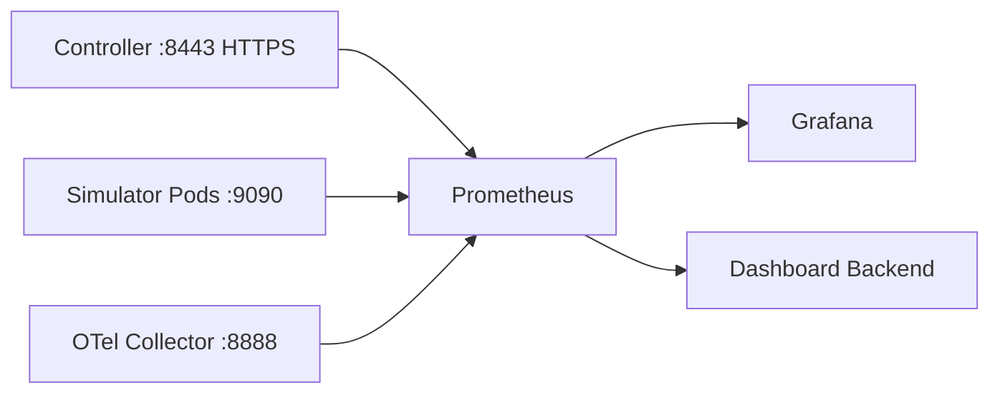

# Prometheus

> 维护层：human | last-reviewed：2026-08-18 | 事实源：dashboard/backend/internal/providers/、config/observability/ 等

## 1. 作用

Prometheus 保存 Controller、Simulator 和 OTel Collector 的时间序列，用于运行趋势、错误率、延迟和容量诊断。它不保存 CR 完整状态，不替代 Kubernetes API 或 PostgreSQL snapshot。

## 2. 开发部署

清单：`config/observability/prometheus.yaml` 与 `prometheus-rbac.yaml`。

| 配置 | 当前值 |
| --- | --- |
| Image | `prom/prometheus:v3.13.2` |
| Scrape interval | 10s |
| Retention | 168h（7 天） |
| Storage | PVC `hello-k8s-ai-prometheus-data`（20Gi、RWO、local-path） |
| Namespace | `hello-k8s-ai-system` |
| Service | `hello-k8s-ai-prometheus:9090` |
| Alertmanager | 未部署 |

数据卷为 PVC（`hello-k8s-ai-prometheus-data`），Pod 重启/重建不丢历史；retention 168h。单副本 + RWO，重启/升级需先 scale 0 再扩 1（目录锁，见 `docs/lessons/observability-pvc-single-replica.md`）。

## 3. Scrape 路径



### Controller

- controller-runtime metrics endpoint 使用 HTTPS 和 bearer token auth。
- Prometheus ServiceAccount 通过 nonResourceURL `/metrics` RBAC 获取权限。
- 如果 target 401/403，检查 token、ClusterRole/Binding 和 TLS 配置，而不是关闭 auth。

### Simulator

- 通过 Kubernetes Pod discovery，筛选 `hello-k8s-ai-system` 和平台 labels/annotations。
- 当前没有 per-instance Service。
- 多副本中所有 Pod 都被抓取；业务 PromQL 应考虑 leader label/metric，避免 follower 重复/空值。

### OTel Collector

- Collector internal metrics 在 8888 pull。
- 用于观察 sent/failed spans、队列和处理器状态。

## 4. Controller 指标

| 指标族 | Labels | 用途 |
| --- | --- | --- |
| `hello_k8s_ai_controller_reconcile_outcomes_total` | controller,outcome | success/error/requeue 速率。 |
| `..._controller_business_operations_total` | controller,operation,outcome | create/patch/status 等领域操作。 |
| `..._orchestrator_decisions_total` | action,reason | scale/no-op 决策。 |
| `..._orchestrator_scaling_operations_total` | direction,outcome | 持久化扩缩结果。 |
| `..._orchestrator_decision_duration_seconds` | histogram | 决策耗时。 |
| `..._orchestrator_pending_scale_plans` | histogram | 快照中恢复计划数。 |
| `..._traffic_allocation_runs_total` | outcome,mode | score/equal 等分配模式。 |
| `..._traffic_allocation_duration_seconds` | histogram | 分配耗时。 |
| `..._traffic_requested_qps` | histogram | Tenant 请求分布。 |
| `..._traffic_allocated_qps` | histogram | 成功分配分布。 |
| `..._performance_samples_total` | result | fresh/stale/invalid 样本分类。 |
| `..._performance_aggregation_duration_seconds` | histogram | 聚合耗时。 |
| `..._performance_fresh_sample_count` | histogram | 每次聚合新鲜样本。 |
| `..._worker_node_gpu_units_used` | node | 业务 GPU 使用。 |
| `..._worker_node_concurrency_used` | node | 业务并发使用。 |

另有 controller-runtime/workqueue/process 标准指标。

## 5. Simulator 指标

完整表见 [../simulator/SIMULATOR_ARCHITECTURE.md](../simulator/SIMULATOR_ARCHITECTURE.md)。核心查询应关注：leader、Tick 成功率/延迟、Status 写失败、assigned QPS、available replicas、effective/pool score、cold factor、time scale、simulation step/elapsed、queue、TTFT。

TTFT 指标单位是秒，而 CR Status 单位是毫秒；Backend provider 负责转换。不要在前端凭字段名猜单位。

## 6. Backend metric catalog

Frontend 只提交 metricId，Backend 生成安全 PromQL。当前支持：

- `simulator.ttft`
- `simulator.queue`
- `simulator.qps`
- `simulator.errorRate`
- `simulator.tickLatency`
- `simulator.timeScale`
- `controller.errorRate`
- `controller.reconcileLatency`
- `worker.gpuUsed`

过滤维度：tenant、model、instance、node；窗口最多 7 天，step 5s..1h，query cache TTL 5s。

为什么不开放任意 PromQL：防止高基数/长窗口查询拖垮 Prometheus，也避免浏览器注入不受控 label matcher。

## 7. Grafana

开发清单预置 12 panels：Reconcile 速率/错误、扩缩决策/执行、TTFT、Queue、QPS、Score、流量分配、样本分类、Trace 管道、Simulator Leader。变量包括 Tenant 和 Model。

Grafana 是运维探索界面；Dashboard Backend 直接查询 Prometheus，不经 Grafana 读取数据。

## 8. Rules 与告警

清单中包含 recording/alert rules（历史验证记录显示 6 条规则通过 promtool）。修改任何 PromQL 后：

```bash
promtool check config <rendered-prometheus-config>
promtool check rules <rules-file>
```

当前没有 Alertmanager，因此 alert rule 只会在 Prometheus 中 Firing，不会通知。生产必须配置 routing、silence、receiver、runbook URL 和测试告警。

## 9. 当前能力边界

当前 Prometheus 没有 kube-state-metrics，也没有通用 kubelet/cAdvisor scrape。因此：

- 可以展示项目业务 GPU/并发、Pods/Deployment 状态（后者来自 K8s API）。
- 不能声称有真实 Node/Pod CPU、memory、filesystem、network 使用率。
- resources.requests/limits 是配置，不是实际使用。

需要这些指标时，部署可信集群指标源，再在 Backend catalog 增加命名查询。

## 10. 排障

完整部署已自动检查 Simulator 指标；如需手工查看：

```bash
kubectl --context docker-desktop -n hello-k8s-ai-system \
  port-forward svc/hello-k8s-ai-prometheus 9090:9090
```

检查顺序：

1. `/targets` target 是否 UP，错误是 DNS/TLS/auth/connection 哪类。
2. 原始 `/metrics` 是否有目标指标。
3. labels 是否与 PromQL matcher 一致。
4. Prometheus query 是否返回 series；时间窗/step 是否合理。
5. Backend `/metrics/query` 是否转换单位/过滤正确。
6. Frontend 是否把 unavailable 当 0。

生产化要求见 [../operations/PRODUCTION_READINESS.md](../operations/PRODUCTION_READINESS.md)。
