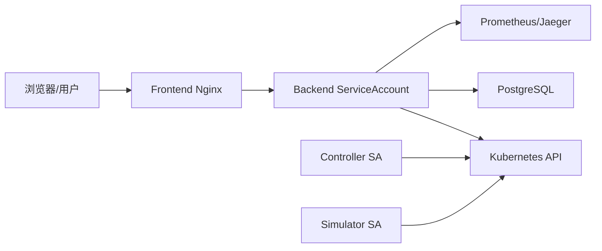

# 安全与 RBAC

> 维护层：human | last-reviewed：2026-08-21 | 事实源：config/rbac/

## 1. 当前信任边界

当前开发实现主要依赖 Kubernetes ServiceAccount/RBAC；没有完整最终用户认证和按用户/租户授权。任何把 Backend 暴露给不可信用户的部署都必须先补 IAM。

写接口（配置批量应用、配置删除、租户 QPS、模拟倍速）已建立应用层认证边界：

- 配置 `ADMIN_TOKEN` 后，写请求必须携带匹配的 `Authorization: Bearer <token>`；
- 未配置 token 时，非生产环境保持匿名写（本地演示可用），生产环境直接拒绝写请求；
- 审计主体取自认证身份；`X-Remote-User` 只在请求通过 Bearer 认证且显式开启 `TRUST_REMOTE_USER_HEADER` 时才被信任，任意调用方无法再伪造该头。

## 2. Backend RBAC

ServiceAccount：`hello-k8s-ai-dashboard-backend`。

| 权限 | 资源 |
| --- | --- |
| get/list/watch | 全部 11 个 platform CRD |
| create/update/patch/delete | Model、WorkerNode、Tenant、TenantModelPolicy、TenantNodePolicy、ModelNodePolicy、Orchestrator |
| create/update/patch | `SimulationClock/default`；应用层只开放 rate，RBAC 不授予 delete/status |
| get/list/watch | Pods、Nodes、Services、Events |
| get/list/watch | Deployments、ReplicaSets |
| get/list/watch | Leases |

没有 Status 子资源写权限，没有原生资源写权限。应用 Gateway 再做 Kind/Spec field allowlist。这是 defense in depth。

生产建议把 read-only 与 command Deployment/ServiceAccount 分离，或按身份做 SubjectAccessReview/impersonation；当前单 SA 意味着所有通过 Backend 的调用共享一套集群权限。

## 3. Controller 与 Simulator

- Controller Manager RBAC 由 kubebuilder markers 生成，负责 CR Status、Deployment 等控制资源和 leader election。
- WorkerNodeUsage 控制器额外读取同名真实 Node（allocatable）与该节点全部非终态 Pod（requests），计算物理水位（memoryUsagePercent/cpuUsagePercent）并写 PhysicalPressure 条件；RBAC 为 core/v1 nodes 只读（get/list/watch），见 `config/rbac/role.yaml`。
- Simulator 独立 ServiceAccount/ClusterRole，只需读取相关 Instance/Model、更新 SimulatorInstance Status、管理本 namespace Lease 等。
- Prometheus ServiceAccount 可发现 Pods，并访问受保护 metrics nonResourceURL。

任何 RBAC 改动从源码 markers/独立清单生成；`config/rbac/role.yaml` 不手改。

## 4. 容器安全基础

当前多数工作负载：runAsNonRoot、drop ALL capabilities、seccomp RuntimeDefault；Backend/Frontend/Collector/Jaeger 使用 readOnlyRootFilesystem（PostgreSQL 因数据目录例外）。有 requests/limits 与 probes。

仍需：

- 镜像 pin digest、SBOM、漏洞扫描、签名/验证。
- Pod Security Admission namespace policy。
- PDB、anti-affinity、topology spread。
- egress/ingress NetworkPolicy。
- RuntimeClass/沙箱按威胁模型评估。

## 5. Secret 与传输

本地部署首次执行时生成随机 PostgreSQL 密码并写入 Kubernetes Secret，不在 Git 中保存密码；DATABASE_URL 仍为本机集群内 `sslmode=disable`。生产禁止：

- 在 Git/Kustomize 直接放真实密码。
- 用默认密码或长期静态 token。
- 跨节点/网络明文连接数据库、OTLP、API。

应使用外部 Secret manager/CSI/Sealed Secret（按组织标准）、自动 rotation、TLS/mTLS、最小读取权限。日志/Trace/Audit 必须过滤 Authorization、Cookie、DATABASE_URL、Secret data。

## 6. 网络

当前只有 controller metrics 相关基础 NetworkPolicy 目录，完整组件间隔离不足。生产建议 allowlist：

- Frontend -> Backend 8080。
- Backend -> Kubernetes API、PostgreSQL 5432、Prometheus 9090、Jaeger 16686、DNS。
- Controller/Simulator -> Kubernetes API、OTel Collector；Prometheus -> metrics endpoints。
- OTel Collector -> Jaeger；Grafana -> Prometheus/Jaeger。
- 默认 deny 其他 ingress/egress。

Simulator 没有业务 Service；不要无意公开 9090。

## 7. API 安全

已有：严格 JSON、1MiB 限制、显式 CORS、请求 ID、安全 headers、panic recovery、命名 PromQL、Trace 参数边界、幂等/resourceVersion、dry-run、audit。

已有：写接口 Bearer 认证（`ADMIN_TOKEN`）、可信上游身份头开关（`TRUST_REMOTE_USER_HEADER`，默认关闭）。

未有/需加强：

- OIDC/session/JWT 验证和 CSRF 策略。
- 按用户/租户的 authorization。
- mutation/query rate limit、body/query complexity quota。
- sensitive DTO/attribute 脱敏。
- 防止 SSRF 的 provider URL 管理（只由受信配置设定）。
- 生产环境启用 token 后的 Frontend 登录态与凭据传递方案。

CORS 不是认证，Idempotency-Key 也不是授权。

## 8. 多租户隔离

CRD 都是 Cluster-scoped，Backend SA 也可读全部对象；当前 Tenant 是业务标签，不是 Kubernetes 安全租户。若要真实多租户：

- 明确用户 -> Tenant membership。
- API 每个 read/write 强制 tenant scope。
- Audit 与 Trace 查询同样过滤。
- 防止通过 metadata.name/ref 枚举其他租户。
- 考虑 namespace-scoped API 或隔离集群的版本设计；不能只在 UI 隐藏。

## 9. 审计与隐私

Audit 应记录 actor、action、resource UID/version、requestId、idempotency key、result，不记录 Secret/完整敏感 payload。Trace attributes 中 Tenant/Model 名可能是业务敏感元数据，需要 retention/access policy。

PostgreSQL/Prometheus/Jaeger/Grafana 访问都应认证、加密、备份并有删除策略。

## 10. 安全发布门

- 无默认凭据；Secret 不在 Git。
- OIDC/授权/tenant scope 测试通过。
- RBAC `can-i` 正负测试；Backend 不能写 Status/Pod/Deployment。
- 全部网络路径最小 allowlist + TLS。
- 镜像扫描/signature/SBOM。
- 审计主体可信、敏感字段脱敏。
- 备份加密/恢复演练。
- 依赖/provider 超时、rate limit、DoS 测试。
- Pod Security/NetworkPolicy 由策略测试验证。

## 11. AIOps 凭据与隐私

- LLM key 仅存 Backend 进程内存（面板写入或环境变量），不落 PostgreSQL、不进日志/Trace/审计；`/aiops/settings` 只回显掩码状态。
- 前端不直接访问 LLM；`AIOPS_OPENAI_BASE_URL` 由受信配置设定，避免任意 URL 注入（SSRF 面收敛到部署配置）。
- 切面名称、Pod/Node/Tenant 摘要与对话内容会进入外部 LLM 上下文：生产部署前需评估数据出域政策、供应商数据处理条款与脱敏方案。
- 调用审计（`aiops_audit_log`）记录模型、耗时、消息长度、token 用量与结果，不含请求原文与 key；审计失败只记日志，不阻塞对话。
- 限流（每会话 6 次/分钟）与消息长度上限（4000 字符）约束滥用面；AIOps 默认关闭，按需启用。
- 生产建议：key 走外部 Secret manager 并轮换、供应商侧配额与成本监控、对话/总结内容 retention 与删除策略。
