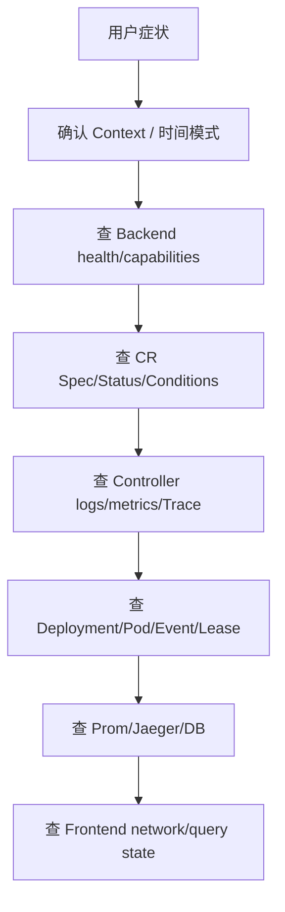

# 排障

> 维护层：human | last-reviewed：2026-08-18 | 事实源：hack/

## 1. 总体排障顺序



先确认页面是 Latest 还是 Historical。历史快照里的 Pending 不会因为当前集群已恢复而变化。

## 2. 快速信息包

```bash
CTX=kind-hello-k8s-ai-dev
NS=hello-k8s-ai-system

kubectl --context "$CTX" get nodes -o wide
kubectl --context "$CTX" -n "$NS" get deploy,statefulset,pod,svc,lease,pvc -o wide
kubectl --context "$CTX" get \
  tenants,models,workernodes,tenantmodelpolicies,tenantnodepolicies,modelnodepolicies,\
simulationclocks,simulatorinstances,tenantperformances,tenantruntimes,orchestrators -o wide
kubectl --context "$CTX" -n "$NS" get events --sort-by=.lastTimestamp
```

不要把 `CTX`/`NS` 未展开的命令用于删除；排障阶段只读。

## 3. Controller Manager 不 Ready

检查：

```bash
kubectl --context kind-hello-k8s-ai-dev -n hello-k8s-ai-system \
  describe deployment hello-k8s-ai-controller-manager
kubectl --context kind-hello-k8s-ai-dev -n hello-k8s-ai-system \
  logs deployment/hello-k8s-ai-controller-manager --all-containers --tail=300
kubectl --context kind-hello-k8s-ai-dev -n hello-k8s-ai-system get lease
```

常见原因：CRD 未 Established、RBAC forbidden、镜像未导入 Node、leader Lease 权限、metrics cert/volume、启动参数/环境变量。完整部署失败时先看 `.runtime/last-failure.log`；OTel endpoint 失败不应使 Manager 退出，若退出则检查其他初始化错误。

## 4. Tenant-Model 没有 SimulatorInstance

按顺序：

1. Tenant/Model 名是否与 policy ref 完全一致。
2. 是否至少一个显式 Allow。
3. 是否有任何同组合 Deny（Deny wins）。
4. Tenant/Model 是否删除中。
5. TenantModelPolicy Conditions。
6. Policy Controller logs/metrics/Trace。

```bash
kubectl get tenantmodelpolicies -o yaml
kubectl get tenants,models
```

没有 Allow 默认不是允许。

## 5. SimulatorInstance 有但没有 Deployment

- Instance 是否有 deletionTimestamp/finalizer 卡住。
- `SIMULATOR_NAMESPACE` 是否有效，Manager ServiceAccount 是否能写 Deployment。
- Tenant/Model/WorkerNode/Policy 依赖是否存在。
- 查看 Instance Conditions 和 Manager log。

```bash
kubectl get simulatorinstance <name> -o yaml
kubectl -n hello-k8s-ai-system get deployment simulator-<name> -o yaml
```

## 6. Pod Pending / 无可用副本

```bash
kubectl -n hello-k8s-ai-system describe pod <pod>
kubectl -n hello-k8s-ai-system get events \
  --field-selector involvedObject.name=<pod> --sort-by=.lastTimestamp
kubectl get tenantnodepolicies,modelnodepolicies,workernodes -o yaml
```

可能原因：

- TenantNodePolicy 没有显式 Allow，或 Deny 排除。
- ModelNodePolicy Allow 收窄/Deny 排除。
- WorkerNode name 与真实 Node name 不一致。
- 无候选节点时 Controller 有意写了不可能 affinity。
- 镜像未 load、ServiceAccount/RBAC、资源/taint/Node NotReady。

不要为“让 Pod 跑起来”删除 Deny 或把 affinity 改成所有节点；先修正业务配置。

## 7. Simulator 没有更新 Status

检查四个证据：Pod、Lease、leader metric、reporterID/observedAt。

```bash
kubectl -n hello-k8s-ai-system get lease simulator-reporter-<instance> -o yaml
kubectl -n hello-k8s-ai-system logs deploy/simulator-<instance> --all-containers --tail=300
kubectl get simulatorinstance <instance> -o yaml
kubectl auth can-i --as=system:serviceaccount:hello-k8s-ai-system:hello-k8s-ai-simulator-sa \
  patch simulatorinstances.platform.study.com/status
```

常见原因：无 leader、Lease renew 失败、Model 缺失/并发非法、Status RBAC、API conflict、instance 删除中。QPS=0 或 available=0 时 Performance nil 是正常，不等于 Status 完全不更新；observedAt/score仍应按 Tick 行为检查。

### 倍速没有生效

```bash
kubectl get simulationclock/default -o yaml
kubectl get simulatorinstances \
  -o custom-columns='NAME:.metadata.name,RATE:.spec.timeScale'
kubectl -n hello-k8s-ai-system get --raw \
  '/api/v1/namespaces/hello-k8s-ai-system/pods/<simulator-pod>:9090/proxy/metrics' \
  | grep 'simulator_time_scale\|simulation_step_seconds'
```

依次区分：Clock desired/applied 是否一致、observedGeneration 是否等于 generation、同步数是否等于总数、目标 Instance 字段是否正确、Simulator 是否已经经过下一真实 Tick。Clock Ready 只表示字段收敛；指标才证明运行进程已经读取。倍速变化不应改变 Pod UID，若发生 rollout，检查是否有人把 timeScale 注入了 Deployment template。

## 8. Score 为 0 / Traffic 不合理

Score 可能为 0：

- `effectiveScore` 未写（通常旧 Model 尚未迁移 `spec.absoluteScore`，或尚未发生扩容决策）。
- 冷启动前半段 factor=0。
- availableReplicas=0。
- Simulator observedAt 已过期，Traffic 忽略。

验证总量：

```text
sum(instance.spec.traffic.qps for tenant) == tenant.spec.qps
```

过渡 Reconcile 窗口可短暂不一致；超过多轮则查 Traffic metrics/log/Trace、Instance phase/observedAt/score。所有 score=0 时等权 fallback 是设计行为。

## 9. TenantPerformance Stale

有效实例要求：Running、availableReplicas>0、observedAt 新鲜、Performance 对应字段存在。依次检查每个 Instance。QPS=0 时 Performance nil，Stale/无样本可能是预期。

注意 TTFT 与 Queue 分别可缺；不要用 TTFT=0 替代 nil。

## 10. Orchestrator 不扩/不缩

检查：

- 每 Tenant 是否恰有一个 Orchestrator 和一个 TenantPerformance。
- TenantPerformance 是否 Running。
- 上/下阈值：扩容是 TTFT OR Queue 高；缩容是 TTFT AND Queue 低。
- 对应方向 cooldown 是否未结束。
- min/max/allowScaleToZero。
- Model.spec.absoluteScore 是否为正整数；旧对象可暂时回退读取 status，但应尽快迁移。
- Policy 候选和 WorkerNode 剩余 GPU/concurrency。
- 实例 `pending-scale-plan` annotation 是否卡住。
- Orchestrator Conditions/lastScaling、metrics/Trace。

若 Condition Reason 是 `ModelScoreMissing`，先补齐 Model Spec；它与 `no_feasible_placement` 表示的策略/容量不足不是同一问题。

不要只看 CPU；当前算法不使用 CPU 指标。

## 11. Backend 不 Ready

```bash
kubectl -n hello-k8s-ai-system logs deploy/hello-k8s-ai-dashboard-backend --tail=300
kubectl -n hello-k8s-ai-system port-forward svc/hello-k8s-ai-dashboard-backend 8080:8080
curl -sS localhost:8080/api/v1/health/live
curl -sS localhost:8080/api/v1/health/ready
curl -sS localhost:8080/api/v1/capabilities
```

硬门：Kubernetes cache；`DATABASE_REQUIRED=true` 时 PostgreSQL。Prometheus/Jaeger 通常只产生 provider unavailable/partial，不应单独使 readiness 失败。

查 Backend ServiceAccount `get/list/watch` 权限、CRD 是否安装、cache sync timeout、DATABASE_URL/Secret、migration lock/error。

## 12. 命令返回失败

| 错误 | 处理 |
| --- | --- |
| Idempotency-Key missing | 生成稳定 key 后重试。 |
| key reused with different payload | 新 key；调查调用方 bug。 |
| resourceVersion conflict | refetch，展示 diff，用户重新确认。 |
| forbidden Kind/field | 不绕过；确认字段所有权和 RBAC。 |
| dry-run validation | 修正 CRD/CEL/引用/字段。 |
| DB unavailable | 恢复 DB；命令被有意禁用。 |

批次中途失败可能已有前序对象写入，查询 audit 和实际 CR，不假设自动回滚。

> WSL 内脚本访问 Backend 一律走 `18080`：Windows 侧 `localhost:8080` 是浏览器入口，WSL 内访问 8080 会与 Windows dllhost 转发冲突（时好时坏，见 `docs/journal/2026-08-16-cluster-and-deploy.md`）。

## 13. 历史页面为空/错时

- `/replay` 是否有 snapshot，最早 capturedAt 是何时。
- 请求 at 是否早于第一条 snapshot。
- 时区是否以 RFC3339/UTC 正确发送。
- snapshot retention 是否已 prune。
- Prom/Jaeger retention 是否短于 DB。
- 当前数据绝不能填入历史空洞。

## 13.1 备份/恢复包不完整（tar 半成品）

- 症状：`backup-data.sh` 产出的 `prometheus.tar.gz` / `jaeger.tar.gz` 只有几 MB，`tar tzf` 报 `Unexpected EOF`。
- 原因：早期版本 `kubectl wait Ready` 只等容器启动，不等 tar 完成就 `kubectl cp`，复制了未写完的文件。
- 处置：脚本已加 `/out/done`（打包）与 `/in/done`（解包）完成标志并轮询；升级脚本后重新执行备份，`tar tzf` 能完整列出即正常。
- 备份目录在 `/var/tmp/`（不入库），迁移前确认三件套齐全：`dashboard.sql` / `prometheus.tar.gz` / `jaeger.tar.gz`。

## 14. Prometheus/Jaeger

Prometheus：先 `/targets`，再 raw metric，再 PromQL，再 Backend metricId。Jaeger：先 Collector accepted/exported metrics，再 Jaeger services/API，再 Backend filters。详见各观察性专题。

## 15. Frontend 显示旧数据

- Network 是否连 `/stream`；是否收到 resync-required。
- Query key 是否包含 at/filter。
- 当前是否仍在 Historical。
- 30s poll 是否运行。
- Nginx SSE buffering 是否关闭。
- Backend sourceVersions/servedAt 是否变化。

不要通过清 localStorage 作为正式修复；生产数据不在 localStorage。

## 16. 收集故障证据

提交 Issue/交接时附：时间范围与时区、Context/namespace、相关 CR YAML（Secret 脱敏）、Pod describe/events、Controller/Simulator/Backend requestId/traceID logs、Prom query、Jaeger traceID、Frontend request/response meta。不要附真实 Secret/DATABASE_URL/token。

## 17. 上下文包生成失败（context-pack）

`make context-pack` 把源码、`docs/` 与 `change-history/` 打包给远程 AI，输出 `.runtime/context-pack/`（已被 gitignore，不提交）。排查：

- **目录残留/占用**：脚本先 `rm -rf` 旧包再重建；`.runtime/context-pack/` 被占用或只读会失败，删除该目录后重试。
- **Open Issues 为空**：`gh` 未认证或网络不可用时，脚本把该段替换为“无法读取”提示而不是失败；确认 `gh auth status` 后重新生成。
- **包模式不符**：`make context-pack` 默认全量包（`FULL=1`，含全部 `docs/`）；只要 AI 两层时用 `make context-pack FULL=0`（仅 `docs/agents/` 与 `docs/remote-ai/`）。
- **包内容过旧**：重新执行 `make context-pack`；以 `CONTEXT_PACK.md` 顶部的生成时间与最近提交为准，包不是实时仓库。
- **磁盘空间**：`tar` 失败通常伴随磁盘不足，检查 `.runtime/` 所在分区。

## 18. 文档门禁检查失败（docs-check）

`make docs-check`（即 `hack/check-docs.py`）是全仓库文档门禁，CI 同样执行。常见失败：

- **根目录 Markdown 不在白名单**：新增根目录 .md 必须加入 `hack/check-docs.py` 的根目录白名单（当前允许 README / AGENTS / PROJECT_OVERVIEW_NEW / CONTRIBUTING / SECURITY），否则 docs-check 报“未在白名单”。
- **MAP 门禁**：diff 命中 `docs/MAP.yaml` 映射的源码路径（如 `hack/`）时，映射的文档必须同时在本提交中更新；先看 `docs/MAP.yaml` 确认应同步哪份人类文档。
- **链接/行数限制**：所有 Markdown 链接必须指向现有文件；README 等有行数上限，超限需精简内容。
- **本地与 CI 差异**：CI 用 PR base 计算 diff（`DOCS_CHECK_BASE`），本地默认 `HEAD~1`；合并前 base 变化时可能需要在分支内先同步目标文档再推。
