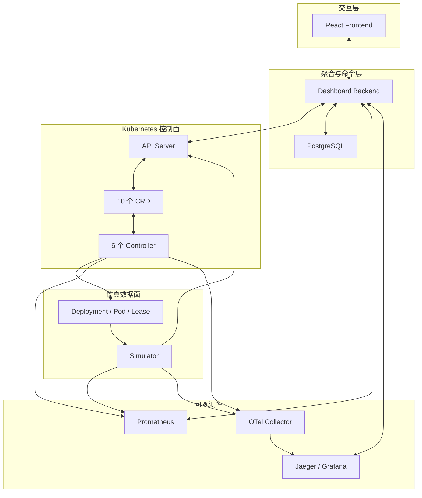
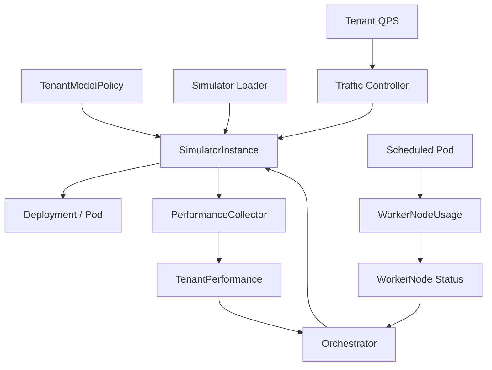
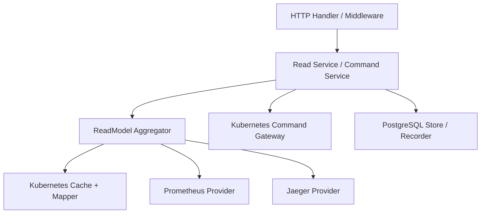

# 架构总览

## 1. 系统分层

## 2. 四种事实源

| 来源 | 拥有什么事实 | 保留特性 | 不能替代什么 |
| --- | --- | --- | --- |
| Kubernetes API | CR Spec/Status、Deployment、Pod、Lease、Event 的最新状态 | etcd 持久化、Watch、resourceVersion、最终一致 | 长期指标、Trace、完整历史快照 |
| PostgreSQL | resource event、定时 snapshot、audit、idempotency、trace index | 当前清单 30 天保留，可查询旧 `at` | Kubernetes 最新状态和 Controller 决策权 |
| Prometheus | Controller/Simulator 时间序列 | 当前开发清单 24h、emptyDir | 对象完整 Spec/Status、命令审计 |
| Jaeger | Trace/Span | 当前开发清单无持久存储保证 | 指标、资源当前态、精确业务审计 |

Backend 响应中的 `meta.partial`、`warnings`、`sourceVersions` 和时间字段用于承认这些来源并不构成一笔跨系统事务。

## 3. 控制面关系

Controller 之间没有方法调用。图中的箭头表示“读一个资源，写另一个资源”，API Server 是隐含中介。

## 4. Dashboard Backend 分层

- Handler 负责 HTTP、严格 JSON、请求 ID、错误 envelope 和超时。
- Aggregator 负责跨对象关联和页面级 DTO，不拥有控制算法。
- Provider 把安全的 `metricId` 或 Trace filter 转换成外部查询。
- Gateway 只写用户拥有的 CR Spec，先 dry-run，再带 resourceVersion 写入。
- Store 负责历史、审计和幂等，不向 Controller 提供控制输入。

## 5. Frontend 分层

远端状态由 TanStack Query 管理；Zustand 只保留控制面连接信息、时间游标和 Traffic 草稿等客户端状态。刷新页面不能依赖 localStorage 恢复生产数据。

## 6. 部署拓扑

Docker Desktop 本地环境保留两个 Kustomize 边界：

- `config/dev`：CRD、Controller、Simulator RBAC、OTel Collector、Jaeger、Prometheus、Grafana。
- `dashboard/deploy`：PostgreSQL、Dashboard Backend、Frontend 和 Backend RBAC。

它们使用同一命名空间 `hello-k8s-ai-system`。`bash setup.sh` 负责构建和向每个 Node 导入镜像、应用两个边界、写入动态演示节点策略并执行全链路验收；CI 中等价的独立 E2E 仍待补齐。

## 7. 架构不变量

- Controller 的输出状态只能由约定所有者写。
- 实例是否允许存在由 TenantModelPolicy 决定；实例分配流量由 Traffic 决定；副本由 Orchestrator 决定；Deployment 由 SimulatorInstance Controller 决定；性能由 Simulator 决定。
- Kubernetes Scheduler 负责最终 Node 选择；项目 Controller 只生成 required node affinity。
- Prometheus 通过 Pod discovery 抓取 Simulator；当前没有为每个 SimulatorInstance 创建 Service。
- 最新查询从 cache 读；旧时间点从 snapshot 读；两者不能静默混用。

下一步深入：[端到端数据流](../data-flow/END_TO_END_DATA_FLOW.md) 与 [字段所有权](../kubernetes/FIELD_OWNERSHIP.md)。
