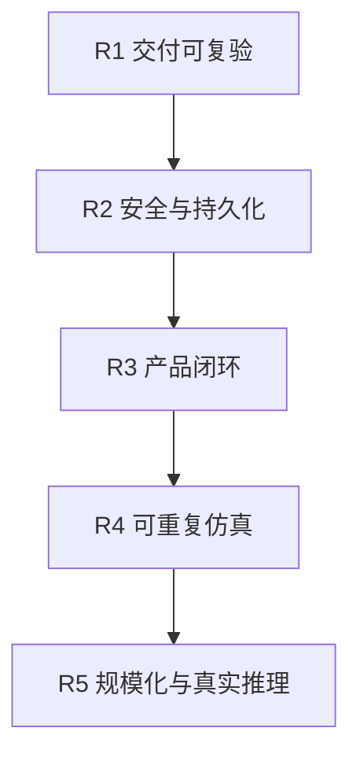

# 当前状态与路线图

基线日期：2026-08-13。状态来自实现、清单审计与用户提供的集群快照；“运行通过”仅在明确列出的验证范围内成立。

## 1. 能力矩阵

| 领域 | 当前状态 | 已有证据 | 仍缺什么 |
| --- | --- | --- | --- |
| CRD 领域模型 | 完成 | 10 个 `api/v1/*_types.go` 与生成 CRD | API 版本升级/转换策略；SimulationRun/Clock 未建模 |
| Policy 解析 | 完成 | TenantModelPolicy、节点策略过滤和测试 | TenantNodePolicy/ModelNodePolicy Status 无 writer；UI 不可编辑 |
| 工作负载收敛 | 完成 | SimulatorInstance -> Deployment、affinity、finalizer、TenantRuntime | PDB、拓扑分散、滚动策略可配置性、生产资源调优 |
| 流量分配 | 完成（控制面） | 新鲜 Score、Largest Remainder、总量守恒、等权 fallback | 前端 Overlay 尚未提交；更复杂权重/SLO 策略 |
| 性能聚合 | 完成 | 新鲜样本、可用副本权重、稳健聚合、Stale 状态 | 指标窗口可配置；异常样本解释/可视化 |
| 扩缩容 | 完成（模拟域） | 双阈值、冷却、容量约束、pending plan 恢复 | 多 Orchestrator 冲突策略、优先级抢占、跨租户公平性 |
| Simulator | 完成（近似模型） | Lease leader、Tick、队列/TTFT、冷启动、状态/指标/Trace | 确定性 seed、逻辑时钟、分布/Token 可配置、真实推理校准 |
| Controller 可观测性 | 完成（开发） | Prometheus 指标、OTel spans、Grafana 12 panels | SLO、Alertmanager、持久化、采样/成本策略 |
| Backend 当前态 | 完成 | 10 CRD + 原生资源 informer/cache、Mapper/Aggregator | 多副本 cache 压力评估；ReplicaSet DTO 未展示 |
| Backend 写命令 | 完成（基础） | 7 类 CR 白名单、dry-run、resourceVersion、幂等、审计 | 用户身份/授权；跨对象原子语义；细粒度策略验证 |
| Backend 历史 | 部分完成 | resource_events、30s snapshots、30d retention、`at` | 备份、压缩/分区、长期策略、事件溯源/确定性重放 |
| Prometheus/Jaeger API | 完成（基础） | 命名查询、过滤、超时、partial、Trace 树 | Jaeger v2 legacy Query API 运行复验；大规模查询保护 |
| Frontend Config | 基本完成 | 真实 GET/apply/delete、Model 能力基准分、历史只读、并发版本 | Policy/Orchestrator UI；组件测试 |
| Frontend Traffic | 部分完成 | 真实 baseline、模板/画布/预览 | Overlay -> Tenant QPS 命令、确认/回滚/审计、真实趋势曲线 |
| Frontend Data View/Trace | 完成（整合页） | `/trace` DataOverview、指标、资源、事件、Trace tree | 单独 Dashboard landing、深链/筛选增强、性能优化 |
| SSE/刷新 | 完成（弱实时） | resource.changed、debounce、30s poll、resync-required | durable cursor/重放；慢客户端丢事件监控 |
| Docker Desktop 本地部署 | 一键流程已实现 | `bash setup.sh` 构建/导入 9 个运行镜像、应用两套 Kustomize 并验收 | 在目标机器完成首次真实运行；CI 独立 E2E；镜像 digest 发布策略 |
| 生产部署 | 未完成 | 仅安全上下文/资源限制等基础 | IAM、TLS、Secrets、NetworkPolicy、HA、备份、持久化、DR |

## 2. 已知问题清单

### P0 - 上生产前必须解决

- 本地 PostgreSQL Secret 已改为部署时随机生成；连接仍是受控本机集群内 `sslmode=disable`，生产必须启用 Secret 管理和 TLS。
- Backend 没有最终用户身份认证与用户级授权；当前是 ServiceAccount 能力边界。
- PostgreSQL 单实例，Prometheus/Jaeger/Grafana 使用开发型易失存储，无备份/恢复演练。
- 没有完整 NetworkPolicy、入口 TLS、镜像签名/扫描和 Secret 外部管理。
- 没有从用户命令到页面回显的真实集群 E2E 证据。

### P1 - 下一开发周期

- 把当前本地完整栈验收复刻到独立 CI Kind E2E，并归档失败证据。
- 为 Traffic Overlay 增加 Preview -> Confirm -> PATCH -> Observe 的真实闭环。
- 验证 Jaeger 2.20 部署是否持续提供 Backend 使用的 legacy Query API。
- 为 Backend mutation 记录真实调用者身份，而不是只记录请求。

### P2 - 架构增强

- 提出 `SimulationRun` / `SimulationClock` API 设计，支持可恢复逻辑时间和随机种子。
- 把 `TenantRuntime.status.instanceCount` 迁移为语义准确的字段名（需版本兼容）。
- 增加领域 Event，或定义长期可重放的操作事件模型。
- 支持 CRD v1alpha/v1beta/v1 转换和升级策略。
- 根据规模引入 DB 分区、snapshot 压缩、Prom/Trace 长期存储。

## 3. 推荐路线图

### R1 - 交付可复验

- 在目标 Docker Desktop 机器执行当前一键流程，保存首次完整验收证据。
- Kind E2E 创建完整 CR，断言 Controller/Simulator/Backend/Frontend API 链路。
- CI 归档对象、日志、Prom target、关键 API 响应和 Trace 查询证据。
- 文档链接、Mermaid、API 契约和 CRD 生成差异检查。

完成标准：一条命令能在干净机器上拉起完整开发环境，测试能解释失败发生在哪一层。

### R2 - 安全与持久化

- OIDC/反向代理认证、用户到权限策略映射、审计主体。
- Secret manager、TLS、NetworkPolicy、PodDisruptionBudget、备份和恢复。
- PostgreSQL HA；Prometheus/Jaeger 使用持久或外部后端。

完成标准：无默认密码；最小权限；节点或 Pod 重启不丢关键数据；备份可恢复。

### R3 - 产品闭环

- Traffic Overlay 真实提交与差异预览。
- Policy、Orchestrator 管理界面。
- Dashboard landing、资源详情、调度解释和故障行动建议。
- 正式 OpenAPI/客户端生成和兼容版本策略。

完成标准：无需 kubectl 即可完成受支持的配置和诊断，同时不会越过字段所有权。

### R4 - 可重复仿真

- `SimulationRun` 固化配置版本、seed、clock、输入流量和输出摘要。
- Simulator 和 Controller 使用可注入 Clock；所有 freshness/cooldown 统一时间域。
- 事件日志 + checkpoint 支持暂停、继续和确定性 replay。

完成标准：相同输入和 seed 产生相同可验证结果，进程重启后能继续。

### R5 - 规模化与真实推理

- 大规模 informer/DB/Prom 查询基准、分片或多集群聚合。
- 接入真实模型服务器和 GPU telemetry，校准模拟参数。
- 跨租户公平、优先级/抢占、成本/能耗目标。

## 4. 取舍原则

- 在完成 R1 前，不继续增加大量产品功能；否则无法判断回归来自哪里。
- 在完成 R2 前，不把开发清单标记为生产就绪。
- 在有统一 Clock API 前，不实现仅前端可见的“倍速”。
- 新能力优先扩展清晰的 CRD/API 契约，而不是在注解、localStorage 或 DB 隐藏核心业务状态。
