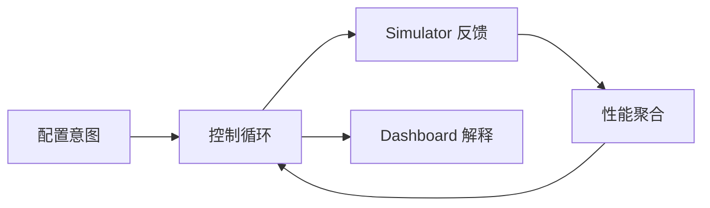

# 项目总览

## 1. 一句话定义

hello-k8s-ai 用 Kubernetes 自定义资源描述多租户 AI 推理调度问题，并用可观测 Simulator 闭环验证策略、容量、流量与扩缩容行为。

## 2. 要解决的问题

真实 AI 推理系统同时面对四类变化：租户请求量变化、模型性能差异、节点 GPU/并发容量变化、实例冷启动与队列变化。如果逻辑分散在页面、脚本和单个服务内，新成员很难回答：

- 某个租户为什么能或不能使用某模型/节点？
- 某个 SimulatorInstance 为什么存在、为什么扩容、为什么没有 Pod？
- QPS 为什么分配给这些实例，分配总量是否守恒？
- TTFT、Queue、Score 是谁算的，样本是否仍新鲜？
- Dashboard 显示的是集群当前事实、数据库历史、指标还是 Trace？

本项目把这些问题拆为 CRD 与控制循环，让每个决定都能在 Kubernetes 对象、指标、Trace 或审计记录中找到证据。

## 3. 业务语言

| 概念 | 含义 |
| --- | --- |
| Tenant | 产生 QPS 和 SLO 阈值的租户。 |
| Model | 可部署的模型及 GPU、并发、冷启动和性能参数。 |
| WorkerNode | 业务层面的节点容量视图；与 Kubernetes Node 同名关联。 |
| Policy | Tenant-Model、Tenant-Node、Model-Node 三类 Allow/Deny 约束。 |
| SimulatorInstance | 一个 Tenant-Model 实例池的期望副本、分配流量与运行状态。 |
| TenantPerformance | 一个 Tenant 的新鲜性能样本聚合。 |
| TenantRuntime | 一个 Tenant 的运行态副本汇总。 |
| Orchestrator | 一个 Tenant 的扩缩容策略和最近决策。 |
| Simulator | 代表推理实例池，模拟到达、排队、服务时间和冷启动。 |
| Dashboard | 人类入口；不拥有控制面的真实状态。 |

## 4. 项目范围

### 当前范围内

- Kubernetes API 和控制循环建模。
- 模拟推理工作负载，而不是执行真实模型推理。
- 多租户、多模型、节点策略与资源约束。
- 自动扩缩容、QPS 分配、性能聚合。
- 当前态、离散历史快照、指标、Trace 和事件可视化。
- 复用 Docker Desktop 已有 Kubernetes 的本地完整栈。

### 当前范围外

- LLM 请求协议、Tokenizer、Batching、KV Cache 或模型服务器集成。
- 真实 GPU 发现与设备插件；WorkerNode GPU 是业务配置和 Pod 派生使用量。
- 跨集群调度、全局流量入口、计费、配额结算。
- 生产级 IAM、租户数据隔离和合规存储。
- 确定性事件溯源和逻辑时钟驱动的完整仿真。

## 5. 成功标准

一个完整闭环应能被新人验证：

1. 用户创建 Tenant、Model、WorkerNode、Policy 和 Orchestrator。
2. TenantModelPolicy Controller 创建对应 SimulatorInstance。
3. Orchestrator 根据 TenantPerformance、阈值、分数和容量修改副本。
4. SimulatorInstance Controller 创建 Deployment，Kubernetes 创建并调度 Pod。
5. Simulator Leader 周期写入性能和分数。
6. Traffic Controller 把 Tenant QPS 守恒地分配到可用实例。
7. PerformanceCollector 回收实例样本形成 TenantPerformance。
8. Prometheus/Jaeger 收集指标与 Trace。
9. Dashboard Backend 聚合并保存历史/审计。
10. Frontend 显示当前结果、来源、新鲜度和历史切面。

这是一个反馈系统：如果文档或代码只解释单次 CRUD，而忽略反馈、样本新鲜度和字段所有权，就没有解释完整项目。

## 6. 读者下一步

- 理解分层与事实源：[ARCHITECTURE_OVERVIEW.md](ARCHITECTURE_OVERVIEW.md)
- 理解设计取舍：[DESIGN_PHILOSOPHY.md](DESIGN_PHILOSOPHY.md)
- 理解当前成熟度：[CURRENT_STATUS_AND_ROADMAP.md](CURRENT_STATUS_AND_ROADMAP.md)
- 理解 CRD：[../kubernetes/CRD_DESIGN.md](../kubernetes/CRD_DESIGN.md)
