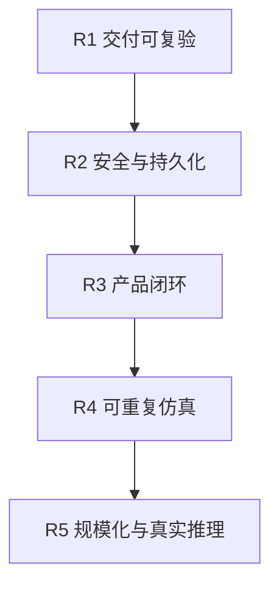

# 路线图（ROADMAP）

> 维护层：human ｜ last-reviewed：2026-08-18 ｜ 事实源：docs/status.md（当前状态）、change-history/（已完成变更）

> 由 `CURRENT_STATUS_AND_ROADMAP.md` 改造而来（2026-08-18）："当前状态"（能力矩阵）已由生成的 `docs/status.md` 承担，本文件只保留"下一步"。

## 1. 已知问题清单

### P0 - 上生产前必须解决

- 本地 PostgreSQL Secret 已改为部署时随机生成；连接仍是受控本机集群内 `sslmode=disable`，生产必须启用 Secret 管理和 TLS。
- Backend 没有最终用户身份认证与用户级授权；当前是 ServiceAccount 能力边界。
- PostgreSQL、Prometheus、Jaeger 单实例（已 PVC 持久化），Grafana 易失，无备份/恢复演练。
- 没有完整 NetworkPolicy、入口 TLS、镜像签名/扫描和 Secret 外部管理。
- 没有从用户命令到页面回显的真实集群 E2E 证据。

### P1 - 下一开发周期

- 告警规则实测触发验收（[#31](https://github.com/3900563672/hello-k8s-ai/issues/31)）：内存告警 10m 周期、Simulator Leader 接管演练，归档触发证据。
- 把当前本地完整栈验收复刻到独立 CI Kind E2E，并归档失败证据。
- 为 Traffic Overlay 增加 Preview -> Confirm -> PATCH -> Observe 的真实闭环。
- 验证 Jaeger 2.20 部署是否持续提供 Backend 使用的 legacy Query API。
- 为 Backend mutation 记录真实调用者身份，而不是只记录请求。

### P2 - 架构增强

- 评估 Simulator 扩容节奏与超大副本行为（[#32](https://github.com/3900563672/hello-k8s-ai/issues/32)）：`maxReplicas=0` 无限制下的批量扩容、扩容冷却与队列收敛。
- 在现有 `SimulationClock` 引擎倍速之上设计 `SimulationRun`，补可恢复逻辑时间、随机种子和 checkpoint。
- 把 `TenantRuntime.status.instanceCount` 迁移为语义准确的字段名（需版本兼容）。
- 增加领域 Event，或定义长期可重放的操作事件模型。
- 支持 CRD v1alpha/v1beta/v1 转换和升级策略。
- 根据规模引入 DB 分区、snapshot 压缩、Prom/Trace 长期存储。

## 2. 推荐路线图

### R1 - 交付可复验

- 在目标 Docker Desktop 机器执行当前一键流程，保存首次完整验收证据。
- Kind E2E 创建完整 CR，断言 Controller/Simulator/Backend/Frontend API 链路。
- CI 归档对象、日志、Prom target、关键 API 响应和 Trace 查询证据。
- 文档链接、Mermaid、API 契约和 CRD 生成差异检查。

完成标准：一条命令能在干净机器上拉起完整开发环境，测试能解释失败发生在哪一层。

### R2 - 安全与持久化

- OIDC/反向代理认证、用户到权限策略映射、审计主体。
- Secret manager、TLS、NetworkPolicy、PodDisruptionBudget、备份和恢复。
- PostgreSQL HA；Prometheus/Jaeger 使用持久或外部后端。

完成标准：无默认密码；最小权限；节点或 Pod 重启不丢关键数据；备份可恢复。

### R3 - 产品闭环

- Traffic Overlay 真实提交与差异预览。
- Policy、Orchestrator 管理界面。
- Dashboard landing、资源详情、调度解释和故障行动建议。
- 正式 OpenAPI/客户端生成和兼容版本策略。

完成标准：无需 kubectl 即可完成受支持的配置和诊断，同时不会越过字段所有权。

### R4 - 可重复仿真

- `SimulationRun` 固化配置版本、seed、现有 Clock 变更、输入流量和输出摘要。
- Simulator 和 Controller 使用可注入 Clock；所有 freshness/cooldown 统一时间域。
- 事件日志 + checkpoint 支持暂停、继续和确定性 replay。

完成标准：相同输入和 seed 产生相同可验证结果，进程重启后能继续。

### R5 - 规模化与真实推理

- 大规模 informer/DB/Prom 查询基准、分片或多集群聚合。
- 接入真实模型服务器和 GPU telemetry，校准模拟参数。
- 跨租户公平、优先级/抢占、成本/能耗目标。

## 3. 取舍原则

- 在完成 R1 前，不继续增加大量产品功能；否则无法判断回归来自哪里。
- 在完成 R2 前，不把开发清单标记为生产就绪。
- 倍速必须保持 Frontend -> Backend -> CRD -> Controller -> Simulator 的真实链路；禁止退回仅前端可见的视觉加速。
- 新能力优先扩展清晰的 CRD/API 契约，而不是在注解、localStorage 或 DB 隐藏核心业务状态。
