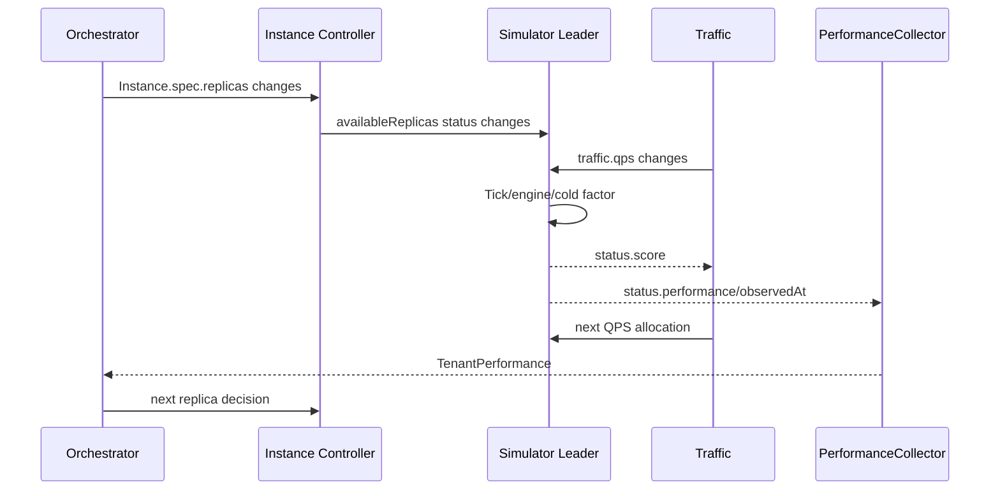

# 仿真流程

## 1. 一次 Tick 的数据

| 数据 | 谁产生 | 谁消费 | 为什么存在 |
| --- | --- | --- | --- |
| `traffic.qps` | Traffic Controller | Simulator | 告诉实例池本轮请求负载。 |
| `availableReplicas` | Instance Controller | Simulator | 只使用实际可用容量。 |
| `effectiveScore` | Orchestrator | Simulator | 把模型能力/资源折扣带入运行分。 |
| `timeScale` | SimulationClock Controller | Simulator | 决定每个真实 Tick 推进多少模拟时间。 |
| Model performance | 用户/Backend | Simulator engine | 定义 prefill/decode 服务时间。 |
| `coldStartMs` | 用户/Backend | cold factor | 模拟新实例暂不可用/渐进可用。 |
| Queue/TTFT | SimEngine | Status、Prom、PerformanceCollector | 反馈性能压力。 |
| Pool score | Simulator | Traffic Controller | 下一轮按能力分配。 |

## 2. 冷启动曲线

设总冷启动时间为 `C`，当前 reporter 任期累计的模拟时间为 `e`：

```text
C <= 0           -> factor = 1
e < 0            -> factor = 0
0 <= e < C/2     -> factor = 0
C/2 <= e < C     -> factor = (e/C - 0.5)^2 × 4
e >= C           -> factor = 1
```

后半段是二次上升：在 75% 时间点 factor=0.25，到 C 时为 1。低 factor 同时降低 score，并把服务时间/首 token 时间按 `1/factor` 放大。

```mermaid
xychart-beta
  title "Cold Start Factor"
  x-axis [0, 25, 50, 75, 100]
  y-axis "factor" 0 --> 1
  line [0, 0, 0, 0.25, 1]
```

## 3. 请求到达

每个真实 Tick 间隔为 `r`、倍速为 `s`，引擎步长 `d=r×s`；per-replica QPS 为 `q`：

```text
lambda = q × d.seconds
newRequests ~ Poisson(lambda)
```

- lambda < 30 使用 Knuth 算法。
- 大 lambda 使用 Atkinson rejection 算法，避免数值溢出。
- 请求到达时间在 Tick 窗口内均匀分布，并按到达时间稳定排序。

随机 seed 当前来自进程启动时间，所以相同配置不保证相同请求序列。

## 4. 请求形状与服务时间

固定工作负载：prompt 500 tokens、output 200 tokens。

```text
prefillMs = prefillBaseMs + prefillPerTokenUs × 500 / 1000
baseServiceMs = prefillMs + decodePerTokenMs × 200
requestServiceMs = baseServiceMs × noise, noise in [0.8, 1.2]
```

首 token 基础时间使用 `prefillMs + decodePerTokenMs`，再受 cold factor 放大。Model 未显式填正数时 Simulator 采用 50ms、500us、20ms 的运行默认；CRD 也有相同默认，双层防御。

## 5. 并发服务器与队列

SimEngine 创建 `maxConcurrency` 个 Server。事件循环在一个 Tick 内反复处理：

1. 记录已达到的 first token。
2. 释放已完成请求的 Server。
3. 从 FIFO queue 给空闲 Server 分配已到达请求。
4. 跳到下一到达、首 token、完成或 Tick 结束时间。

因此单个 Server 在一个 Tick 内可以连续完成多个请求，不是“一 Tick 最多一个请求”。

## 6. 内存保护

每步最多 materialize 100,000 个请求对象。超出部分计入 virtual queue，只保存数量、到达时间和请求模板；queue depth 是实体队列 + virtual queue 的饱和加法。

这个保护避免极端 QPS OOM，但虚拟请求共享形状/到达近似，精度低于实体请求。容量压测必须同时观察 queue 深度和 Tick duration。

## 7. TTFT

请求的 TTFT：

```text
TTFT = firstTokenAt - arriveTime
firstTokenAt = serviceStart + (prefillMs + decodePerTokenMs) / factor
```

它包含排队等待 + 首 token 服务时间。每 Tick 只对本 Tick 产生 first token 的请求计算均值；如果无完成 first token，`hasTTFT=false`，Status 可只包含 Queue 而不伪造 TTFT=0。

Prometheus gauge 在无 TTFT 时当前设为 0；查询/展示时必须结合 QPS、availableReplicas、queue 和 Status nil 语义，避免把“无样本”当“0ms”。这是指标表达可改进点。

## 8. QPS=0 和容量=0

| 条件 | 引擎行为 | Status Performance | Score |
| --- | --- | --- | --- |
| qps <= 0 | reset queue/servers/time | nil | 仍由 effective×factor×available 计算 |
| availableReplicas=0 | perReplicaQPS=0，reset | nil | 0 |
| effectiveScore=0/factor=0 | 请求可进入队列但不能服务 | Queue 有值，TTFT可能无 | 0 |
| normal | 事件推进 | Queue + 可选 TTFT | 正值 |

Traffic Controller 对正分数进行权重分配；所有分数为 0 时使用等权 fallback，以避免永久鸡生蛋问题，但只有可运行候选参与。

## 9. 完整反馈时序



## 10. 时间尺度

`SimulationClock/default.spec.rate` 允许 1..20。SimulationClock Controller 把它同步为每个实例的 `spec.timeScale`；Simulator 每 5 秒真实 Tick 重新 GET Instance，所以运行中改变倍速无需重启 Pod，通常在下一个 Tick 生效。

| 内容 | 是否随倍速变化 |
| --- | --- |
| SimEngine 步长、Poisson 请求量、冷启动累计进度 | 是，乘以 `timeScale` |
| Queue/TTFT 的模拟演进 | 是；TTFT 仍以模拟毫秒报告 |
| Simulator Tick/Status/Trace 发布频率 | 否，仍是每 5 秒真实时间 |
| Traffic/Performance/Orchestrator 周期与样本 freshness | 否，仍是真实时间 |
| 冷却、Lease、Prometheus scrape、DB snapshot、Backend 时钟 | 否，仍是真实时间 |

高倍速会让一次控制面观察间隔内经过更多模拟时间，因此 Queue/TTFT 可能比 1x 变化更快。20x 上限用于限制单 Tick 工作量；这项能力是 Simulator 引擎加速，不是全系统逻辑时间。

| 环节 | 当前默认 |
| --- | ---: |
| Simulator Tick | 5s |
| Traffic reconcile fallback | 10s |
| Performance reconcile fallback | 10s |
| Orchestrator fallback | <=10s |
| sample freshness | 约 30s |
| scale-up cooldown | 60s |
| scale-down cooldown | 120s |
| Prometheus scrape | 10s |
| DB snapshot | 30s |

表中周期都是真实墙钟。只有 SimEngine 每次 Tick 内的模拟步长乘以倍速；Frontend 历史游标不会改变任何运行周期。

## 11. 改进方向

- 将 prompt/output tokens、arrival distribution、noise、seed、倍速变更记录、Tick 与 engine version 纳入 SimulationRun。
- 分别模拟每个 Pod 或明确池级 aggregate 模型，避免 leader 代表副本的近似歧义。
- 用 Pod creation/ready 时间为逐副本冷启动，而非 reporter 任期累计时间。
- checkpoint queue/RNG/clock，支持 leader 切换与确定性 replay。
- 用真实模型数据校准服务时间分布，而非仅固定均值 + 均匀噪声。
- 为“无 TTFT 样本”设计显式 Prometheus 指标，而不是 gauge=0。
