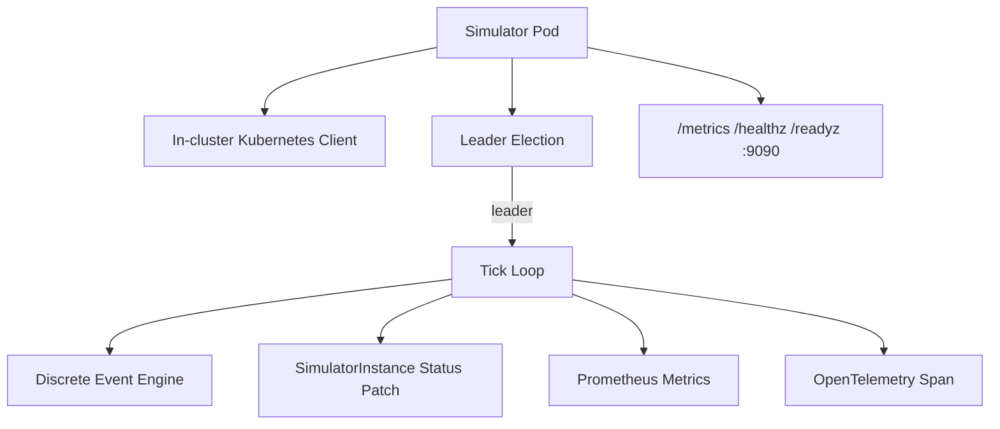
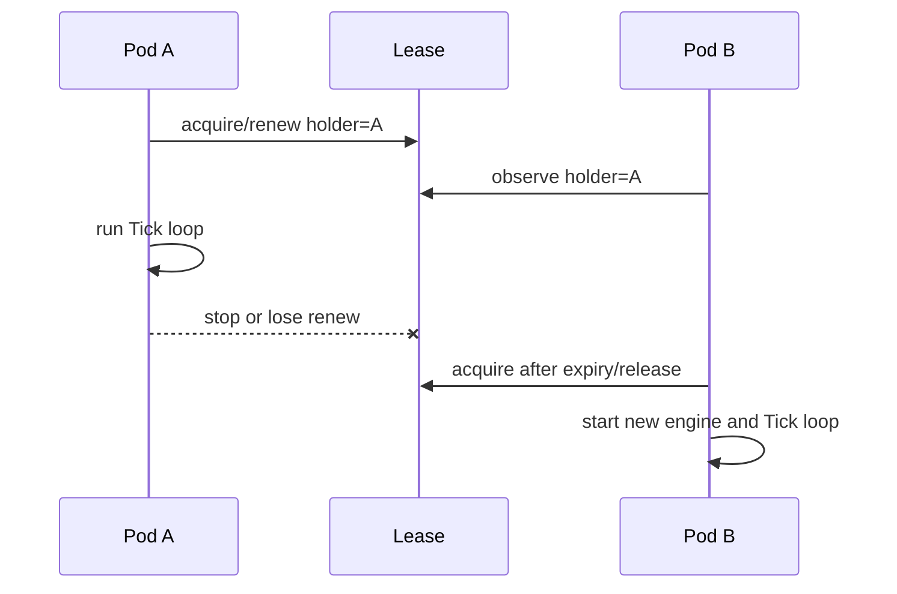

# Simulator 架构

> 维护层：human | last-reviewed：2026-08-18 | 事实源：simulator/

## 1. 定位

Simulator 是受 Kubernetes 管理的推理实例池近似器。每个 SimulatorInstance 对应一个 Deployment；Deployment 可以有多个 Pod，但通过 Lease 只有一个 Pod 作为 reporter，周期计算并写回该 SimulatorInstance 的实时 Score 和 Performance。

它用于验证控制环，不执行真实模型推理，也不提供外部推理 HTTP API。

## 2. 进程结构



启动必需参数/环境：instance name、Pod name、Pod namespace。Simulator 只支持 in-cluster config；无法在集群外直接运行而不修改/包装连接方式。

## 3. Controller 如何创建 Simulator

SimulatorInstance Controller 根据 Instance Spec 创建 Deployment并注入：

- `SIMULATOR_INSTANCE_NAME` / `--instance`。
- Downward API 的 `POD_NAME`、`POD_NAMESPACE`。
- Simulator image、ServiceAccount、OTel endpoint、集群/环境属性。
- metrics/health address `:9090`、默认 tick interval 5s。
- instance/tenant/model labels/annotations，供 Prometheus discovery 与 WorkerUsage 识别。
- required node affinity，来自 TenantNodePolicy 与 ModelNodePolicy。

Deployment replicas 来自 Orchestrator 写入的 `SimulatorInstance.spec.replicas`。Simulator 自己不扩缩 Pod。

## 4. Leader Election

每个 Pod 竞争 Lease：

```text
namespace: Pod 所在 namespace
name: simulator-reporter-<SimulatorInstanceName>
identity: Pod name
LeaseDuration: 15s
RenewDeadline: 10s
RetryPeriod: 2s
ReleaseOnCancel: true
```

名称超过 Kubernetes 上限时稳定哈希截断。



只有 leader 构造 `Simulator` 并运行 Tick。Follower 仍暴露 HTTP/进程指标，`hello_k8s_ai_simulator_leader=0`。取得/失去/观察 leader 都记录 metrics 和 leadership span。

### 设计理由

Deployment 副本代表实例池容量；如果每个 Pod 都写同一 CR Status，会产生随机覆盖和重复模拟。Lease 把写入者降为一个，同时保留多 Pod 生存状态。

### 限制

Leader 切换会创建新的进程内 SimEngine，队列状态和随机序列不会恢复；冷启动累计模拟时间从 `status.simulationElapsedMs` 恢复，不会随 reporter 重启归零。Status 继续更新，但仿真不是确定性/无缝 checkpoint。未来 SimulationRun 需要持久化 seed/engine checkpoint。

## 5. Tick

默认每 5 秒：

1. GET SimulatorInstance；删除中则退出。
2. GET 引用 Model；校验 maxConcurrency。
3. 读取 effectiveScore、availableReplicas、assigned QPS 和 `spec.timeScale`。
4. 按 `真实 Tick × timeScale` 推进累计模拟时间，计算冷启动 factor、per-replica score、pool score。
5. 创建或复用与 maxConcurrency 对应的 SimEngine。
6. 把总 QPS 除以 availableReplicas，推进一个代表性副本的引擎。
7. 生成 performance；QPS=0 或无可用副本时为 nil。
8. 更新 Prometheus gauges/counters。
9. RetryOnConflict，只 Patch 自己拥有的 Status 字段。
10. 结束 `simulator.tick` Span。

## 6. 分数

```text
effectiveScore = Orchestrator 写入的单副本静态能力
simulationStep = tickInterval × timeScale
factor         = coldStartFactor(simulationElapsed, model.coldStartMs)
perReplicaScore = effectiveScore × factor（整数、饱和保护）
poolScore       = perReplicaScore × availableReplicas（饱和保护）
```

`poolScore` 写入 `status.score`，Traffic Controller 用它作为分配权重。availableReplicas 来自 Deployment Status，不使用 spec.replicas，以免把 Pending Pod 当可服务容量。

`simulationElapsed` 只在成功读取 Instance/Model 后按固定步长累加，并随 Status 持久化为 `simulationElapsedMs`；Leader 首次接管时从 Status 恢复，没有历史值才从 0 开始。倍速变化只影响后续步长，不重置已经推进的冷启动进度；进程暂停后也不会按墙钟差值补算，避免恢复时制造流量尖峰。Leader 切换只重置内存队列，不再重置冷启动进度。

## 7. Performance

- 总 instance QPS 平均分摊到 availableReplicas，SimEngine 模拟单副本负载。
- Queue 单位 `requests`。
- TTFT 单位 `ms`，只有本 Tick 内产生首 token 样本时才出现。
- QPS>0 且 availableReplicas>0 时返回 Performance；否则 nil，并重置引擎（QPS<=0）。
- PerformanceCollector 再跨实例按 availableReplicas 稳健聚合。

Simulator 不写 Instance Phase；一个 Tick 暂时失败不应该覆盖 Deployment 收敛状态。

## 8. Status 写入

Simulator 只写：

- `status.score`
- `status.performance`
- `status.observedAt`
- `status.reporterID`

实现使用 `RetryOnConflict`、重新 GET 最新对象、`Status().Patch(MergeFrom)`。不写 `phase/conditions/availableReplicas/effectiveScore`。

## 9. Metrics

每个 Pod 暴露独立 registry（含 Go/process metrics）：

| 指标 | 类型 | 说明 |
| --- | --- | --- |
| `hello_k8s_ai_simulator_leader` | gauge | 本 Pod 是否 leader。 |
| `..._leadership_changes_total{event}` | counter | acquired/lost/observed。 |
| `..._ticks_total{outcome}` | counter | leader Tick 成功/失败。 |
| `..._tick_duration_seconds` | histogram | Tick 耗时。 |
| `..._status_updates_total{outcome}` | counter | Status Patch 结果。 |
| `..._assigned_qps` | gauge | Instance 总分配 QPS。 |
| `..._available_replicas` | gauge | CR 中 available replicas。 |
| `..._effective_score` | gauge | Orchestrator 分数。 |
| `..._pool_score` | gauge | 冷启动/副本后的运行分。 |
| `..._cold_start_factor` | gauge | 0..1。 |
| `..._time_scale` | gauge | 当前 Tick 实际采用的倍速。 |
| `..._simulation_step_seconds` | gauge | 最近一个真实 Tick 推进的模拟秒数。 |
| `..._simulation_elapsed_seconds` | gauge | 当前 reporter 任期内累计模拟秒数。 |
| `..._queue_depth` | gauge | 模拟队列。 |
| `..._ttft_seconds` | gauge | 最近 Tick 平均 TTFT，Prom 指标用秒。 |
| `..._engine_reinitializations_total` | counter | maxConcurrency 变化导致重建。 |

注意：Follower 的业务 gauges 可能保持初值或旧值。PromQL 应筛选 `leader==1` 或按 reporter/Pod 理解，不能无脑 sum 所有 Pod 的 TTFT。

## 10. Trace

OTel service name `hello-k8s-ai-simulator`，资源属性可包含 Pod、Namespace、Node、Cluster、Environment、Instance/Tenant/Model。

主要 Span：

- `simulator.tick`：输入/输出属性包含 assignedQPS、availableReplicas、effective/pool score、timeScale、simulation step/elapsed、cold factor、queue、TTFT、outcome。
- `simulator.leadership.acquired/lost`：领导权生命周期。
- Kubernetes API 普通请求由 otelhttp instrument；watch 长连接被过滤，避免长 Span 污染。

OTel 初始化失败时记录错误并使用 no-op，Simulator 继续运行。

## 11. 健康端点

- `/healthz`：进程健康。
- `/readyz`：HTTP 服务就绪；当前不等价于 leader。
- `/metrics`：Prometheus。

Follower 也应 Ready；“是否 reporter”由 Lease和 leader metric 判断，不能用 readiness 代替。

## 12. 与 Controller 的交互表

| 对方 | Simulator 读取 | Simulator 写 | 交互目的 |
| --- | --- | --- | --- |
| Orchestrator | replicas 间接形成 Pod、status.effectiveScore | score/performance | 静态能力转为运行反馈 |
| Instance Controller | status.availableReplicas | 不写其字段 | 使用真实可用容量 |
| Traffic | spec.traffic.qps | status.score | QPS 与能力反馈环 |
| SimulationClock | 经 Instance.spec.timeScale 读取 | metrics/Trace 反映实际倍速 | 运行中调整离散事件推进速度 |
| PerformanceCollector | - | performance/observedAt | 提供租户聚合样本 |
| WorkerUsage | Pod labels/model | 无 | Controller 统计容量占用 |
| Backend | 无直接命令 | Backend 只读 Status/metrics/trace | 可视化/历史/诊断 |

## 13. 当前模型限制

- 离散事件引擎支持 1x..20x 动态倍速；没有 pause/seek，也不加速 Controller 冷却、新鲜度、Lease、采集或 Backend 历史时间。
- 随机 seed 来自 `time.Now().UnixNano()`，leader 切换不可重复。
- 固定 prompt=500 tokens、output=200 tokens，非 CR 配置。
- 每个 leader 引擎模拟一个代表性副本，假设总 QPS 均匀分配；不模拟副本间负载不均。
- 不模拟网络、batching、cache、GPU kernel、OOM、请求取消和真实错误。
- reporter 任期累计模拟时间近似整个池冷启动，而不是逐 Pod warmup；leader 切换会重置。
- 高倍速会在每个真实 Tick 中处理更多模拟请求，受 20x 上限和虚拟队列保护，但仍需观察 Tick duration 与队列；控制环采样频率保持真实时间，不能按全系统倍速实验解释。

使用指标做真实容量承诺前，必须用实际推理系统校准。
