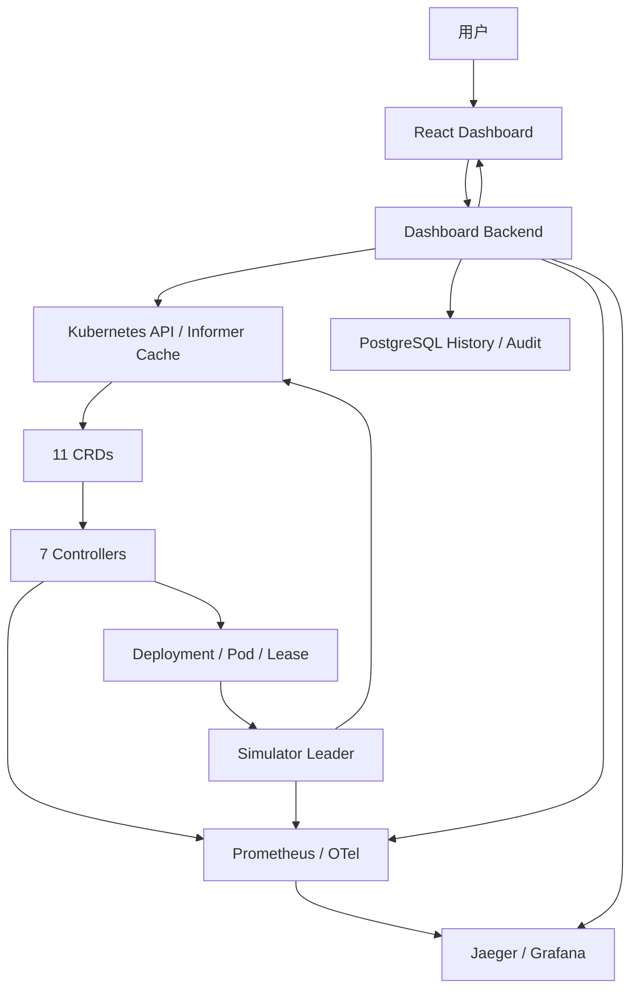
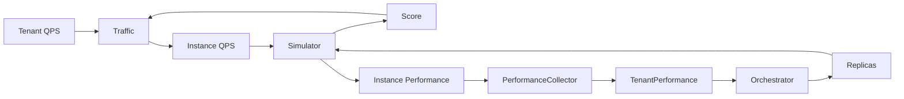
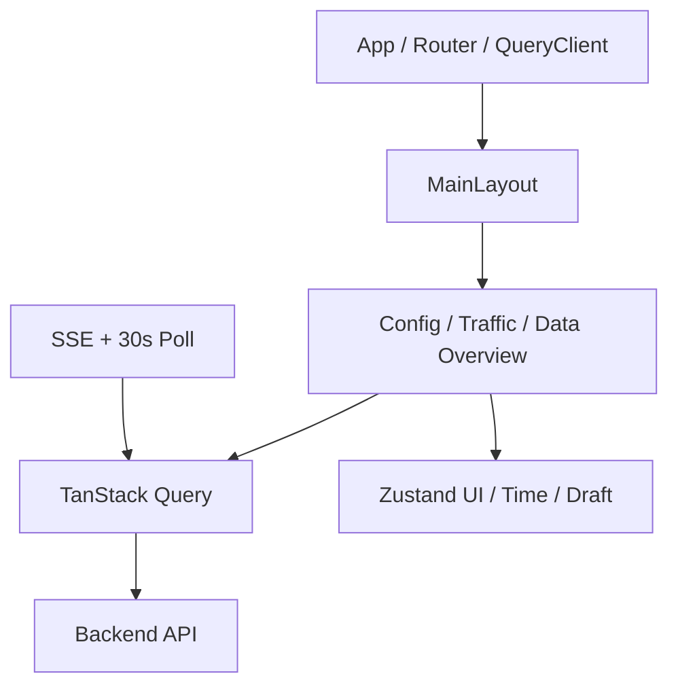
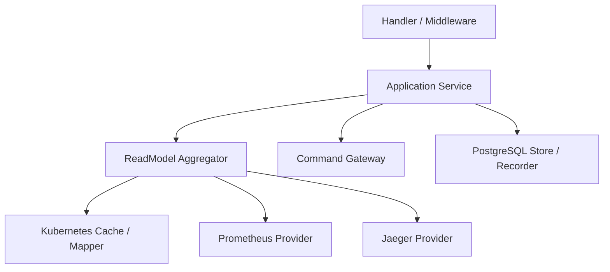
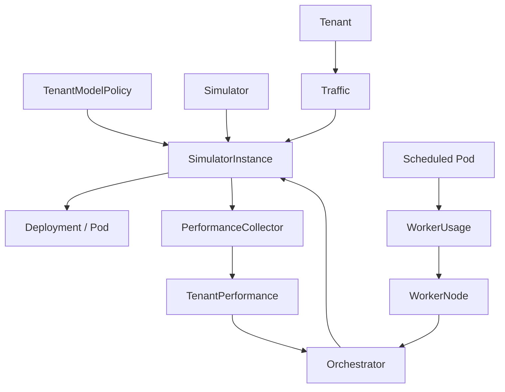
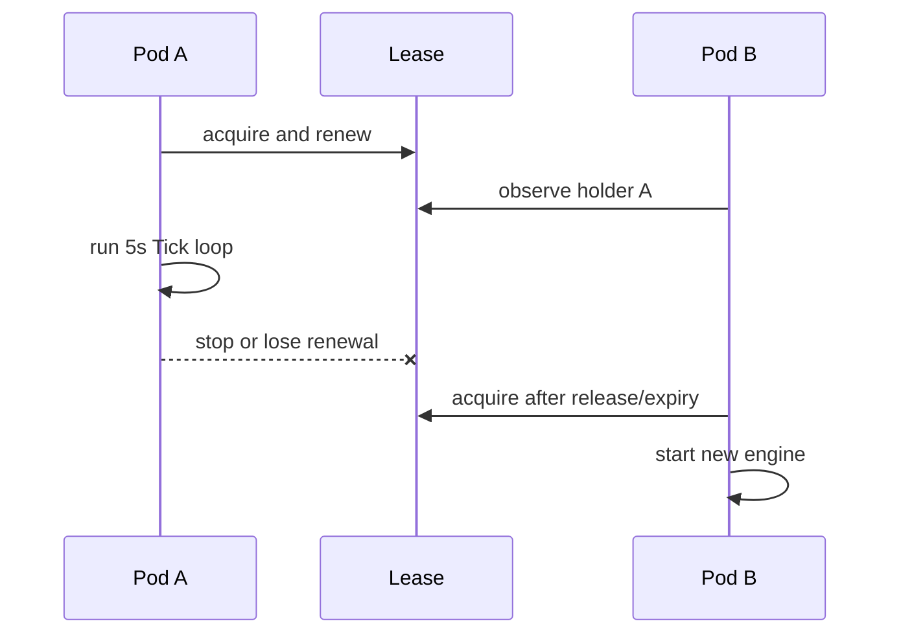
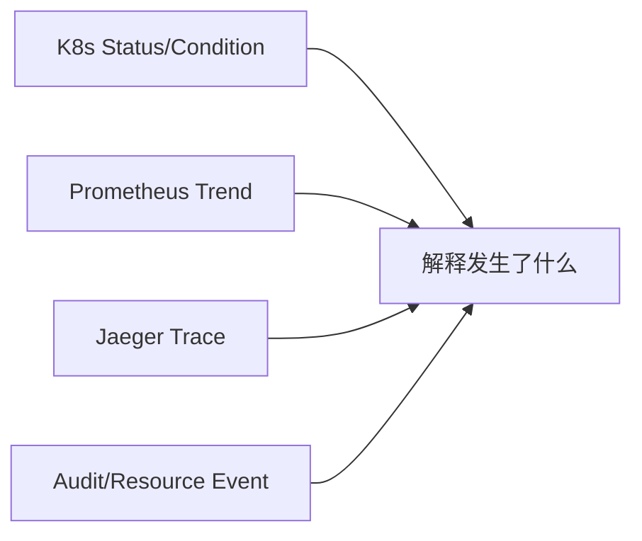
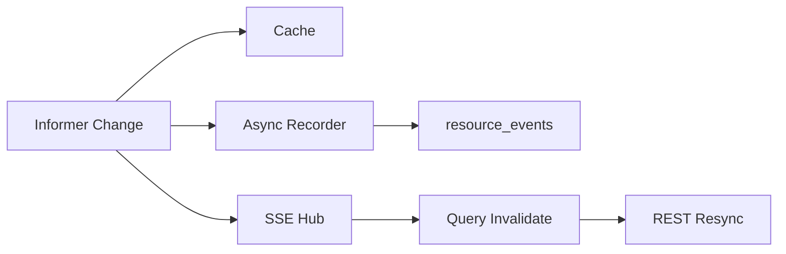
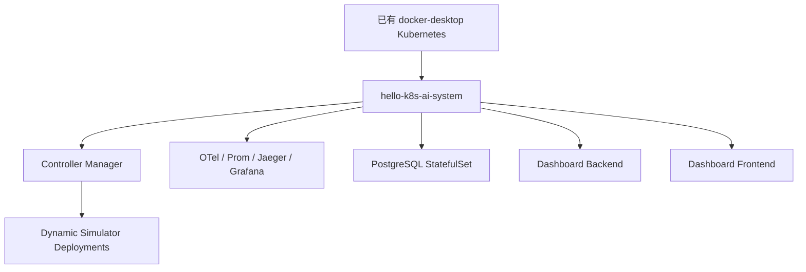

# hello-k8s-ai 完整技术总览

副标题：Kubernetes 原生 AI 推理调度与仿真平台技术白皮书  
文档基线：2026-08-14
适用读者：第一次接触项目的开发者、架构师、SRE 与 AI 编程代理

> 本文是 `hello-k8s-ai-complete-overview.pdf` 的唯一正文源。实现事实来自当前源码与清单；“声明部署”不等于当前集群 Ready；“未来设计”不等于现有能力。

## 阅读摘要

hello-k8s-ai 把多租户 AI 推理调度问题表示为 Kubernetes CRD。用户在 React Dashboard 中提交租户、模型、节点、策略和 Simulator 倍速；Dashboard Backend 把允许的意图写入 Kubernetes；七个 Controller 通过 API Server 协作，创建 SimulatorInstance 和 Deployment、同步倍速、分配流量、聚合性能、统计容量并扩缩容；Simulator Leader 用离散事件模型产生 Queue、TTFT、Score、Metrics 与 Trace；Backend 再从 Kubernetes cache、Prometheus、Jaeger 和 PostgreSQL 聚合成页面读模型。

系统最重要的设计不是某个页面或算法，而是三条边界：

1. Kubernetes 是当前配置与收敛状态的主要事实源。
2. 每个 Spec/Status 字段有明确写入者，组件不能相互覆盖。
3. 当前态、历史快照、指标、Trace 和浏览器草稿必须区分来源和时间。

# 第一章：项目介绍

## 1.1 背景

AI 推理平台必须同时处理请求量、模型性能、节点容量、冷启动和队列变化。传统演示常把这些状态写在页面 Mock 或单个服务的内存里，因此无法回答“为什么这样调度”“数据是否新鲜”“重启后能否恢复”。hello-k8s-ai 选择 Kubernetes 声明式控制面：业务意图被持久化为 CR，控制器反复收敛，任何结果都能从对象、Condition、指标、Trace 或审计中寻找证据。

## 1.2 核心目标

- 建立可读的 AI 调度领域模型：Tenant、Model、WorkerNode、Policy、Instance、Performance、Runtime、Orchestrator。
- 在没有真实模型服务器时，用 Simulator 验证流量、队列、TTFT、冷启动和扩缩容反馈。
- 让前端使用真实 Backend，而不是 localStorage、假 Worker 或预生成时间切片。
- 让 Dashboard 既能读当前态，也能浏览离散历史，并对 Prometheus/Jaeger 故障诚实降级。
- 用最小权限、幂等、乐观并发、审计和可恢复计划保护写入链路。

## 1.3 当前边界

本项目当前是调度与仿真平台，不是真实 LLM inference gateway。它不处理 OpenAI-compatible 请求、Tokenizer、Batching、KV Cache 或真实 GPU kernel；WorkerNode GPU 是业务容量，不是真实设备利用率。Simulator 使用真实 Tick 和随机到达，离散事件引擎支持 1x..20x 动态倍速；全系统逻辑时间、pause/Seek 与确定性回放仍未实现。

## 1.4 技术栈

| 层 | 技术 |
| --- | --- |
| 控制面 | Kubernetes、Kubebuilder 4、controller-runtime 0.24、client-go 0.36、Go 1.26 |
| 仿真 | Go 离散事件引擎、client-go leader election、Prometheus client、OpenTelemetry |
| Backend | Go 1.26、dynamic/typed informer、PostgreSQL 17、Prometheus/Jaeger HTTP API |
| Frontend | React 19、TypeScript 6、Vite 8、TanStack Query、Zustand、ECharts、Tailwind |
| 可观测性 | Prometheus 3、OpenTelemetry Collector、Jaeger 2、Grafana 13 |
| 开发部署 | Docker Desktop Kubernetes、Kustomize、Node containerd 镜像导入 |

## 1.5 当前成熟度

CRD、七个 Controller、Simulator、Backend、真实数据 Frontend、开发清单与 Docker Desktop 一键完整部署流程均已实现；Traffic 场景提交、完整逻辑时间、生产 IAM/持久化/HA 和 CI 全栈 E2E 仍未完成。本白皮书在每章区分完成与缺口。

# 第二章：整体架构

## 2.1 组件架构



## 2.2 完整用户数据链路

用户要求的主链路可写成：

```text
用户操作
  -> Frontend React
  -> Dashboard Backend
  -> PostgreSQL（幂等与审计）
  -> Kubernetes API
  -> CRD Spec
  -> Controller
  -> SimulatorInstance / Deployment
  -> Simulator Pod / Lease
  -> Prometheus / OpenTelemetry / Jaeger + CRD Status
  -> Backend Informer / Aggregation
  -> PostgreSQL Snapshot / Resource Event
  -> Frontend Visualization
```

每一步的意义如下：

| 步骤 | 数据 | 生产者 -> 消费者 | 存在理由 |
| --- | --- | --- | --- |
| 用户 -> React | 表单、QPS、筛选、时间游标 | 人类 -> 页面 | 把意图与观察问题结构化 |
| React -> Backend | typed API、idempotency、resourceVersion、at | API client -> Handler | 统一协议与时间语义 |
| Backend -> DB | 幂等记录、审计 | Command service -> PostgreSQL | 防重复并保留操作证据 |
| Backend -> K8s | 允许的 CR Spec | Gateway -> API Server | 声明式持久意图与并发校验 |
| CRD -> Controller | refs、QPS、阈值、容量、状态 | API watch -> Reconciler | 组件间稳定业务语言 |
| Controller -> Workload | Instance、Deployment、affinity、replicas | Reconciler -> K8s controllers | 将意图变为进程 |
| Pod -> Telemetry/Status | leader、Queue、TTFT、Score、Span | Simulator -> K8s/Prom/OTel | 控制反馈与诊断证据 |
| Backend -> Frontend | read model、source time、partial warnings | Aggregator -> Query cache | 解释系统而非暴露原始对象 |

## 2.3 四种事实源

| 来源 | 权威内容 | 当前保留 | 明确不拥有 |
| --- | --- | --- | --- |
| Kubernetes | 最新 CR/Deployment/Pod/Lease/Event | etcd/watch 语义 | 长期趋势和 Trace |
| PostgreSQL | Snapshot、resource event、audit、idempotency、trace index | 默认 30 天 snapshot | 最新控制状态 |
| Prometheus | 指标时间序列 | dev 24h、emptyDir | CR 完整状态/审计 |
| Jaeger | Trace/Span | dev 易失 | 指标或配置 |

跨来源聚合不是一笔强一致事务。响应必须携带 servedAt、capturedAt、observedAt、queriedAt、sourceVersions、partial 和 warnings。

## 2.4 核心反馈环



流量环用 Score 重新分配 QPS；扩缩容环用聚合性能调整 Replicas。可观测系统只观察，不直接驱动 Controller，避免 Prometheus/Jaeger 故障改变控制行为。

# 第三章：Frontend

## 3.1 定位与分层

Frontend 是人类入口，不是事实源。MainLayout 提供 Sidebar、ClusterStatus、全局 TimeTravelBar 和页面 Outlet；远端服务状态由 TanStack Query 管理，Zustand 只保存控制面连接/能力、时间游标和 Traffic 草稿。



## 3.2 页面结构

当前产品概念与路由并非一一对应：

| 概念 | 路由/组件 | 页面目的 | 数据与 API | 状态管理 |
| --- | --- | --- | --- | --- |
| Dashboard | 所有路由的 MainLayout | 导航、集群/Provider/Clock、时间上下文 | bootstrap、capabilities、clock、replay、stream | controlPlaneSlice/timeSlice + Query |
| Config | `/config` | 管理 Model、WorkerNode、Tenant | configuration、apply、delete | Query + form/Zod；历史只读 |
| Traffic | `/traffic` | 查看真实 QPS/Instance 基线并编辑场景 | traffic；Backend已有 tenant QPS PATCH | baseline=Query；Overlay=内存草稿 |
| Trace | `/trace` 的 Trace 区域 | 搜索 Trace、查看 Span tree | overview、traces、trace detail | Query + selected trace UI state |
| Data View | 同一 `/trace` DataOverviewPage | 资源、指标、事件、Trace 综合解释 | overview/replay frame | latest 15s refetch；historical固定 |

没有独立 `/dashboard` 或 `/data-view` route；`/` 重定向 `/config`。这不是文档遗漏，而是当前实现事实。

## 3.3 Config

Config 展示/编辑 Model、WorkerNode、Tenant。创建/修改通过 `POST /configuration:apply`，删除通过 `DELETE /configuration/{kind}/{name}`。更新带 resourceVersion，mutation 带 Idempotency-Key；Rename 只改 displayName，不改 metadata.name。

Backend 还能写三类 Policy 与 Orchestrator，但 UI 未覆盖。批量删除是多个 DELETE 并发请求，不是单次原子事务。

## 3.4 Traffic

`GET /traffic` 返回 Tenant 请求 QPS、实例分配、副本、Score、Performance、Runtime。模板、画布和 Overlay 只在 `trafficSlice` 内存，刷新会丢失；当前 UI 尚未把 Overlay 转成 `PATCH /tenants/{name}/traffic`。

因此页面必须把 Overlay 标为 Draft。目标闭环应是 Preview Diff -> 用户确认 -> PATCH Tenant QPS -> Traffic Controller 收敛 -> SSE/REST 回显，而不是直接写 SimulatorInstance 分配。

## 3.5 Data Overview / Trace

综合页包括：Clock、对象计数、6 个核心 Prometheus 图、Traffic/Performance、11 个 CRD、Pod/Deployment/Node/Service/Lease、Kubernetes Event、Provider freshness、Trace summaries 和 Span tree。

Jaeger/Prometheus 是可选来源。它们失败时页面显示 section warning，继续展示 Kubernetes 内容；历史 snapshot 存在但 Trace retention 已过时，也应显示 unavailable 而非 0。

## 3.6 Mock 替换状态

| 旧主链路 | 当前真实替代 | 结论 |
| --- | --- | --- |
| Config localStorage | Backend configuration API + K8s CR | 已替换并清理旧文案 |
| 9 个假 Worker | bootstrap + Node/WorkerNode | 已替换 |
| 805 mock snapshots | PostgreSQL replay timeline/snapshot | 已替换为离散历史，非同等确定性回放 |
| Trace placeholder/failing stub | Jaeger provider + DataOverview | 已替换 |
| Mock traffic baseline | `/traffic` | 已替换 |
| Traffic Overlay | 仍是本地草稿 | 有意未伪装为远端状态 |

## 3.7 同步与失败恢复

应用首次 bootstrap，建立 `/stream` EventSource；`resource.changed` 经约 350ms debounce 失效 queries；每 30 秒安全轮询。SSE 是可丢通知，Last-Event-ID 只能触发 `resync-required`，不能精确重放，Frontend 必须 REST resync。

# 第四章：Backend

## 4.1 架构分层



Handler 处理协议；Aggregator 构造页面 DTO；Provider 查询外部系统；Gateway 只写允许 Spec；Store 保存历史/审计。ReadModel 不执行扩缩容或流量算法。

## 4.2 Kubernetes Client、Informer 与 Cache

Backend 使用 dynamic client 处理 11 个 CRD，typed client 处理 Pod、Node、Service、Event、Deployment、ReplicaSet、Lease。未指定 kubeconfig 时优先 in-cluster；本地使用 KUBECONFIG/KUBE_CONTEXT；client QPS 50、Burst 100。

所有资源进入 shared informer cache，resync 10 分钟、初次同步超时 2 分钟。页面读请求只读 cache；resourceVersion 变化触发 SSE 和异步 Recorder。Recorder buffer 4096，满时 drop/log 而不阻塞 informer，所以 resource_events 不是无损日志。

## 4.3 API

核心路由：

| 领域 | Routes |
| --- | --- |
| Health/Bootstrap | GET health/live、health/ready、capabilities、bootstrap、clock；PATCH clock/rate |
| Configuration | GET configuration；POST configuration:apply；DELETE configuration/{kind}/{name} |
| Traffic | GET traffic；PATCH tenants/{name}/traffic |
| Metrics | GET metrics/query（也兼容 metrics） |
| Traces | GET traces；GET traces/{traceID} |
| History/View | GET events、replay、replay/frame、overview |
| Realtime | GET stream（SSE） |

成功响应统一 `{data,meta}`，错误 `{error,meta}`。meta 包含 requestId、servedAt、partial、warnings、sourceVersions。严格 JSON 拒绝未知字段，body 最大 1MiB，显式 CORS、安全 header、timeout、panic recovery 和结构化日志生效。

## 4.4 命令与权限

通用配置可写：Model、WorkerNode、Tenant、TenantModelPolicy、TenantNodePolicy、ModelNodePolicy、Orchestrator。Clock 专用 API 只 create/update `SimulationClock/default.spec.rate`。禁止写 SimulatorInstance、TenantPerformance、TenantRuntime、任何 Status、Deployment、Pod、Lease，也禁止删除 Clock。

命令流程：预留幂等键 -> 全批 API Server dry-run -> 顺序持久写 -> audit -> 缓存响应。跨对象不是 ACID 原子事务；resourceVersion conflict 返回 409，不自动覆盖。DB 不可用时命令关闭，因为无法保证幂等/审计。

## 4.5 PostgreSQL

表：schema_migrations、resource_events、resource_snapshots、audit_log、trace_index、clock_state、command_idempotency。默认 30 秒 snapshot、30 天 retention、每日 prune；pool max 20/min 2；migrations 使用事务与 advisory lock。

`clock_state` 是 scaffold，当前不驱动运行时；Backend server/actual/logical 仍是 UTC，Simulator desired/applied rate 来自 Kubernetes `SimulationClock`。`trace_index` 只存元数据，不存 Span；resource_events 可丢；snapshot 是离散 JSON 切面。这些限制决定“历史回看”不能写成“确定性重放”。

## 4.6 Aggregation 与 Provider

最新查询从 cache；`at` 距 now <=2s 仍 live；更旧选择 `captured_at <= at` 最新 snapshot；无 snapshot 返回 historical unavailable，绝不使用 current 伪装。

Prometheus Provider 只开放 metricId catalog，窗口 <=7d、step 5s..1h、TTL 5s。Jaeger Provider 使用 Query API，窗口 <=24h、limit 1..100。Overview 并发 fan-out 多个 metrics 与 traces；可选来源失败返回 partial/warnings。

## 4.7 错误处理和就绪

Readiness 必须有 cache；`DATABASE_REQUIRED=true` 时 DB 也是硬门。Prometheus/Jaeger disabled/down 不阻止 readiness，但 capabilities/Overview 要报告。冲突、validation、forbidden、provider unavailable、history unavailable 是不同错误，不统一成 500。

# 第五章：Kubernetes Controller 与 CRD

## 5.1 十一个 CRD

全部属于 `platform.study.com/v1`、Cluster scope：

| CRD | Spec 主要字段 | Status 主要字段 | 用途/生命周期 | Dashboard/Backend |
| --- | --- | --- | --- | --- |
| Model | displayName、gpuUnits、maxConcurrency、absoluteScore、coldStartMs、performance | 旧 absoluteScore（兼容）、conditions | 模型成本/服务时间；被 Policy/Instance 引用 | Config/Data View；dynamic cache |
| WorkerNode | displayName、gpu、maxConcurrency | usedGPU、usedConcurrency | 业务容量；同名关联 core Node | Config/Data View；与 Node/Pod 聚合 |
| Tenant | displayName、priority、qps、TTFT/Queue up/down | conditions | 请求与 SLO；控制环主入口 | Config/Traffic/Data View |
| TenantModelPolicy | tenantRef、modelRef、effect | Ready Condition | 显式 Allow，Deny 优先；决定 Instance 存在 | Backend可写，UI暂未编辑 |
| TenantNodePolicy | tenantRef、nodeRef、effect | 预留 conditions | Tenant 基础节点 allowlist | Backend可写，UI暂未编辑 |
| ModelNodePolicy | modelRef、nodeRef、effect | 预留 conditions | Model 额外 allow/deny | Backend可写，UI暂未编辑 |
| SimulationClock | rate（1..20） | appliedRate、同步计数、Ready | 集群唯一 Simulator 引擎倍速 | Clock 专用 API / ExecutionControls |
| SimulatorInstance | refs、replicas、traffic.qps、timeScale | performance、effectiveScore、score、available、observedAt、reporterID、simulationElapsedMs、phase | Tenant-Model 实例池协作中心 | Backend只读；Traffic/Data View |
| TenantPerformance | tenantRef | avgTTFT/Queue、observedAt、sampleCount、phase | PerformanceCollector 每Tenant派生 | Backend只读 |
| TenantRuntime | tenantRef | instanceCount、phase | Instance Controller派生；instanceCount实为可用副本合计 | Backend DTO称 readyReplicaCount |
| Orchestrator | tenantRef、cooldown、allowZero、min/max | lastScaling、up/down time、conditions | 每Tenant扩缩策略 | Backend可写，UI暂未编辑 |

重要：Model.spec.absoluteScore 是调度必填配置，由用户/Backend 提供；旧 Status 字段只用于升级兼容。TenantNodePolicy/ModelNodePolicy Status 无 writer，空 Conditions 不代表失败。

## 5.2 字段所有权

| 字段 | 写入者 |
| --- | --- |
| 用户配置 CR Spec | kubectl / Backend Gateway |
| Instance identity/refs/初始 replicas=0,qps=0 | TenantModelPolicy Controller |
| Instance.spec.replicas + status.effectiveScore | Orchestrator |
| Instance.spec.traffic.qps | Traffic Controller |
| SimulationClock.status / Instance.spec.timeScale | SimulationClock Controller |
| Instance.status.availableReplicas/phase/Ready | SimulatorInstance Controller |
| Instance.status.score/performance/observedAt/reporterID/simulationElapsedMs | Simulator Leader |
| TenantPerformance.status | PerformanceCollector |
| TenantRuntime.status | SimulatorInstance Controller |
| WorkerNode.status.used* | WorkerNodeUsage |
| Orchestrator.status | Orchestrator |

任何新 writer 都要更新 RBAC、Patch 逻辑、冲突测试和文档。

## 5.3 TenantModelPolicy Controller（旧称 Tenant Controller）

主资源 TenantModelPolicy；watch Instance 生命周期与 Tenant/Model generation。聚合同 Tenant-Model 的全部 Policy：任意 Deny 拒绝；否则至少一个 Allow 才允许。允许且依赖存在时确保稳定命名的 SimulatorInstance，带 Tenant owner、refs、初始 0 副本/0 QPS；拒绝或依赖删除时删除实例；写 Policy Ready Condition。Finalizer `platform.study.com/tenant-model-policy` 保护清理。它不写后续 replicas/QPS/Status。

## 5.4 SimulationClock Controller

主资源为集群唯一的 `SimulationClock/default`。缺失时创建 1x；Clock generation 或 Instance 生命周期变化时，使用冲突重试只 Patch `Instance.spec.timeScale`，再写 observedGeneration、appliedRate、同步计数与 Ready。timeScale 不进入 Pod template，因此运行中修改不重启 Simulator；进程在下一真实 Tick 读取。

## 5.5 SimulatorInstance Controller

主资源 Instance，owns Deployment，watch Node Policies。TenantNode Allow 是基础集合、Deny 删除；Model Deny 删除，若有任何 Model Allow 再相交。无候选节点时写不可能匹配的 required affinity，宁可 Pod Pending 也不越权调度。

输出 `simulator-<instance>` Deployment：replicas、affinity、Simulator image/SA/env、9090 probes/metrics、non-root、安全上下文、owner。只写 Instance availableReplicas/phase/Ready；确保 TenantRuntime，`instanceCount` 汇总 Deployment available replicas。删除 finalizer 先清 Deployment，再更新 Runtime。

## 5.6 Traffic Controller

主资源 Tenant，watch Instance score/observedAt/phase/replicas，约 10 秒 requeue。只使用 Running、replicas>0、约 30 秒新鲜、score>0 的权重。所有分数为 0 时等权 fallback；有正分数时零分分配 0；Largest Remainder 产生整数，保证总分配等于 Tenant.qps。只写 Instance.spec.traffic.qps。

## 5.7 PerformanceCollector

主资源 Tenant，watch Instance status/spec，约 10 秒。样本要求 Running、available>0、observedAt 新鲜、对应 performance 存在；TTFT/Queue 分别处理。按 available replicas 加权，使用基于加权中位数偏差的稳健均值，不是简单平均。确保同名 TenantPerformance，写 avg metrics、sampleCount、latest observedAt、Running/Stale 和 Condition。

## 5.8 WorkerNodeUsage

主资源 WorkerNode，watch Pod 与 Model generation。筛选调度到同名 Node、非终态、具有 Simulator identity 的 Pod；每 Pod 累加 Model.gpuUnits 与 maxConcurrency，写 usedGPU/usedConcurrency/Condition 和 gauges。这是业务 reservation，不是真实 GPU telemetry。

## 5.9 Orchestrator

主资源 Orchestrator，MaxConcurrentReconciles=1；watch TenantPerformance、Instance、WorkerNode 和 Tenant/Policy/Model generation，约 10 秒兜底。要求一个 Tenant 一个 Orchestrator/Performance，Performance Running。

决策：低于 floor 或 TTFT/Queue 任一高于上阈值则扩；QPS=0 或 TTFT 与 Queue 同时低于下阈值则缩；上下方向独立 cooldown；遵守 min/max/allowScaleToZero。Policy 与 WorkerNode 剩余 GPU/并发是硬门；effectiveScore = absoluteScore × cold-start weight（最低约0.7）。扩容选高分可容纳目标；缩容选副本多、分低目标。

跨对象执行使用 pending scale plan annotation 和 trigger SHA256：先持久化可恢复计划/replica，再写 effectiveScore/Orchestrator status，最后清 annotation；重启先恢复 pending。

## 5.9 Controller 关系



# 第六章：Simulator

## 6.1 生命周期与 Leader

Simulator 只使用 in-cluster client。每个 Instance Deployment 的多个 Pod 竞争 namespace 内 `simulator-reporter-<instance>` Lease：duration 15s、renew 10s、retry 2s、ReleaseOnCancel。identity 是 Pod name；只有 Leader 运行 Tick/写 Status，Follower 仅暴露健康/metrics。



Leader 切换会重建内存队列与随机序列，但冷启动进度从 `status.simulationElapsedMs` 恢复，不随 reporter 重启归零；这保证单 writer，但不是无缝/确定性仿真。

## 6.2 Tick 和分数

默认每 5 秒读取 Instance/Model，取得 effectiveScore、availableReplicas、QPS；冷启动前半为0，后半二次升到1：`factor=4*(elapsed/C-0.5)^2`。单副本分 = effectiveScore×factor；pool score = 单副本分×availableReplicas，带整数饱和保护。Score 写 Status，Traffic 作为下一轮权重。

## 6.3 离散事件模型

总 QPS 除以可用副本，leader 引擎模拟一个代表副本。到达数服从 Poisson(`qps × interval`)；固定 prompt 500、output 200；服务时间为 prefill + decode，并乘 [0.8,1.2] 噪声。maxConcurrency 个 Server 在 Tick 内处理到达、first token、完成事件；FIFO Queue；每步最多 materialize 100,000 请求，超出进入 virtual queue。

TTFT = 排队等待 + 被 factor 放大的 prefill/首 token 服务时间。只在本 Tick 有 first token 样本时输出 TTFT；QPS=0 重置引擎；QPS>0且available>0才输出 Performance。

## 6.4 写入与遥测

Simulator RetryOnConflict，只 Patch score、performance、observedAt、reporterID、simulationElapsedMs；不碰 phase/available/effectiveScore。Metrics 包括 leader/leadership、Ticks、Tick latency、Status updates、QPS、available、scores、cold factor、queue、TTFT、engine resets。Spans 包括 `simulator.tick` 与 leadership acquired/lost；OTel 故障不阻断 Tick。

## 6.5 近似边界

固定 tokens、非确定 seed、均匀副本负载、池级 leader cold start、无网络/batching/cache/GPU/OOM/取消。它能验证控制算法链路，但不能直接预测真实模型成本/SLO。未来需 SimulationRun、seed、clock、逐副本 warmup、checkpoint 和真实数据校准。

# 第七章：Observability

## 7.1 Prometheus

dev Prometheus 3.13，scrape 10s、retention 24h、emptyDir。抓取 Controller HTTPS authenticated metrics、Simulator Pods 9090 和 Collector 8888。Controller 指标覆盖 reconcile outcome、业务操作、Orchestrator decision/scaling/latency/pending plan、Traffic allocation/QPS、Performance sample/latency、Worker usage；Simulator 指标覆盖领导权、Tick、Status、QPS、Score、cold factor、Queue、TTFT。

Backend 只开放命名 metric catalog：simulator.ttft/queue/qps/errorRate/tickLatency、controller.errorRate/reconcileLatency、worker.gpuUsed；不接受任意 PromQL。当前没有 kube-state-metrics/cAdvisor，因此没有真实通用 CPU/memory 使用率。

## 7.2 OpenTelemetry

Controller/Simulator OTel SDK 通过 OTLP/gRPC -> Collector 0.158 -> memory limiter/batch/queue/retry -> Jaeger。W3C TraceContext/Baggage；Resource 可含 Pod/Namespace/Node/Cluster/Environment/Instance/Tenant/Model。Kubernetes 普通 HTTP 调用 instrumented，watch 长连接过滤。

dev sampler 为 parentbased_traceidratio=1.0；生产需成本策略。遥测 failure 使用 no-op/错误记录，不阻断控制面。Collector sent/failed/dropped/queue 本身需要 Prometheus 监控。

## 7.3 Jaeger

dev Jaeger 2.20 单副本、Query 16686、OTLP 4317/4318，未配置持久 storage。Backend 通过 legacy Query API 获取 services/traces/detail，窗口 <=24h、limit <=100，归一化 summary/Span tree，并将 metadata 写 trace_index。Jaeger v2 对 legacy API 的实际兼容必须运行验证。

## 7.4 Grafana

Grafana 13 预置 Prometheus/Jaeger datasource 和 12 panels，适合运维探索。Dashboard Backend 直接查询数据源，不经 Grafana代理。当前匿名 Viewer/emptyDir 只限开发，生产需 SSO/RBAC/持久化。

## 7.5 诊断组合



对象回答“现在/期望是什么”，指标回答“何时开始恶化”，Trace 回答“一次操作在哪里失败”，审计回答“谁提交了什么”。四者互补，不能用单一来源替代。

# 第八章：数据链路与时间

## 8.1 当前态读取

Backend informer 首次同步后，Aggregator 从同一进程 cache 读取 CR/原生资源，通过 refs、labels、annotations、Owner UID 关联，生成 Configuration、Traffic、Workloads 和 Overview。单个 cache 也不承诺跨对象 etcd transaction，因此页面展示 desired/observed/derived 和收敛状态。

## 8.2 历史读取

无 `at` -> live cache；`at` 距现在 <=2s -> live；更旧 -> PostgreSQL 最新 `captured_at <= at` snapshot；没有 -> unavailable。请求 at 与 capturedAt 必须同时显示。Snapshot 每 30 秒，可能错过瞬态；Prom 24h、Jaeger易失与DB 30天 retention 不同，历史页面允许 section partial。

## 8.3 Event 与 SSE

Kubernetes Watch 触发 Controller/Backend，但可以 relist，Reconcile 必须基于当前状态。Kubernetes Event 用于 Scheduler/Deployment 诊断；Backend resource_events 可能因 buffer 满 drop；SSE 是内存通知，可丢；Audit 记录命令意图。这五类不是同一事件日志。



## 8.4 时间

Backend Clock 的 server/actual/logical 仍是 UTC now、running、authoritative；rate/appliedRate 单独表示 Simulator 引擎倍速，canSetRate/simulatorAcceleration 为 true，canPause/canSeek 为 false。Frontend 历史时间条只浏览 snapshot；ExecutionControls 的倍速经过 Backend、CRD 和 Controller，在下一真实 Tick 改变引擎步长和冷启动模拟进度，但不改变 sample freshness、Controller cooldown、Lease 或采集周期。

真正逻辑时间需版本化 SimulationRun/Clock、anchor、rate、seed、input versions、checkpoint，并统一 Controller/Simulator 时间域；不能只把页面时钟乘以倍率。

## 8.5 一致性示例

Tenant.qps 刚更新时，Traffic 分配尚未写；replicas 刚变时 Deployment/available尚未收敛；新 leader 尚未写 observedAt；Prom scrape 比 CR Status稍晚。这些是正常最终一致窗口。超过 freshness/多轮 Reconcile 才按 Condition、Event、metrics、Trace 排障。

# 第九章：部署架构

## 9.1 Docker Desktop 开发拓扑

本地部署复用已有 `docker-desktop` Context，不创建或删除集群。2026-08-13 用户快照中有 1 个 control-plane 与 9 个 worker，全部 Ready；Namespace 为 `hello-k8s-ai-system`。`bash setup.sh` 构建四个项目镜像、预拉取第三方运行镜像、导入全部 Node 的 containerd、部署完整栈并执行链路验收。



## 9.2 两个部署边界

- `config/dev`：CRD、RBAC、Manager、Simulator SA、Observability。
- `dashboard/deploy`：PostgreSQL、Backend、Frontend、Backend RBAC。

根 Makefile 通过 `cluster-up` 串联两个边界；`config/demo` 保留静态 Model/Tenant/策略，WorkerNode 与 Node Policy 按真实 worker 名动态生成。

## 9.3 Dashboard 资源

PostgreSQL 17 StatefulSet 1副本、10Gi RWO；Backend 1副本/Service 8080；Frontend 1副本/Nginx Service 80->8080。容器多为 non-root、drop capabilities、read-only root、probes、resources。Frontend Nginx SPA fallback，`/api/` proxy Backend 且关闭 SSE buffering。

## 9.4 RBAC

Backend get/list/watch 全 11 个 CRD；create/update/patch/delete 仅 7 个通用配置 CR，另对 SimulationClock 授予 create/update/patch 而无 delete/status；只读 Pods/Nodes/Services/Events、Deployments/ReplicaSets、Leases。Controller/Simulator/Prometheus 使用独立 ServiceAccount/Role。

## 9.5 当前集群事实

本白皮书更新环境没有 kubectl、Docker 和目标集群，无法替用户执行新栈的 Pod Ready 或 target UP 验收。用户提供的快照确认 Context、Node 与旧 `controller:latest` 的 ImagePullBackOff；新部署结果以 `bash setup.sh` 的自动验收为准。

## 9.6 生产差距

本地 PostgreSQL 密码由部署脚本随机生成，但 DB 仍为集群内 sslmode=disable；PostgreSQL 单实例无备份；Prometheus/Jaeger/Grafana易失；无完整 OIDC/租户授权/TLS/NetworkPolicy/PDB/HA/Alertmanager/镜像供应链。当前部署只能称开发拓扑。

# 第十章：未来扩展

## 10.1 已完成、未完成与改进重点

| 领域 | 做成了什么 | 还不够好 | 优先变化 |
| --- | --- | --- | --- |
| 控制面 | 11 CRD、7 Controller、字段所有权、恢复计划、Model 分数与倍速闭环 | 部分Policy无Status | API 版本升级与兼容 |
| Simulator | Leader/Tick/动态倍速/离散事件/指标/Trace | 非确定、池级近似、leader切换重置 | SimulationRun/seed/checkpoint |
| Backend | cache/read model/API/DB/providers/SSE | batch非原子、actor未认证、resource events可丢 | IAM、contract、recovery/metrics |
| Frontend | 真实Config/Traffic基线/Data Overview | Overlay未提交、UI覆盖不全 | 产品命令闭环与E2E |
| Deployment | Docker Desktop 一键完整栈与链路验收 | 当前环境未代跑、无生产数据/安全 | 目标机证据、CI/E2E、HA/backup/TLS |
| 文档 | 本体系建立唯一入口 | 未来仍可能漂移 | CI链接/PDF/契约/发布审计 |

## 10.2 推荐路线

### 阶段一：可复验交付

先在目标机器执行现有一键部署并保存自动验收结果；再让独立 Kind E2E 断言用户命令 -> CR -> Controller -> Pod -> Status -> Metrics/Trace -> DB -> API，并在 CI 归档日志、对象、target 与 trace 证据。

### 阶段二：安全与持久化

OIDC、用户/租户授权、可信 audit actor、Secret manager、TLS/mTLS、default-deny NetworkPolicy；PostgreSQL HA/PITR；Prom/Jaeger 持久化/HA；Alertmanager、PDB、anti-affinity、镜像 digest/SBOM/signature。

### 阶段三：产品闭环

Traffic Preview/Confirm/PATCH/Observe；Policy/Orchestrator UI；独立 Dashboard landing/路由命名；正式 OpenAPI/客户端生成与契约测试。

### 阶段四：可重复仿真

在现有 `SimulationClock` 引擎倍速之上设计 `SimulationRun`；固定配置 resourceVersion、Clock 变更、engine version、seed、输入流量；queue/RNG checkpoint；pause/resume/branch/replay；实际/仿真时间同时进入 metrics/Trace。

### 阶段五：规模化与真实推理

大规模 informer/DB/snapshot/Prom/Trace 基准；多集群/分片；接入真实模型服务器和GPU telemetry校准；Tenant公平、优先级/抢占、成本/能耗目标。

## 10.3 架构演进原则

- 新核心业务状态优先进入明确版本的 CRD，而不是 annotation/localStorage/隐藏 DB 表。
- 新字段先定所有者和生命周期，再写代码。
- 新页面先定 Read Model/来源/时间/缺失语义，再画 UI。
- 新 mutation 必须有 RBAC、allowlist、dry-run、resourceVersion、幂等、审计和失败恢复。
- 新历史能力不得把 current 假装 past，也不得把 snapshot 回看称为确定性 replay。
- 新生产宣称必须有真实运行证据，不能从 Kustomize 清单推断 Ready。

## 10.4 新维护者行动清单

1. 先读 `docs/AI_CONTEXT.md`、字段所有权和与你任务相关专题。
2. 在可访问集群采集 Cluster Information 实况。
3. 运行根/Backend Go test、Frontend check、三套 Kustomize render。
4. 不编辑生成 CRD/RBAC/DeepCopy。
5. 修复 Traffic/Config 的产品语义前，不增加更多看似可执行但只在本地的控件。
6. 每次架构变更同步 Markdown，再从本文重建 PDF。

## 结语

hello-k8s-ai 已不再是几个孤立页面或 Controller 示例，而是一个具有声明式领域模型、反馈控制、仿真、历史与可观测链路的完整工程原型。它最值得保护的是清晰边界和诚实语义：谁拥有数据、数据来自何时、故障如何退化、哪些能力尚未实现。只要这些不变量被文档、测试和部署证据共同维护，后续人类或 AI 才能安全地继续扩展。
