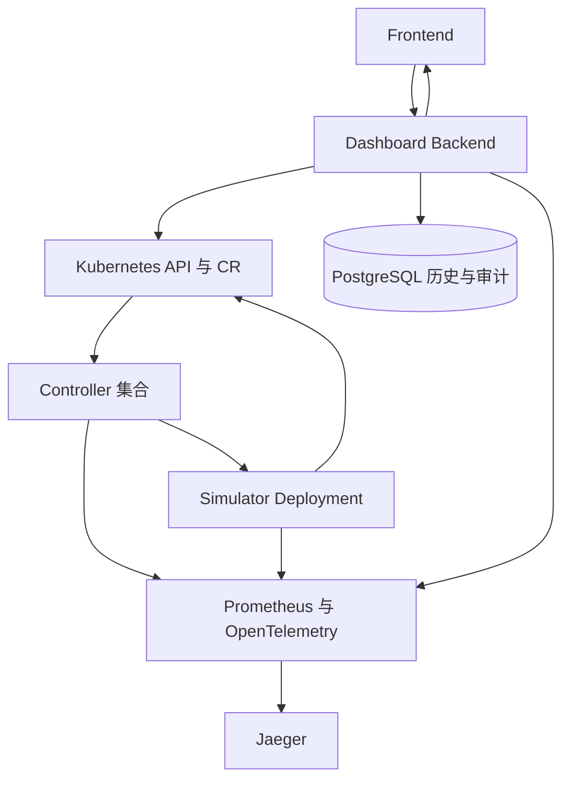

# hello-k8s-ai 项目深度审查

## 本目录用途

本目录记录当前项目经过完整代码审查后确认的重大技术问题、影响和后续重构方向。它是一份独立审查记录，不替代项目现有 `docs/`，也不代表已经实施修改。

本次审查的目标是让后续开发者先理解系统真实运行方式，再按风险逐项处理问题。结论以当前代码和部署配置为主，已有文档只作为辅助证据。

## 审查基线与证据边界

- 审查日期：2026-08-13。
- 源码基线：归档内 Git `HEAD` 为 `c51f586`。归档同时包含 9 个相对该提交的已修改文件，因此当前交付物不是干净提交；本次审查按归档中的实际内容进行。
- 代码证据：逐项核对 API 类型、6 个 Controller、Simulator、Dashboard Backend、Frontend、PostgreSQL、Prometheus、OpenTelemetry、Jaeger、Kubernetes YAML、Makefile、Shell、测试与 CI。
- 运行证据：归档中的 `.runtime/up-20260813T061633Z.log` 记录了一次完整本地部署成功，Backend readiness、Kubernetes 聚合、PostgreSQL Snapshot、Prometheus 指标、OpenTelemetry 到 Jaeger、Frontend 页面均通过。因此，本报告不把项目描述为“完全不可运行”。
- 独立验证边界：审查环境没有 Go、Docker、kubectl 和 kustomize，未重新执行 Go 测试、镜像构建或集群部署；`setup.sh` 与 `hack/*.sh` 已通过 `bash -n` 语法检查。运行结论采用代码静态分析与归档内实际运行记录交叉判断。

## 真实系统链路

当前本地演示链路已经形成闭环，但调度意图、身份边界、模型基准分来源等关键契约仍依赖隐含约定或部署脚本。它们是从“能演示”走向“可长期多人维护”时应首先解决的部分。

## 审查范围

- Go Controller：Reconcile 职责、状态字段所有权、事件映射、扩缩容与资源核算。
- CRD：Spec/Status 边界、引用关系、唯一性、生命周期和 API 演进能力。
- Simulator：Leader election、冷启动、队列状态、指标与状态回写。
- Backend：API、Kubernetes 缓存和命令网关、数据聚合、幂等与审计。
- Frontend：远端数据获取、内存状态、流量工作台与 Backend API 的闭环。
- 数据与可观测性：PostgreSQL Snapshot、Prometheus、OpenTelemetry、Jaeger 与历史查询。
- Kubernetes 与构建：RBAC、镜像、Kustomize、部署脚本、Makefile 和环境依赖。
- 测试与交付：单元测试、Envtest、E2E、Frontend 检查、GitHub Actions 与归档基线。

## 审查原则

- 不修改业务代码、配置或现有文档。
- 不删除文件，不生成补丁，不实施重构。
- 不因“不是最佳实践”而判定为问题；只记录会影响正确性、安全性、稳定性或长期维护的事项。
- 每个问题均给出代码上下文、实际影响、根因和方向性建议，不给出具体实现代码。
- 对尚未在现有运行记录中触发的问题，明确标注为风险，不把推断写成已发生事实。

## 总体判断

项目的本地一键部署和主数据链路已有成功记录，Controller、Simulator、Backend 和 Frontend 也具有清晰的基础模块划分。当前不需要整体推倒重写。

进入长期多人协作或对外部署前，应优先处理 3 个 P0 问题：调度选点没有真正落到 Pod、Backend 写接口没有可信身份边界、`Model.status.absoluteScore` 没有系统内生产者。其余 7 个 P1 问题应在扩大租户、节点和数据保留规模前按依赖顺序推进。

完整排序见 [TOP10_ISSUES.md](TOP10_ISSUES.md)。建议先阅读 P0，再处理 CRD 契约和命令一致性，最后推进规模化、历史数据和交付门禁。

## 本次产物边界

本次新增内容仅限 `project-review/`。没有修改代码、Kubernetes 配置、现有 `docs/` 或测试文件。
